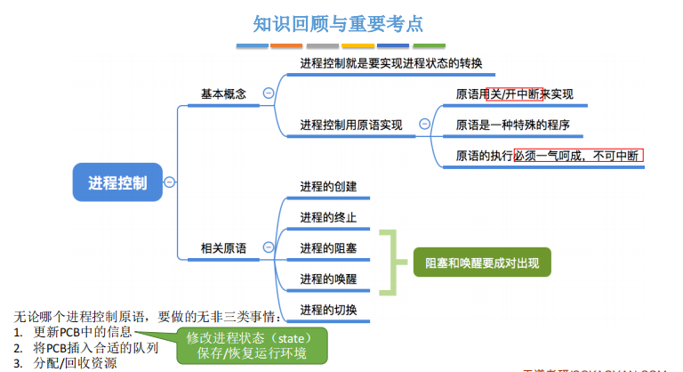
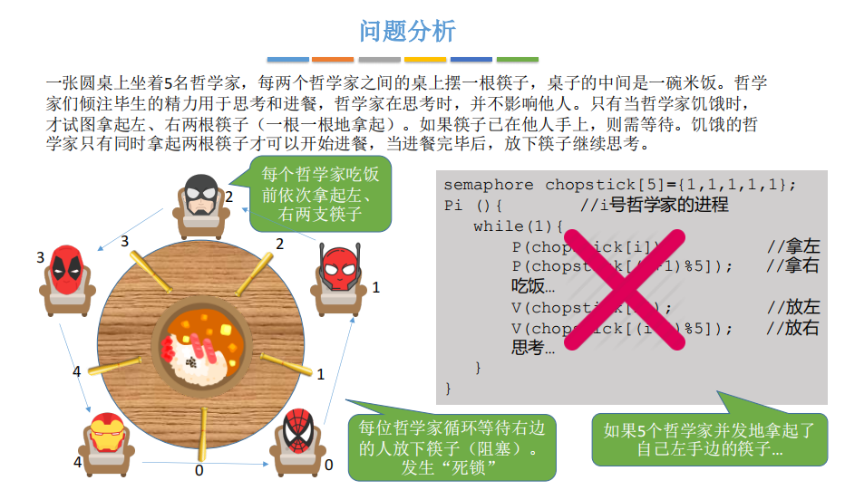
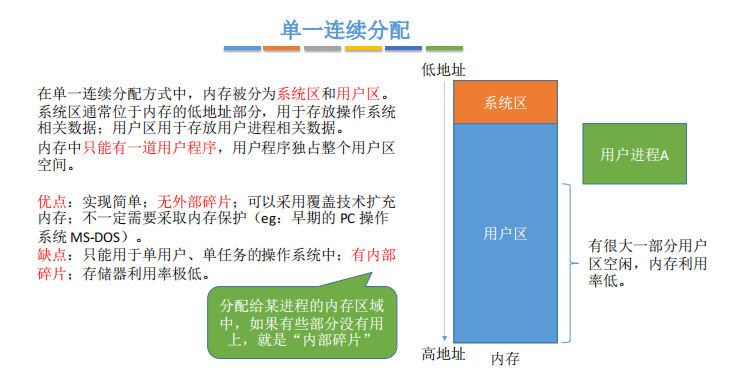
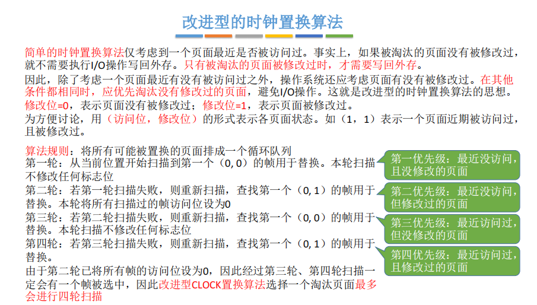
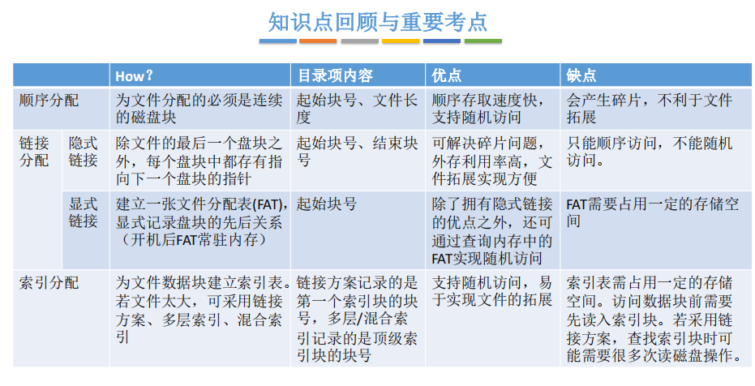
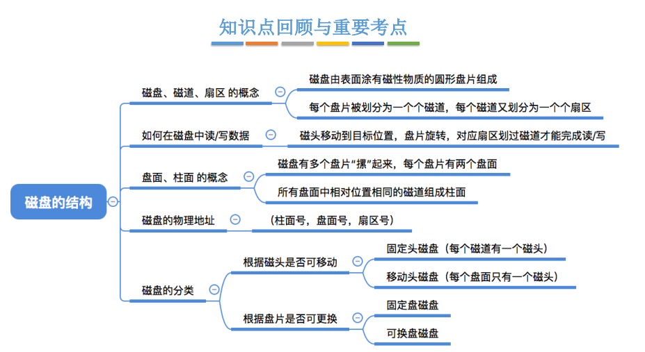
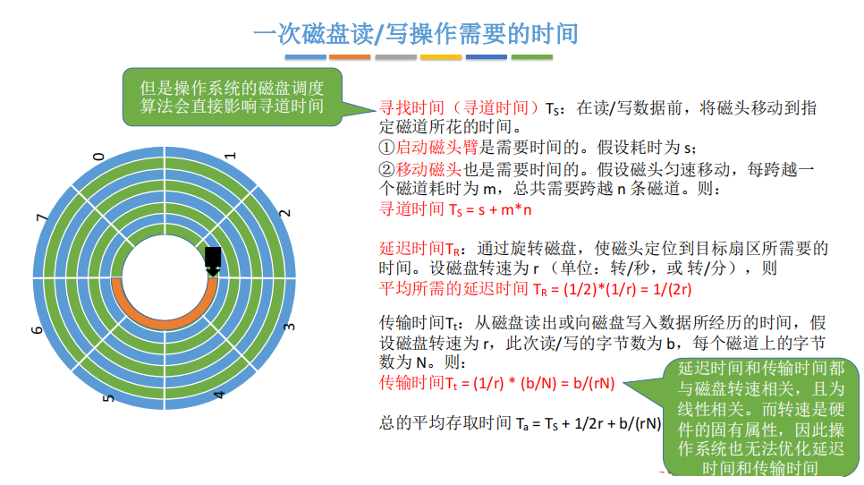

# 一、概览

**分数组成：**

- 选择题23-32，共20分
- 大题45-46，共15分


## 定义

​		**负责管理协调硬件、软件等计算机资源工作，为上层用户、应用程序提供简单易用服务的一种系统软件。**

## 发展


## 功能


- 管理
- 向上提供服务
  - 普通用户
    - GUI
    - 命令接口（联机 or 脱机）
  - 程序员
    - 系统调用
- 对硬件机器扩展


## 特征


- 有并发，才导致了异步性
- 没有并发，就谈不上虚拟


## 运行机制


# 二、进程篇

## 概述


​		**进程是能独立运行、获得资源、接受调度的基本单位**。

​		**程序：静态的**，存放在磁盘里的可执行文件。

​		**进程：动态的**，是程序的一次执行过程。

### 组成

​	**进程实体（进程映像）**，由PCB、程序段、数据段组成。进程是动态的，映像是静态的，反映了某一时刻的状态。

- **PCB**
- **数据段**
- **程序段**

### 特征

- **动态**
  - 动态产生、变化、消亡
- **并发**
  - 内存中有多个进程实体，各进程并发执行
- **独立**
  - 进程是独立运行、获得资源、接受调度的基本单位
- **异步**
  - 各自独立、不可预知速度推进
- **结构**
  - 每个进程都会分配PCB、程序段、数据段


## 控制


### 状态


- **创建**
  - 正在被创建
- **就绪**
  - 没有空闲CPU，只等待CPU
- **阻塞**
  - 除等待CPU，还在等待某个事件
- **运行**
  - 在CPU上运行
- **终止**


### 转换


### 组织


- **链接方式**

  - 链表组成队列

- **索引方式**

  - 指针指向进程的索引表

  

### 控制

​		进程控制的主要功能是对系统中的所有进程实施有效的管理，它具有创建新进程、撤销已有进程、实现进程状态转换等功能。

​		**进程控制通过原语实现，原语通过开关中断实现。**




## 通信


### 共享存储

​		**为避免出错，各个进程对共享空间的访问应该是互斥的。**


- **基于数据结构（低级通信）**
- **基于存储区（高级通信）**


### 消息传递

​		进程间的数据交换以格式化的信息为单位，**通过发送消息/接受消息的原语进行数据交换。**


- **直接通信**
- **间接通信**


### 管道通信


- **命名管道**
- **匿名管道**


## 线程

### 概念


​		**线程是一个基本的CPU指向单元，也是程序执行流的最小单位。**引入线程后，进程只作为系统资源（除CPU）的分配单元。

​		**线程是处理机的分配单元。**

### 实现

- **用户级**
  - 线程管理工作由应用程序负责
  - 优点：线程切换在用户空间即可完成，不必切换到核心态
  - 缺点：一个用户级线程阻塞后，整个进程都会阻塞，并发度不高
- **内核级**
  - 线程管理工作由操作系统负责
  - 优点：并发能力强，多线程可在多核处理机上并发执行
  - 缺点：一个用户进程会占用多个内核级线程

### 模型


- **一对一**
- **多对一**
- **多对多**


## 调度

### 层次


- **高级调度（作业调度）**
  - 从外存的后备作业队列挑选一个调入内存
- **中级调度（内存调度）**
  - 将挂起的进程重新调入内存
- **低级调度（进程调度）**
  - 选取一个进程，将处理机分配给它

> > 补充，七状态模型，见下ios的进程调度：墓碑机制
> >
> > 进程进入后台运行后，最多再占用10分钟CPU，就会被挂起，挂起后，会被保存一个进程快照，内存紧张时会将快照写入闪存。


### 时机


- 需要进程调度与切换
  - 主动放弃：进程正常终止、发生异常终止、主动请求阻塞（如IO）
  - 被动放弃：时间片用完、紧急的事处理（如IO中断）、高优先级抢占
- 不可进程调度与切换
  - 中断过程
  - 内核临界区（普通临界区可以）
  - 原子操作中

> > 狭义的进程调度：
> >
> > - 就绪队列中选中一个要运行的进程
> >
> > 广义的进程调度：
> >
> > - 选中一个进程
> > - 进程切换（现场保护、新进程数据恢复）

### 评价指标


- 周转时间：提交到结束，无法知道等待时间
- 带权周转时间：周转时间 / 运行时间 = 1 + 等待时间 / 运行时间


### 算法（1）

- **不关心响应时间**
- **不区分紧急程序**
- **适用于早期批处理系统**


**先来先服务（FCFS）**

- 非抢占
- 优点：公平
- 缺点：对短作业不利
- 饥饿：不会

**短作业优先**

- 非抢占式：SJF / SPF
- 抢占式：SRTN（最短剩余时间优先）
- 优点：短作业有利，SRTN平均带权周转最少
- 缺点：对长作业不利
- 饥饿：会

**高响应比优先（HRRN）**

- 非抢占
- 响应比 = （等待 + 运行）÷ 运行
- 优点：综合考虑等待时间和运行时间
- 饥饿：不会

---


### 算法（2）

- **注重响应时间、公平性、平衡性**
- **适合交互式系统**


**时间片轮转**

- 抢占式
- 优点：公平、响应快
- 缺点：高频切换进程开销大、不区分紧急程度
- 饥饿：不会

**优先级调度**

- 抢占式、非抢占式
- 优点：可区分任务紧急程序、灵活调整对进程的偏好
- 缺点：源源不断的高优先级到来时，会饥饿
- 饥饿：会

**多级反馈队列**

- 抢占式
- 优点：相对公平、时间相对较少、响应相对快、可动态调整优先级
- 饥饿：会


> > 优先级调度中，分静态优先级和动态优先级，通常：
> >
> > - 系统 > 用户
> > - 前台 > 后台
> > - IO密集 > CPU密集


## 互斥

### 原则


- **空闲让进**
- **忙则等待**
- **有限等待**
- **让权等待**


### 软件实现


- **单标志检查法**
  - 设置一个turn表示允许进入的进程
  - 若轮到某个进程的turn了，一直不进入，则违反空闲让进
- **双标志先检查法**
  - 检查对方想用就循环等待
  - 若两个进程同时上锁，则同时进入临界区，违反忙则等待
- **双标志后监察法**
  - 先上锁，再检查对方是否想用
  - 若两个进程同时上锁，则都进步不了临界区，违反空闲让进，有限等待
- **皮特森算法**
  - 上锁、谦让、检查
  - 不能让权等待


### 硬件实现


- **中断屏蔽**
  - 关中断后不能进行进程切换
  - 仅内核进程、单处理机
- **TS/TSL指令**
  - 可适用于多处理机
  - 不满足让权等待
- **Swap/XCHG指令**


### 信号量机制


- **整型**
  - 不满足让权等待
- **记录型**


## 同步

### 生产者消费者

- **单生产者-单消费者**


- **多生产者-多消费者**
  - 缓冲区大小为1时可不设置mutex


- **单生产者-多消费者**
  - 可生产多种产品的单生产者，要轮流或按序供应


### 读者写者

​		读者写者也可以理解成生产者消费者，不同在于读者写者里的消费者读者，他的消费不是取走那一片数据。

**要求：**

- 多个读者可同时读
- 仅允许一个写者写
- 写者写完前不允许其它任何操作
- 写者写之前，其它读者写者应该已退出


- 对读者，先上一个写优先锁，以保证写进程不会被挤到后面去，访问临界区之前解除此锁
- 第一个来的上读写锁，最后一个走的解读写锁


### 哲学家就餐



- 问题关键：拿起两个筷子的操作非原子性
- 解决办法：
  - 最多只允许4个哲学家就餐
  - 奇数先拿左，偶数先拿右
  - 一次拿两个筷子
- 多个进程需要同时持有多个临界资源情况可类比


### 管程


- 互斥特性由编译器负责实现，程序员不用关心


## 死锁


### 概念


- 死锁：各进程互相等待对方手里的资源


**必要条件：**

- **互斥**
- **不剥夺**
- **请求和保持**
- **循环等待**


### 预防


- 破坏互斥条件
  - 互斥改共享，或者SPOOLing技术
  - 但很多条件下就是需要互斥
- 破坏不剥夺条件
  - 方案一：请求资源得不到满足，释放自己持有的所有资源
  - 方案二：请求的资源被其它进程占用，由OS协助剥夺该进程资源（考虑优先级）
- 破坏请求保持条件
  - 静态分配法：一次性申请完所有资源
- 破坏循环等待条件
  - 顺序资源分配法：资源编号，编号递增申请


### 避免

- **处于不安全状态未必死锁，死锁一定处于不安全状态**

**银行家算法步骤：**

- 判断Request ≤ Need
- 判断 Request ≤ Available
- 试探性分配
- 判断是否处于安全序列


### 检测


- 找不阻塞非孤点进程，分配资源给该进程使其执行完毕
- 进程执行完之后资源增加，慢慢化简图


### 解除


- **资源剥夺法**
  - 挂起死锁进程
- **撤销进程法**
  - kill掉部分死锁进程，实现简单
- **进程回退法**
  - 保存历史节点，设置还原点


# 三、内存篇

## 概述


**内存管理：**

- **分配回收**
- **空间扩充**
- **地址转换**
- **存储保护**


> > C语言程序执行步骤
> >
> > - 预处理
> >   - 把头文件的代码、宏之类的转换，生成.i文件，还是C代码
> >   - gcc参数为-E
> > - 编译
> >   - 把预处理后的程序编译为.s汇编代码
> >   - 编译永远是以单个文件（预处理后）为单位。
> >   - gcc参数为-S
> > - 汇编
> >   - 生成.o目标文件，机器代码
> >   - 我们有时候谈编译，指的就是编译+汇编
> >   - gcc参数为-c（代表只编译不链接）
> > - 链接
> >   - 把各个.o文件链接起来生成可执行文件
> >   - 没有链接之前，所有的非本文件的函数，调用地址都暂时为0
> >   - gcc中由链接器ld完成，如：gcc a.o b.o -o final.o
> > - 装入
> >
> > Linux下生成的 .o目标文件、so动态库文件以及下一小节链接阶段生成最终的可执行文件都是elf（Executable and Linkable Format）格式的， 可以使用readelf工具来查看它们的内容。
> >
> > Windows使用的是PE格式（Portable Executable）。

​		Linux下一个可执行文件有如下部分：


**链接举例：**

```c
#include<stdio.h>

// 只有声明,实现在math.c中，实现简单的加法
int add(int a,int b);

int main(){
    printf("Hello World!");
    add(3,4);
    return 0;
}
```

​		例如，对上面的c代码只编译汇编，不链接，```gcc -c main.c -o main.o```，然后使用```objdump -s -d main.o```查看其反汇编，会发现跳转地址被设为0，如下图。


​		图中两个call代码，就是执行的两个函数，机器码的跳转地址都是0。而为了让链接器定位到这些被修正的地址，在代码块中还可以找到一个重定位表（Relocation Table），使用```objdump -r main.o```有如下图结果


​		OFFSET表示他们在代码段中的偏移位置，后面的TYPE是地址类型和长度。链接器链接时就会查看链接表，如果找不到对应的链接文件，就会提示符号未定义，如下图：


​		执行链接命令```gcc main.o math.o -o final.o```，生成最终的要执行的目标文件。


​		再次查看链接后生成的最终文件的重定位表，对比之前的main.o的重定位表，会发现最终的可执行文件重定位表为空，此时即可执行。


​		一般为了避免繁琐的步骤、不必要的编译和避免复杂的依赖，都借助make帮忙完成编译过程，如下makefile。


### 链接


- 静态链接
  - 编译时就把各模块打包连接成一个完整可执行模块
  - gcc参数--static，但目标文件体积很大
- 动态链接
  - 装入时
    - 运行前边装入边链接
  - 运行时
    - 运行时才装入链接，如dll


​		从图中可以看到，使用动态链接生成的hello程序才8.3KB， 而使用静态链接生成的hello_static程序则高达845KB。


### 装入

装入中的地址转化分为：

- **绝对装入**
  - 编译器负责地址转换（单道程序阶段，无操作系统）
  - 装入时编译器修改指令中的地址
- **可重定位装入（静态重定位）**
  - 装入程序负责地址转换（早期多道批处理阶段）
  - 装入内存时就必须分配其要求的全部内存，作业进入内存开始运行后就不能再移动
- **动态运行装入（动态重定位）**
  - 运行时才进行地址转换（现代操作系统）
  - 允许程序在内存中发生移动，需要一个重定位寄存器储存基址


## 分配回收

**内部碎片：分配的空间有没有利用的部分**

**外部碎片：没有分配出去的空间比较零散，不好利用，可通过紧凑（Compaction）技术来解决** 

### 连续分配

- **单一连续分配**
  - 单一用户程序，独占用户区空间
- **固定分区分配**
  - 分区大小相等、分区大小不等；
  - 每个分区一道作业
- **动态分区分配**
  - 不预先建立分区，进程进入时根据进程大小来划分
  - 数据结构：空闲分区链/表，分配回收时根据前后有无空闲分区分为四种情况

**单一连续分配**



**固定分区分配**


**动态分区分配**


- **首次适应（First Fit）**
  - 综合性能最好
  - 空闲分区地址递增排列
- **最佳适应（Best Fit）**
  - 小碎片过多
  - 空闲分区容量递增排序
- **最坏适应（Worst Fit）**
  - 对大进程不友好
  - 空闲分区容量递减排序
- **临近适应（Next Fit）**
  - 算法开销小
  - 碎片大小适中，大进程依然可能进不来
  - 空闲分区地址递增排列


---


### 离散分配

- **基本分页**
  - 每个进程一张页表，页表常驻内存（只要作业进入内存）
  - 物理块：页框、页帧、物理块、物理页面
  - 逻辑块：页、页面
  - 物理块号：页帧号、页框号、物理页号
  - 逻辑块号：页号、页面号
- **基本分段**
  - 关键词：方便编程、共享和保护、动态链接和增长
  - 段号：决定可以分多少段
  - 段内地址：决定每个段最长为多少
  - 每个段是个连续存储区
- **基本段页式**
  - 地址结构：段号、页号、页内地址
  - 每个进程一张段表，每个段一个页表


**基本分页**


- 逻辑地址 ÷ 页大小 = 页号.....页内地址（十进制也要会算）
- 页面大小要求是2的倍数，方便二进制运算
- 页表项：物理块号，要求按字节对齐
- 各页表项连续地存放在内存中，要求每个页面恰好能装下整数个页表项


**多级页表**


- 各页表项必须连续存放，页表很大时，需要占用多个连续页框
- 进程一段时间仅需某几个页面，没必要整个页表都常驻内存
- 可将页表再分页离散存储，再建立一张页表记录各个部分存放位置，称之为页目录表、外层页表、顶层页表
- 页目录表项：页表所在物理块号，要求按字节对齐


**基本分段**


- 不能被修改的代码称为纯代码或可重入代码（非临界资源）
- 可重入代码是可以共享的，可修改的代码是不能共享的
- 可重入程序减小了对换数量，提高了性能
- 共享的进程使用共享段表来共享程序段
- 分段的地址空间是二维的，程序既要给出段名，也要给出段内地址


**基本段页式**


- 段页式是二维的，由程序员决定分段
- 每个段进行分页，每个段有一张页表


### 分配置换


概念：


- **驻留集**
  - 请求分页中给进程分配的物理块的集合
  - 一般小于进程总大小，过小会频繁调页，过大会降低并发度
- **工作集**
  - 某段时间内，进程实际访问页面的集合
  - 从当前访问页面向前扫描一个窗口尺寸
  - 驻留集不能小于工作集大小，否则会频繁缺页
- **抖动（颠簸）**
  - 分配的物理块不够，页面频繁换入换出


分配策略：


- **固定分配**
  - 分配固定数目的物理块，即驻留集不变
- **可变分配**
  - 分配可变的数目的物理块，即驻留集可变


置换策略：


- **局部置换**
  - 缺页时只对自己的物理块进行置换
- **全局置换**
  - 分配空闲物理块
  - 把别的进程的内存块置换出去


何时调入页面：

- **预调页**
  - 一次调入若干相邻的页面可能比一次调入一个页面更高效
  - 主要用于进程首次调入
- **请求调页**
  - 运行期间缺页才调入


何处调入页面：


- **磁盘对换区（Swap分区）**
  - 进程运行前，将相关数据从文件去复制到对换区
  - 对换区不足时，将不会被修改的数据从文件区换入换出（换出时不需要写磁盘）


## 空间扩充

### 覆盖

​		早期计算机内存极小，经常内存不够，所以将程序分成多个段，常用段常驻内存，不常用的段需要时才调入内存。

​		内存被分为一个固定区（常驻段在此）和若干个覆盖区（不常用的段在此）。


### 交换

​		内存空间紧张时，将某些进程暂时换出内存（PCB还在）。


- 进程IO时不可换出主存


### 虚拟存储


传统存储有两个特性：

- **一次性**
  - 作业必须一次性全部装入内存后才能开始运行
  - 问题一：大作业不能全部装入内存
  - 问题二：大量作业要求运行时无法容纳，并发度低
- **驻留性**
  - 作业一旦装入内存，就会一直驻留内存

虚拟存储有三个特征

- **多次性**
  - 作业运行时无需一次性全部装入内存
- **对换性**
  - 作业运行时无需一直常驻内存
- **虚拟性**
  - 逻辑上扩充了内存容量

虚拟存储最大容量和实际容量：

- **最大容量**，取决于CPU寻址能力（MAR位数）
- **实际容量**，寻址能力和内外存之和取最小值


## 地址转换

### 早期转换

- 绝对装入（编译期间）
- 静态重定位（装入期间）

### 基本分页

- 基本分页
- 基本分页（快表）
- 基本分页（多级页表）


- 页表寄存器（PTR），存放页表起始地址和页表长度
- 页表始址和长度存在在PCB中，调度时将其放入页表寄存器
- 页式管理地址是一维的，页号是隐含的
- 总共两次访存，第一次查页表，第二次访问目标单元


**基本分页（快表）**


- 快表（联想寄存器，TLB，translation lookaside buffer），是一种高速缓存（快表非内存）
- 同Cache一样，可以同时访问快表和慢表，或者先访问快表再访问慢表
- 若命中快表，则仅需一次访存


**基本分页（多级页表）**


- 从PCB中读页目录表始地址
- 根据一级页号查页目录表，找到下级页表在内存中位置
- 根据二级页号查二级页表，找到最终页框号


### 基本分段


- 同基础分页，需要两次访存
- 分段系统也可以引入快表机构，以减少访问次数


### 基本段页式


- 先查段表，再差页表


### 请求分页


- **缺页中断机构**
  - 访问页面不在内存，产生一个缺页中断（fault），缺页进程阻塞，调页完成后唤醒
  - 内存有空闲块，为进程分配一个空闲块
  - 内存无空闲块，置换出一个空闲块
- **地址变换机构**
  - 快表中有的页面一定是在内存中
  - 页面被换出内存，快表中就要删除该页表项
  - 调入的页面对应的表项会直接加入快表，故调页后直接查快表

---

**置换算法：**

- **最佳置换（OPT）**
  - 理想情况，不能实现
- **先进先出（FIFO）**
  - 实现简单，性能差
  - Belady异常
- **最近最久未使用（LRU）**
  - 性能好，实现困难，开销大
- **时钟算法（CLOCK、NRU）**
  - 第一轮扫描，找访问位为0的页面，扫描过将1置0
  - 第二轮扫描，继续找0
- **改进时钟算法**
  - 考虑是否修改，优先找访问位位0的页面，次之找没修改过的页面
  - 第一轮扫描，找（0，0），即没访问也没修改
  - 第二轮扫描，找（0，1），没访问过但修改过，扫过的访问位置0
  - 第三轮扫描，找（0，0），即访问过但没修改过
  - 第四轮扫描，找（0，1），即访问过修改过




## 存储保护

### 上下限寄存器


### 基址寄存器


- 内存保护需要由操作系统和硬件机构合作完成


# 四、文件篇

## 概述

### 层次结构


​		文件就是一组有意义的信息/数据的集合，文件存放在磁盘中，所以文件管理就是对外存的管理。

- **非空闲空间**
  - 文件逻辑结构：文件内部如何组织
  - 文件物理机构：文件如何存储/分配
  - 文件之间关系：目录结构
- **空闲空间**
  - 存储空间管理，联想内存管理


## 逻辑结构

### 无结构

​		内部数据是一系列二进制流或字符流。又称”流式文件“。如Windows下的.txt文件。

### 有结构


​		有结构文件又称”记录式文件“，每条记录由若干数据项组成。每个记录有一个数据项作为关键字（用来识别不同记录）

​		**根据每条记录的长度是否可变，分为：定长记录、可变长记录。**

​		根据逻辑上如何组织，又可以分为：

- **顺序文件**
  - 记录在逻辑上是顺序的，可定长可边长
  - 串结构，记录之间顺序与关键字无关
  - 顺序结构，记录之间顺序按关键字排序
- **索引文件**
  - 为文件建立索引表（可根据不同字段建立多张）
  - 索引表本身是定长记录的顺序文件
  - 可根据建立的索引表，根据该关键字折半查找
  - 增删时，需要修改索引表
- **索引顺序文件**
  - 同样为文件建立索引表，但是一组记录一个索引表项
  - 可以建立多级索引表，其实就是Trie树（字典、前缀树）


> **考试题目所说的顺序文件，指的是物理结构中顺序存储的顺序文件。**


## 目录结构

​		**文件目录：FCB的有序集合。**

- 搜索，根据文件名搜索目录，找到该文件对应的的目录项。
- 显示，显示目录中的内容
- 创建/删除文件，增和删目录项
- 修改目录，某些文件属性保存在目录中，因此需要能够修改对应的目录项（如重命名）

### 文件标识

- 一个FCB就是一个文件目录项。


​		iNode节点更小，因此一个磁盘块能存更多的iNode，一次能读到更多的节点，所以大大提升了文件检索速度。

- 索引节点建立了文件名到文件的映射，故iNode即可代表文件
- 索引节点包含除了文件名之外的所有信息
- 目录项：文件名、索引节点指针
- 外存中：磁盘索引节点
- 内存中：内存索引节点，增加了一些信息


### 目录结构

- **单级目录**
  - 早期操作系统，不允许文件重名
  - 显然不适用多用户操作系统
- **两级目录**
  - 主文件目录（记载用户名及该用户对应目录存放地址）
  - 用户文件目录（由该用户文件FCB组成）
  - 允许不同用户文件名重名，同一用户文件仍不允许重名
  - 可以通过登录用户名实现访问限制
- **多级目录（树形目录）**
  - 引入当前目录和相对路径
  - 不便于实现文件共享
- **无环图目录**
  - 多个不同文件名指向同一个文件，某个文件删除只会使计数器减一


## 物理结构

### 分配方案



​		物理结构即讨论如何给一个文件分配物理块。

- **连续分配**
  - 顺序读写最快
  - 物理上不方便扩展（可用紧凑处理）
- **隐式链接**
  - 方便扩展，无碎片，利用率高
  - 仅支持顺序访问，查找效率低
- **显式链接**
  - 为每个磁盘建立一张FAT，开机后常驻内存
  - FAT表项在物理上连续存储（物理块号是隐含的）
  - 支持随机访问，扩展方便，但FAT需占用一定空间
- **索引分配**
  - 为每个文件建立一张索引表
  - 索引块：索引表存放的磁盘块
  - 支持随机访问，扩展方便，但索引表需占用一定空间

**连续分配**


**链接分配**


**索引分配**

- 逻辑块号也是隐含的
- 注意与逻辑结构的索引类型文件区分


### 索引方案

- 各级的索引表不能超过一个块
- 顶级索引块的指针存放在FCB中
- 每读下一级索引块都要IO一次
- 注意顶级索引是否已调入内存


- **链接方案**
  - 大文件索引表的索引块很多，要多次IO
- **多层索引**
  - 小文件也需要多次IO
- **混合索引**
  - 既包含直接地址索引（直接指向数据块）
  - 也包含多级间接索引

> > 区分：存储、分配、文件类型
> >
> > 存储是文件内部对数据的组织
> >
> > 文件类型分为有结构、无结构
> >
> > 比如，文件是顺序文件（顺序结构，即关键字有序），那么可以如何组织呢？即如何存储呢？可以采用顺序存储或者链式存储，即数组或者链表，这些都是逻辑上的。
> >
> > 将文件交给OS，文件就是很多个块，不管是什么类型、如何存储。然后OS就会给文件分配真实的物理块。

​		如下，顺序文件（分为串结构和顺序结构，即是否按关键字排序），可以采用顺序存储，或者链式存储，如下C语言实现。


## 保护共享

### 保护


- **口令保护**
  - 开销小，但口令存放在系统内部，不安全
- **加密保护**
  - 对称加密，如异或。
  - 保密性强，不需要存储密码，但加解密耗时
- **访问控制**
  - FCB中增加访问控制表，记录各用户对该文件权限
  - 考虑到用户多的情况，可以精简控制表，以用户组为单位


### 共享


​		共享，意味着系统中只有一份文件数据，某一用户修改了，其它用户均可见。


- **硬链接（基于索引节点）**
  - 目录项中的索引节点指针指向同一个索引节点
  - 索引节点中设置计数变量，表示链接的目录项数
- **软链接（基于符号链）**
  - 文件存放了共享文件的存放路径
  - 操作系统会一层层查找目录，直到找到共享文件
  - 需要查询多级目录，需要多次IO，因此比硬链接慢


## 磁盘管理

### 概览


磁盘分为两个部分：

- 交换区
- 文件区

文件区又划分为

- 目录区
  - 存放文件目录信息，即FCB
  - 以及空闲空间信息
- 文件区
  - 存放文件数据


### 空闲块组织


- **空闲表法**
- **空闲链表法**
- **位示图法**
- **成组链接法**


---

**空闲表法**


---

**空闲链表法**

- 盘块链
- 盘区链


---

**位示图法**


---

**成组链接法**

- Unix系统采用此方法，适用于大型文件系统
- 目录区有一个超级块，启动时超级块读入内存


### 磁盘结构



**磁盘读写时间：**

- 寻道时间
  - 启动磁头臂时间
  - 移动磁头时间
- 延迟时间
  - 转到目标扇区所需要的时间，一般为转半圈时间
- 传输时间
  - 从磁盘中读写数据经历的时间



**磁盘初始化**

- 低级初始化
- 磁盘分区
- 逻辑格式化


**引导块**

- 存放初始化程序（自举程序）
- 自举装入程序（Bios）存放在ROM中


> > ROM是属于内存部分，而Disk磁盘是属于外存部分

**坏块**

- 简单的磁盘：逻辑格式化时标记出来
- 复杂的磁盘：磁盘控制器维护坏块链、管理备用扇区


### 磁盘调度


​		延迟时间、传输时间都与磁盘转速相关，属于硬件特性，OS不可优化，所以OS能做的只有优化寻道时间。

- **先来先服务（FCFS）**
  - 平均寻道时间长
- **最短寻找时间（SSTF）**
  - 移动完成之后，下一次移动到距离当前最近的磁道
  - 可能导致小范围寻道
- **Scan算法**
  - 移动到最边上才掉头
  - 响应频率不均匀
- **Look算法**
  - 前进方向无请求就掉头
- **C-Scan算法**
  - 单向移动
- **C-Look算法**


### 传输优化


- **交替编号**
  - 针对扇区的优化
- **错位命名**
  - 针对盘面的优化

---

**磁盘编址**

- 柱面号、盘面号、扇区号
- 将改变磁道放在最后面


---

**交替编号**

- 让逻辑上相邻的扇区在物理上有一定间隔
- 可以使得读取连续扇区空间有一定缓冲时间


---

**错位命名**


## 文件操作


### 创建删除

- **创建文件**
  - 找到所需空间（位示图法、成组链接法...）
  - 根据路径找到目录，创建目录项


- **删除文件**
  - 根据路径找到目录，找到目录项
  - 根据目录项中记录的文件所在外存地址回收空间
  - 删除对应目录项


### 打开关闭

- **打开文件**
  - 根据路径找到目录，找到目录项
  - 检索用户权限，目录项复制到”打开文件表“
  - OS有一张打开文件表，每个进程也有一张


- **关闭文件**
  - 进程的打开文件表中删除该表项
  - 系统打开文件表计数减一


### 读写文件

- **读文件**
  - 文件在打开文件表中的索引号
  - 读入多少数据、存放在内存中何处


- **写文件**
  - 文件在打开文件表中的索引号
  - 写入多少数据、数据在内存中何处


# 五、外设篇

## 概念

### 分类


**使用特性**

- 人机交互类
- 存储类
- 网络通信类

**传输速率**

- 高速
  - 磁盘
- 中速
  - 打印机
- 低速
  - 键盘鼠标

**信息交换单位**

- 块设备
  - 速率快，可寻址
- 字符设备
  - 速率慢，不可寻址，常采用中断驱动


## IO设备

### 控制器


**IO设备组成**

- 机械部件
- 电子部件


- IO控制器就是计组里的IO接口
- 一个IO接口可有若干个IO端口
- 设备独立编址在OS里称为：寄存器独立编址
- 设备统一编址在OS里称为：内存映像IO


### 控制方式


- 程序直接控制
- 中断驱动
- DMA方式
- 通道控制


### 软件层次


- **用户层软件**
  - 实现了与用户交互的接口
- **设备独立性软件**
  - 提供统一的系统调用接口（理解为胶水层）
  - 设备的保护，设备看成一种特殊文件
  - 数据校验、差错处理
  - 设备分配与回收
  - 数据缓冲区管理
  - 建立逻辑设备名到物理名的映射
- **设备驱动程序**
  - 与硬件相关、但与中断无关都在这层
- **中断处理程序**
  - 进行设备中断处理

> > LUT（逻辑设备表）可以是整个系统一整张，也可以是每一个用户一张。
> >
> > 设备独立性软件、设备驱动程序、中断处理程序称为IO核心子系统。
> >
> > 假脱机（SPOOLing）技术属于用户层，但是408中是属于IO核心子系统。
> >
> > IO调度（如磁盘请求调度）也属于设备独立性软件中

**假脱机技术**


- 要实现脱机技术，必须有多道程序技术支持


### 分配回收

分配时应考虑：

- **设备固有属性**
  - 独占、共享、虚拟
- **设备分配算法**
  - 先来先服务、优先级算法....
- **分配中的安全性**
  - 安全分配：死锁预防（银行家算法）
  - 不安全分配：死锁避免、死锁检测和解除

分配中的数据结构：

- **设备控制表（DCT）**
- **控制器控制表（COCT）**
- **通道控制表（CHCT）**
- **系统设备表（SDT）**


申请步骤：

- 提供逻辑设备名，OS根据LUT查找对应的物理设备名
- 根据物理设备名查找SDT
- 根据SDT查找DCT分配设备
- 根据DCT查找COCT分配控制器
- 根据COCT查找CHCT分配通道


## 缓冲区

### 组成

- 内存，或者
- 硬件寄存器


### 作用

- 缓和CPU与设备速度矛盾
- 减少中断频率
- 解决数据粒度不匹配问题
- 提高CPU与设备并行性


### 组织


- **单缓冲**
- **双缓冲**
- **循环缓冲**
- **缓冲池**


**单缓冲**


**双缓冲**


> > 管道通信中的管道其实就是缓冲区，要实现全双工，必须设置两个管道

**循环缓冲**


**缓冲池**

