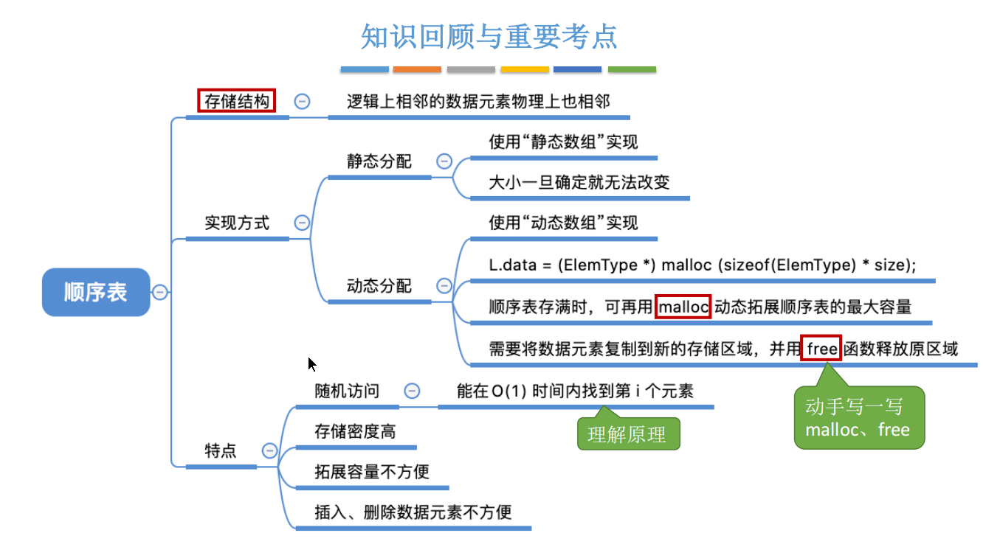
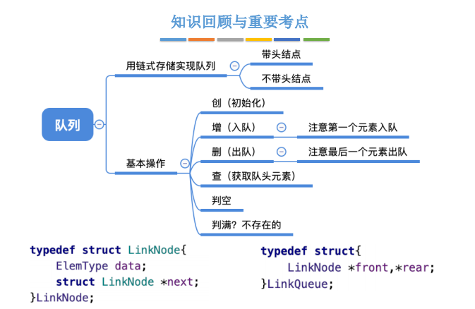
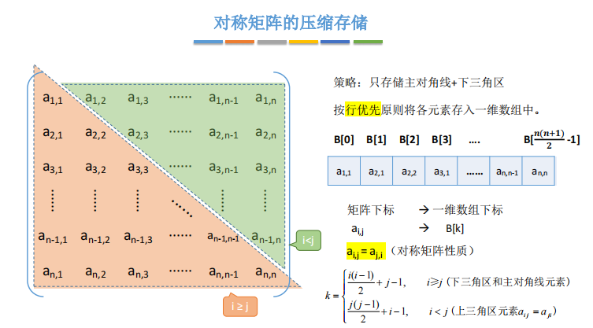
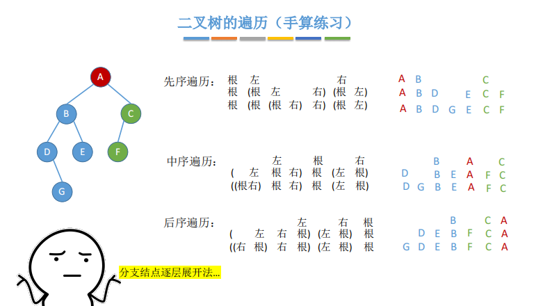
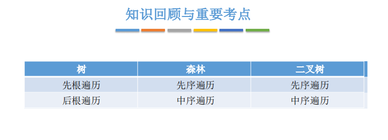
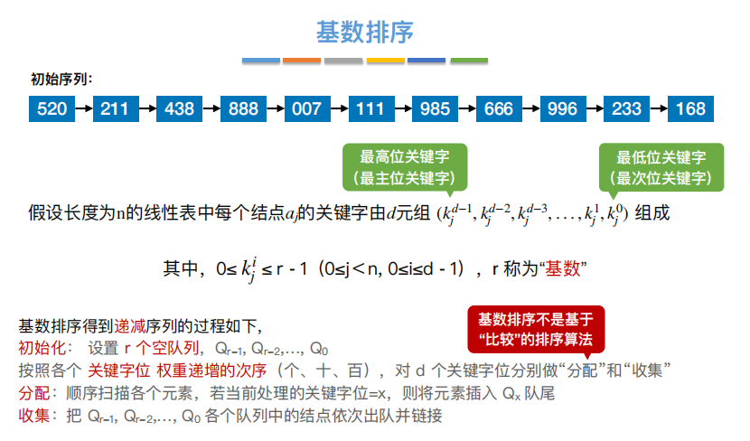
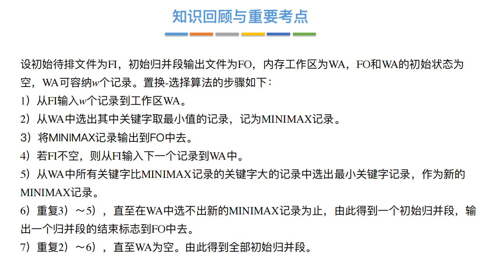

# 一、概览

**分数组成：**

- 选择题1-11，共22分
- 大题41-42，共23分

## 术语

​		**数据结构（struct）是相互之间存在一种或多种关系的元素的数据元素（element）的集合。**

### **抽象**

- **数据**
  - 是信息的载体，其基本单位是数据元素（element）。
- **数据项**
  - 构成数据元素（element）的不可分割的最小单位
- **数据对象**
  - 具有相同性质的数据元素（element）的集合，是数据的一个子集。

### 具体

- **数据类型**
  - 一个值的集合和定义在此集合上的一组操作的总称。
  - 原子类型，其值不可拆分。
  - 结构类型，其值课拆分。
- **抽象数据类型**
  - 抽象数据组织及与之相关的操作。

## 要素

​		从数据结构定义可以看到：数据元素、元素之间的关系，元素又有若干数据项组成，所以我们每次讨论一个数据结构，都会讨论：

1. **数据元素的构成**
   - 数据项是如何组成该数据元素
2. **数据元素彼此之间的关系**
   - 【逻辑结构】抽象的逻辑之上的关系
   - 【存储结构】落实到具体到当代计算机存储上的关系

### 逻辑结构

### 存储结构

1. **顺序存储**
   - 将逻辑相邻的元素存储在物理位置上也相邻的存储单元中。
2. **链式存储**
   - 逻辑相邻的元素物理位置上可以不相邻，借助元素存储地址的指针表示元素之间的逻辑关系。
3. **索引存储**
   - 在存储元素信息的同时，还建立附加的索引表，索引表中的每一项称为索引项，索引项一般形式是（关键字，地址）。
4. **散列存储**
   - 根据元素的关键字直接计算出该元素的存储地址，又叫哈希存储。

### 运算

​	**施加在数据上的运算，包括运算的定义和实现。**

- **定义**
  - 针对逻辑结构
- **实现**
  - 针对物理结构

## 算法

### 概念

​		**程序 = 数据结构 + 算法**，数据结构定义如何把现实世界的问题信息化，同时还要定义数据结构的基本操作，而算法则定义如何处理这些信息，以解决实际问题。

### 特征

1. **有穷性**
   - 有穷步结束，每一步都可在有穷时间内完成。
   - 注：算法必须是有穷的，而程序可以是无穷的。

2. **确定性**
   - 算法中的每条指令必须有确切的定义，对于相同的输入只能得出相同的输出。

3. **可行性**
   - 算法中描述的操作都可以通过已经实现的基本运算执行有限次来实现。

4. **输入**
   - 0个或多个输入，输入取自某个特定对象的集合。

5. **输出**
   - 1个或多个输出，输出是与输入有着某种特定关系的量。

### 好算法

1. 正确性
   - 能够正确解决求解的问题。
2. 可读性
   - 良好的可读性，以帮助人们理解。
3. 健壮性
   - 输入非法数据时，能够适当做出反应或进行处理。
4. 高效率与低存储
   - 时空间复杂度低

### 效率的度量

**时间复杂度**

​		**时间复杂度（全称：渐进时间复杂度）**，用来评估算法大概执行时间，与机器因素无关，评估标准：最好时间复杂度、最坏复杂度、平均时间复杂度（一般而言评价最坏和平均更多），记忆法：常对幂指阶：O(1) < O(logn) < O(n) < O(n·logn) < O(n$^2$) < O(n!) < O(n$^n$)

**空间复杂度**

​		**空间复杂度**，用来评估算法执行需要的大概空间。若复杂度为O(1)，可称为算法原地工作。

​		需要注意的是递归程序的函数栈也是需要空间的。

# 二、线性表

## 逻辑

​		除第一个元素外，每个元素有且仅有一个直接前驱；除最后一个元素外，每个元素有且仅有一个直接后继。

## 顺序存储

**顺序表**

顺序存储可分为：

- 静态分配
  - 静态分配固定大小连续的空间
  - 如：int data[MaxSize]，再设置一个变量保存表长
- 动态分配
  - 初始时不分配空间，插入时需要扩容时再分配
  - 缺点：扩容时需要复制原数据

**优点：**

- 随机访问，可在O(1)时间内找到第i个元素
- 存储密度高

**缺点：**

- 扩展容量不方便
- 插入、删除不方便，需要移动元素

## 链式存储

链式线性表可分为：

- **单链表**
- **双链表**
- **循环链表**
- **静态链表**

链表又可分为：

- **带头节点**
- **不带头节点**

---

**单链表**

**优点：**

- 不要求大片连续空间
- 改变容量方便
- 方便插入和删除

**缺点：**

- 不可随机存取
- 指针需要耗费一定空间

---

**双链表**

​	每个节点多了一个前驱指针，指向节点的前一个节点。

**优点：**

- 可快速找到前驱节点，前向遍历

**缺点：**

- 多了一个指针域

**注意：**

- 为空时，指针域均指向空

---

**循环链表**

**优点：**

- 方便在表尾进行操作。

**注意：**

- 为空时指针域均指向自己

---

**静态链表**

**优点：**

- 增、删不需移动大量元素（对比顺序表）

**缺点：**

- 不能随机存储，存储容量固定不可变

# 三、栈和队列

## 栈

### 逻辑

### 顺序存储

- 缺点：容量不可扩展

### 链式存储

- 头插法的链表实现

## 队列

### 顺序存储

- rear可指向队尾元素或队尾后一个元素
- 判空/满
  - 牺牲一个空间
  - 增设字段：size、tag

### 链式存储

- 注意不带头节点

## 应用

### 栈

- **递归**
  - 不是所有递归改非递归都要用到栈，如斐波那契
  - 非递归一般更快，因为递归一般有重复运算
- **括号匹配**
  - 左括号入栈，右括号出栈查看是否匹配
- **前中后缀表达式**
  - 波兰式：前缀表达式
  - 逆波兰式：后缀表达式

**表达式转换**

- **中缀转后缀（左优先）**
  - 确定运算顺序，括号优先，从左至右
  - 按：左操作数、操作数、运算符组成新运算数
- **后缀转中缀**
  - 从左至右扫描，遇到运算符就组合前面两个数，并看成一个整体
  - 最后出现的运算符先被运算
  - 因为左操作数先入的栈，所以出栈时先出栈的是右操作数

- **中缀转前缀（右优先）**
  - 同转后缀，确定运算顺序，括号优先，从右至左
  - 按：运算符、左操作数、操作数组成新运算数
- **前缀转中缀**
  - 从右至左扫描，遇到运算符就组合后面两个数，并看成一个整体

### 队列

- **缓冲区（Buffer Pool）**
- **广度优先遍历（BFS）**
- **先来先服务（FCFS）**
- **进程组织**

### 特殊矩阵

**数组：**

- 一维（无特殊说明从0开始）
- 二维（行优先、列优先）

**矩阵：**

- **对称阵（方阵）**
  - 只存储半边加对角线
- **三角阵（方阵）**
  - 上三角矩阵，下三角区元素相同
  - 跟对称阵一样存，不同在于最后1个/第0个位置存常数c
- **三对角阵（方阵）**
  - 带状矩阵
- **稀疏矩阵**
  - 策略一：三元组存储
  - 策略二：十字链表法

- 可按行号排序，也可按列号排序

- 每个结点两个指针，指向同行或同列的下个元素
- 要能算清有多少个指针

# 四、串

## 存储

### 顺序存储

- 栈区/堆区
- 位序问题

### 链式存储

- 成块链接，考虑实际的空间占用

## 运算

### 模式匹配

- 主串：被搜索内容
- 模式串：搜索内容
- 前缀：包含第一个字符，且不包含最后一个字符的子串
- 后缀：包含最后一个字符，且不包含第一个字符的子串

**朴素算法**

- 主串共有n-m+1个长度为m的子串，依次对比这些字串和模式串
- 最坏时间复杂度为O((n-m+1)m)，约为O(nm)

**KMP算法**

- 充分利用失配字符前面的已配字符的信息
- 第j个字符失配，1-j-1记为S，j跳转到S的最长前后缀长度+1个字符
- 算法平均时间复杂度为：O(m+n)
- 改进：若失配字符，与其next对应的字符相同，则递归Next

# 五、树

## 概念

### 术语

- **有序/无序**
  - 各子树从左至右是否有次序
  - 二叉树不等于度为2的有序树
  - 但二叉树是有序树
- **结点路径**
  - 从一个结点到另一个结点，所经历的所有结点
  - 只能从上至下
- **路径长度**
  - 路径上经过边的条数
- **结点的度**
  - 结点的分支数
- **结点的带权路径长度**
  - 根结点到该结点的路径长度 × 结点权重
- **树的带权路径长度**
  - 所有叶子结点的带权路径长度之和

### 性质

- **结点与度**

  - 结点数 = 总度数 + 1

- **结点与高**

  - 高固定，最多  (m${^{h}}$-1) / (m-1) 个结点（铺满）
  - 结点固定，最小 log${_m}$(n (m-1) + 1)  的高度（前h-1层铺满）

## 二叉树

### 存储

- **顺序存储**
  - 用于满/完全二叉树
- **链式存储**
  - 三叉链表

### 性质

- **结点与度**
  - n = n${_0}$ + n${_1}$ + n${_2}$
  - n = n${_1}$ + 2n${_2}$ + 1
  - n${_0}$ = n${_2}$ + 1
  - n 的奇偶与 n$_1$ 奇偶相反
- **结点与高**
  - 高固定，最多  (2${^{h}}$-1) 个结点
  - 结点固定，最小 log${_2}$(n + 1)  的高度
- **满二叉树**
  - i号结点的左孩子位序为2i
- **完全二叉树**
  - n$_1$ 等于0或1

### 运算

- **先/中/后序遍历**
  - 有递归栈，空间复杂度O(h)
  - 给出一种遍历序列不能确定二叉树
  - 中序 + 前/后序可以确定
- **层次遍历**
  - 借助队列实现
  - 中序 + 层序可以确定
- **线索化**
  - 利用遍历时进入Visit的先后顺序进行线索化
- **找线索前驱**
  - 有线索则先利用线索
  - 中序：左子树最右结点
  - 后序：左右孩子不为空的一个，优先右孩子
- **找线索后继**
  - 有线索则先利用线索
  - 中序：右子树最左结点
  - 先序：左右孩子不为空的一个，优先左孩子

​		先序（后序）线索二叉树中，子树只会是后继（前驱），因此不能通过子树找到前驱（后继）。因此必须要能够找到p结点的父节点，有两个方案：

- 方案一：三叉链表

- 方案二：从根结点向下遍历

  - p为根结点，无前驱（后继）
  - p为先孩子，前驱（后继）为父节点
  - p为后孩子（先孩子不存在），前驱（后继）为父节点
  - p为后孩子（先孩子存在），则找先孩子的最后孩子

### 应用

- **线索二叉树**
  - 中序遍历既可方便找前驱，也方便找后继
  - 树有唯一前驱和多个后继，线索二叉树只有唯一后继
  - 除第一个和最后一个遍历结点，其它结点的链域都不为空
- **二叉排序树**
  - 中序遍历即可得到有序序列
  - 查找，log$_2$n，即O(h)
- **平衡二叉树**
  - 任一结点左右子树高度差不超过1（结点平衡因子）
  - 每次调整对象都是最小不平衡子树
- **哈夫曼树**
  - 也称最优二叉树
  - 树的带权路径长度最小
  - 哈夫曼树不唯一，但WPL必然相同
  - n$_0$ = n$_2$ +1 ，n$_1$ = 0

---

**线索二叉树**

> 爱的魔力转圈圈
>
> 问题：某一结点的左指针指向了前驱（即父结点），然后下次先序遍历他的左子树会再次遍历回它的父结点，陷入了死循环。原因是遍历之前改变了结点的指针指向
>
> 解决：在先序遍历左子树之前判断左边是否有子树，即判断左子树是线索还是子树。

---

**二叉排序树（BST）**

- 插入
  - 相同的值如何处理
- 删除
  - 叶子结点，不影响
  - 有一个子树，子树代替结点位置
  - 有两个子树，后继（前驱）代替结点位置

---

**平衡二叉树（AVL）**

- **LL**
  - 右单旋，左子树替代根的位置

- **RR**
  - 左单旋，右子树替代根的位置

- **LR**
  - 先左旋，后右旋

- **RL**
  - 先右旋，再左旋

---

**哈夫曼树**

- 没有度为1的结点

## 森林

### 存储

- **双亲表示法（顺序）**
  - 静态链表，指针域指向父节点
  - 优点：查找双亲很方便
  - 缺点：查找孩子只能从头遍历
- **孩子表示法（顺序 + 链式）**
  - 每个结点都有一个指向其兄弟的指针
  - 优点：查找孩子方便
  - 缺点：查找双亲不方便
- **孩子兄弟表示法（链式）**
  - 二叉树形式存储，左孩子右兄弟

**双亲表示法**

- 增加结点
  - 找到有一个空的空间添加
- 删除结点
  - 需要遍历一遍将孩子也删除
  - 方案一：指针置为-1，然后删除孩子
  - 方案二：最后一个结点挪上来覆盖掉，这样可以保证-1都集中在数组下面

**孩子表示法**

**孩子兄弟表示法**

- 可用于森林与二叉树转换

### 运算

**树的运算**

- 先根
  - 二叉树先序
- 后根
  - 二叉树中序
- 中根（不存在）

**森林的运算**

- 先序
  - 依次先序各个子树
  - 二叉树先序
- 中序
  - 转为二叉树后中序

### 应用

- **并查集**
  - Union优化：小树并到大树
  - Find优化：每次命中就将结点及其查找路径所有结点挂到根结点

- 可用于图的最小生成树的Kruskal算法

> Kruskal：每次选择权值最小、且两边未连通的边
>
> 因每次要选择最小者，可采用排序、败者树等，最小时间也是eloge
>
> 然后从小到大遍历边序列，每次看边序列两边是否连通，未连通则连通

# 六、图

## 概念

### 术语

​		顶点个数表示图的阶，线性表可以为空表，树可以为空树，但图不能为空，顶点集一定非空。

**点到点关系：**

- **路径**
  - 点到点的路上的点的集合
- **回路**
  - 出发点和终端点相同
- **简单路径**
  - 顶点不重复出现的路径
- **简单回路**
  - 顶点不重复出现，且为回路
- **路径长度**
  - 路径上边个个数
- **带权路径长度**
  - 路径上所有边的权值之和
- **连通**
  - 两点之间有路径
  - 任意两点连通称为连通图
- **强连通**
  - 有向图中，两点之间互有路径
  - 任意两点强连通称为强连通图

**图的局部：**

- **子图**
  - E、V均是原图的子集
- **生成子图**
  - V（顶点集）与原图相等的子图
- **连通分量**
  - 无向图中，极大连通子图
  - 极大表示 V 和 E 尽量多
- **强连通分量**
  - 有向图中，极大强连通子图
  - 极大表示 V 和 E 尽量多
- **生成树**
  - 包含全部顶点的极小连通子图
  - 极大表示 E 尽量多
- **生成森林**
  - 非连通图中，各连通分量的生成树构成

### 分类

**方向分类**

- 有向图
- 无向图

**复杂性分类**

- 简单图
- 多重图

**特殊图**

- 完全图（E达到最大）
- 稀疏图、稠密图
- 树、森林（不存在回路）

## 存储

### 疏密度

- **邻接矩阵**
  - 遍历行求出度，遍历列求入度
  - 无向图可以视为对称矩阵
  - 顺序存储，存储稠密图
- **邻接表**
  - 类似树的孩子表示法，指针指向第一条边
  - 表示法不唯一，有向图找入边不方便
  - 顺序加链式，存储稀疏图

### 方向

- **十字链表**
  - 只适用于存储有向图
  - 顶点结点两个链表，出边链表、入边链表
  - 边结点两个链表，相同弧头链表，相同弧尾链表

- **邻接多重表**
  - 只适用于存储无向图
  - 顶点结点一个链表，相连表链表
  - 边结点两个链表，弧两边结点的边链表

## 运算

### 遍历

- **广度优先遍历（BFS）**
  - 邻接矩阵结果唯一，链接表结果不唯一
  - 非连通图无法遍历完所有结点
  - 对于无向图，BFS调用次数 = 连通分量数
  - 空间复杂度：O（V）

- **深度优先遍历（DFS）**
  - 邻接矩阵结果唯一，链接表结果不唯一
  - 同样，非连通图无法遍历完所有结点
  - 对于无向图，BFS调用次数 = 连通分量数
  - 空间复杂度：O（V）

### 判环

- **拓扑排序**
  - 拓扑排序时统计访问的节点的数量，不足则存在环
- **并查集**
  - 无向图：遍历某条边时，若边的两顶点父亲相同，则有环
  - 有向图：无法判断
- **深度优先遍历**
  - 所有结点分三色：白（未访问）、灰（访问了当未访问孩子）、黑（结点和孩子均访问）
  - 若访问某节点的孩子时，发现其孩子节点是灰色，则存在环

## 应用

### 最小生成树

> 生成树：包含全部顶点的极小联通子图。
>
> 最小生成树，也称为最小代价树，带权图中边的权值和最小的生成树。比如多个城市之间修路。只有连通图才有生成树，非连通图只有生成森林。

- 最小生成树可能多个，但边的权值和唯一且最小
- 若联通图本身就是树，则最小生成树是本身
- 生成树边数 = 顶点数 - 1，减少一个不连通，增加一个有回路

算法：

- **Prim算法**

  - 从顶点开始构建，适合边稠密图
  - 每次纳入代价最小的顶点，至到所有顶点连通

- **Kruskal算法**

  - 从边开始构建，适合边稀疏图
  - 每次选择权值最小的边，使边的两头连通，若已连通则不选

### 最短路径

- **单源最短路径**
  - 指定起点，找到与指定点间的最短路径
  - 无权图：BFS算法
  - 带/无权图：Dijkstra算法（不适合负权值图）
- **各顶点间最短路径**
  - 每对顶点间的最短距离
  - 带/无权图：Floyd算法

---

**Dijkstra算法**

- final数组：是否访问过
- dist数组：起点到该点的最短路径
- path数组：路径上的前驱

> 思想：
>
> 同Prim一样，是贪心算法。
>
> 集合S和T，每次找到一个到集合S中点最近的点加入S，并重新计算S内的点到达T点的最短距离。
>
> 因为以前加入S的点已经算过了到T的最短距离，故每次只需要重新计算新加入S的点到T中点的最短距离即可。
>
> 时间复杂度：O (V$^2$)
>
> 空间复杂度：O (V)

---

**Floyd算法**

- A数组：两点间的最短距离
- path数组：i、j路径上，j的前置结点

> Dijkstra算法：以起点为中心，像一个涟漪一样在水面铺开。
>
> Floyd算法：一个一个的小涟漪，最后铺满整个水面

### 算术表达树

- **有向无环图（Directed Acyclic Graph），简称DAG。**

### 拓扑排序

- **AOV网（Activity On Vertex NewWork），用顶点表示活动**
  - 其一定是DAG图，不能有环，可用拓扑排序检测是否有环

- **拓扑排序，可看作对DAG图的一种排序**
  - 每个顶点出现，且仅出现一次
  - 若顶点A排在B前面，则不存在B到A的路径

### 关键路径

- **AOE网（Activity On Edge Network），以有向边表示活动，以顶点表示某个事件的完成，一定是DAG图**
  - 仅有一个入度为0的点，称为源点。
  - 仅有一个出度为0的点，称为汇点。
- **关键路径：起点到汇点的所有路径中，具有最大路径长度的路径。**
  - 一个工程的最短时间就是关键路径的长度
  - 关键路径上的活动称为关键活动
  - 关键路径可以有多条，只提高一条不能缩短整个工程工期

**关键路径步骤：**

- **事件**
  - 最早开始时间，拓扑排序
  - 最晚开始时间，逆拓扑排序
- **活动**
  - 最早开始时间，开始事件的最早开始时间
  - 最晚开始时间，结束事件的最晚开始 - 活动时长
  - 时间余量，最早和最晚的差值，等于0为关键活动

# 七、查找

## 概念

### 术语

- **查找**
  - 在数据集合中寻找满足某种条件的数据元素的过程
- **查找表**
  - 用于查找的数据集合，它由同一类型数据元素组成
  - 静态查找表：仅关注查找速度即可
  - 动态查找表：除了查找，也要关注插入删除
- **关键字**
  - 数据元素中唯一标识该元素的某个数据项的值
  - 基于关键字的查找，结果应该是是唯一的

### 效率

- **查找长度**
  - 需要对比关键字的次数
- **平均查找长度（ASL）**，Average Search Length
  - 进行关键字比较次数的平均值

## 基本查找

### 顺序

- 通常用于线性表，从头到jio挨个找
- 若表中元素已有序，可减少对比次数

### 折半

- 仅适用于有序的顺序表，又称二分查找
- 判定树一定是平衡的，即AVL树

### 分块

- 块内无序，块间有序，也称索引顺序查找
- 确定分块时可用折半查找，块内顺序查找

## 树形查找

### 二叉排序树

- **缺点**
  - 结点过多时树高过大
  - 不平衡时查找性能差

### 平衡二叉树

- **缺点**
  - 平衡条件过于苛刻

### 红黑树

- 左根右、根叶黑、不红红、黑路同

- 插入
  - 新节点均为红色，看是否违反不红红
  - 叔叔黑色，LL、RR则父爷对调换色（右左旋，爷爷变爸爸的儿子）
  - 叔叔黑色，LR、RL则儿换爷染色（两次旋转，爷爷和儿子染色）
  - 叔叔红色，叔父爷换色，爷爷视为新节点

- 删除

### B树

为了压缩二叉排序树，可以类比提出多叉查找树，并做出一些约束：

- **度数约束**
  - 度数要求大于m的一半（向上取整），根结点除外。
  - 度数比关键字数多一个

- **平衡约束**
  - 可以类比AVL树，使得子树尽可能平衡
  - 但子树过多，会导致平衡比较复杂，故直接一刀切让所有子树高度相等

由此引出B树：

- **阶**
  - 结点的孩子个数的最大值
- **终端结点**
  - 叶子结点的上面一层
- **叶子结点**
  - 最下面一层查找失败的结点
  - n条关键字，必有n+1个叶子结点，(-∞，+∞)被这n个结点划分开

---

- **高度**

- 大部分教材都不包含最下面一层虚拟出来的失败的叶子结点

- **最小高度**

  - 每个结点尽可能铺满，h ≥ log$_m$(n+1)
  - 第一层：1个结点，第二层：m个结点，第三层：m$^2$个结点
  - n ≤  ( m - 1 ) * ( 1 + m + m$^2$ + .... + m$^h$)

  

- **最大高度**

  - 每个结点都是最小关键字数，记最小分叉数为k，则最小关键字数为k-1
  - 思路一：第一层：1个结点，第n层：2 * k$^{n-2}$个结点，每个结点k+1个关键字，....
  - 思路二：叶子结点是第h+1层，该层有2 * k$^{h-1}$个结点，而叶子结点数等于n+1

---

- **插入**
  - 第n个孩子指针和第n个关键字位置，称之为对应
  - 每次运用查找算法，找到要插入的结点
  - 若结点已满，则将结点中间的关键字，跃迁至对应处
  - 中间关键字右边的关键字分裂为一个新的结点，挤占指针链右边的指针链
  - 如下，80跃迁到88的位置，将88往右边挤，83、87分裂成新结点，挤占右边的指针

---

- **删除**
  - 删完满足约束条件，结束
  - 删完不满足约束条件，分为：终端结点、非终端结点

- **非终端结点**
  - 用直接前驱、后继来填补，如图，删除88，可以用87这个前驱填补
  - 将对非终端结点的删除转变为了对终端结点的删除

- **终端结点**
  - 左兄弟够借，前驱来填补删除结点，前驱的前驱来填补前驱（右兄弟为后继同理）。
  - 左兄弟不够借，和兄弟以及跟兄弟所夹的关键字合为同一个结点，合并后若父结点不满足，继续合并。

> > B树又称多路平衡搜索树，是一种自平衡搜索树。
> >
> > 来源场景：数据量很大时，无法完全在主存中操作。而数据是一块一块地从磁盘读入主存的，使用B树的主要目的就是减少磁盘的读取次数，通常情况下，B树的结点大小与磁盘块大小相等，其大多数操作都需要O (h) 次磁盘操作。
> >
> > B树的生长和收缩都是从根开始的，不同于其它的搜索树从底部开始生长收缩。
> >
> > 上面提到的均为关键字，而不是记录，是因为要尽可能减少IO次数。可以在每个结点内保存关键字对应记录的地址（分散映射），也可以保存一整张的大的索引表，保存所有关键字到记录的映射。

### B+树

- **度数约束**
  - 度数（子树个数）等于关键字个数
  - 非叶根结点（即两层及以上）至少两棵子树
  - 其它每个分支结点至少 k 棵子树

> > 个人理解为，就是在分块查找的基础上，增加了一个树形的索引表，帮助更快地定位到目标所在的块。

---

**对比B树**

- **查找**
  - B树：不支持顺序查找，可能停在任何一层
  - B+树：支持顺序查找，一定会查找到最后一层
- **度数/子树**
  - B树：n个关键字对应n+1棵子树
  - B+树：n个关键字对应n棵子树
- **关键字数**
  - B树：根节点：[1, m-1] 、其它结点：[k-1, m-1]
  - B+树：根结点：[1,m]、其它节点：[k,m]
- **关键字**
  - B树：各节点关键字不重复
  - B+树：叶结点包含全部关键字，非叶节点中出现的也会出现在叶子中
- **结点**
  - B树：每个结点都包含了关键字对应记录的存储地址
  - B+树：非叶结点仅起索引作用，不包含该关键字对应记录的存储地址

## 散列查找

​		**散列表（Hash Table），又称哈希表，是一种数据结构，特点：数据元素关键字与存储地址直接相关。**

### 散列函数

- **除留取余法**
  - 取一个不大于m但最接近m的质数p作为模运算
  - 用质数取模，分布更均匀，冲突更少

- **直接定址法**
  - 适用于关键字分布基本连续的情况，H = a * key + b
  - 如：学号减去起始号码
- **数字分析法**
  - 选取数码位分布较均匀的若干位作为散列地址
  - 如：手机号取后4位
- **平方取中法**
  - 选取关键字平方值中间几位作为散列地址

​		

### 冲突处理

​		不同关键字通过散列函数映射到同一个值，则称他们为同义词，若通过散列函数确定的位置已经存放了元素，则称之为“冲突”。

> > 冲突的两个元素不一定是同义词。

常见的冲突解决方法：

- **拉链法**
  - 将所有同义词存储在一个链表中
  - 将链表中的元素有序排序可微微提高查找效率
- **开放定址法**
  - 线性探测法
  - 平方探测法
  - 伪随机序列法
- **再散列法**
  - 多个散列函数重新计算
  - 两个散列函数，另一个用来计算冲突增量

> > 有的教材会把空指针的比较也算作一次比较。

---

**线性探测法**

- 删除：要做特殊标记
- 查找失败：要根据表中现有情况分析

---

**平方探测法**

- 左探右探，注意负数如何取模
- m必须是一个可以表示成 4j + 3 的素数，才能探测到所有位置

---

**伪随机序列法**

- d$_i$是一个伪随机序列

---

**再散列法**

> > go语言map实现
> >
> > 底层是一个数组存储，数组中每一项对应一个bucket（桶），每个bucket可以存储8个k-v对，当达到8个后会通过一个overflow指针指向新的bucket，即链表结构。bucket内存储：tophash、keys、values、overflow
> >
> > 查询
> >
> > 先根据根据key计算出hash值，hash值的低8位对数组长度取余，确定在哪一个桶中，高8位存储在bucket的tophash中，用来快速判断key是否存在，当一个bucket满了之后，通过overflow指针链接到下一个bucket。
> >
> > 补充
> >
> > kv存储模式：k1、k2...v1、v2...，而不是k1、v1、k2、v2。
> >
> > 比如map[int64]int8，如果采用第二种方案，kv交替分布，会造成内存不对齐，会导致v也会对齐到占用64位，而第一种内存是对齐的。

# 八、排序

## 概念

### 评价指标

- 稳定性
- 时空复杂度

### 分类

**数据存储位置**

- 内部排序
- 外部排序

**排序方式**

- 插入
- 交换
- 选择
- 归并

**是否要比较**

- 比较排序
- 非比较排序

## 基于比较

### 插入排序

- **直接插入**
  - 将待排序记录插入到前面已排好序的子序列中，n-1趟
  - 带哨兵的话arr[0]不能用，节省了一个tmp的空间开销
  - 最好：每趟只对比一次
  - 最坏：每趟对比i+1次，移动i+2次
- **折半插入**
  - 先用折半查找找到要插入的位置，再移动元素
  - 找到第一个大于目标元素，即C++中的upper_bound
  - 比较次数减少，但移动次数并未减少
- **希尔排序**
  - 每次对分组元素进行直接插入排序
  - 采取折半插入排序较为复杂
  - 部分有序逼近到全局有序

|          |  最好  |  最坏  |   平均    |   稳定   |
| :------: | :----: | :----: | :-------: | :------: |
| 直接插入 |   n    | n$^2$  |   n$^2$   |    √     |
| 折半插入 |   n    | n$^2$  |   n$^2$   |    √     |
| 希尔排序 | depend | depend | n$^{1.3}$ | **不稳** |

> 插入类排序都没有都没有辅助数据结构和递归，均原地工作

### 交换排序

- **冒泡排序**
  - 从后往前/从前往后，两两比较，若为逆序，则交换两个元素
  - 一趟冒泡中没有交换发生，则可提前退出
- **快速排序**
  - 画出递归树，可知空间复杂度为树高
  - n个元素树高最好为logn，最坏为n
  - 初始有序或逆序，则树高最大

|          |  最好  | 最坏  |  平均  | 平均空间 |   稳定   |
| :------: | :----: | :---: | :----: | :------: | :------: |
| 起泡排序 |   n    | n$^2$ | n$^2$  |    1     |    √     |
| 快速排序 | nlog n | n$^2$ | nlog n | log$_2$n | **不稳** |

### 选择排序

- **简单选择**
  - 不管是否有序，需要n-1躺
  - 每趟对比：n-i次，交换1次
  - 可以用于链表
- **堆排序**
  - 建堆：将非终端结点[0,n/2]依次进行下坠处理
  - 排序：每次将堆顶元素放到堆底，然后开始调整，重复n-1趟
  - 若调整函数是递归实现，则会需要空间
  - 插入：插在堆底，并开始调整，“上浮”
  - 删除：用堆底元素代替，并开始调整，“下浮”

|          |  最好  |  最坏  |  平均  | 空间 |   稳定   |
| :------: | :----: | :----: | :----: | :--: | :------: |
| 简单选择 | n$^2$  | n$^2$  | n$^2$  |  1   | **不稳** |
|  堆排序  | nlog n | nlog n | nlog n |  1   | **不稳** |

### 归并排序

- 2路归并趟数为归并树的树高：log$_2$n，向上取整
- 时间复杂度：nlogn，因此每一趟需要对比n个关键字
- 空间复杂度：n，来自辅助数组B，递归栈还有logn的空间消耗

## 非基于比较

### 基数排序

- 优先按权重低的数位进行一轮分配、收集
- **空间复杂度：O(r)，因为需要基数r个队列**
- **时间复杂度：O(d(n+r))，关键字拆成d个部分，每个部分可能取r个值，有d次遍历r个队列，也有d次遍历整个数组，取大者**
- 如年龄排序，可先按日排序、再按月排序，再按年排序；有三个不同基数，最大者即为空间复杂度

> 桶排序：
>
> 如统计某段文字中各字母出现次数，基于比较的排序是分别统计26个字母次数，然后进行排序。
>
> 桶排序做法是先统计出现次数最多的字母的次数max，然后创建max个桶，然后将各个字母放到这max个桶中，避免了排序。

## 外部排序

### 归并排序

- 步骤
  - ①生成初始归并段
  - ②内部排序
  - ③内部归并
- 时间开销：读写外存时间 + 内部排序时间 + 内部归并时间

### 归并优化

- **多路归并k**
  - 减少了IO次数
  - 需要增加输入缓冲区个数
  - 每次从段中选取一个元素需要k-1次对比，可用败者树优化

- **减少初始归并段数量r**
  - 减少了IO次数
  - 即增加段长，但需要更大的内存工作区去生成初始归并段

---

**败者树**

- 用于优化多路归并时的比较次数

> 经典腾讯面试题：
>
> 64匹马，8个跑道，问最少比赛多少场，可以选出跑得最快的4匹马
>
> - Step1：64个马分成8组，每组进行一场比赛，假设结果为：A1、A2 、...、A7、A8
>   - 视为初始归并段，需要8场比赛
> - Step2：每组排名第1的赛马进行一场比赛，假设结果为：A1、B1、C1、...、 H1
>   - 此时A1为第一，B2无缘第二，C2无缘第三，D2无缘第四，后面四组都无缘前四了
>   - 第一次比较，建立了败者树，需要1场比赛
> - Step3：剩下的马：A2、A3、A4、B1、B2、B3、C1、C2、D1（9匹）都有机会争夺前四，此次比赛需要选出前三名，踢出C2或D1后进行一场比赛
>   - 若C1排名第三及之后，因为C2、D1都比它小，无需再比了
>   - 若C1排名第二，第一肯定是B1，第三可能为B2、A2、C2、D1，需要加赛一场
> - 综上，需要10场或11场
>
> ps：我觉得题目不严谨，因为前8场分组时就可以记录下每个马的成绩（即关键字值），仅需一个能装满64个元素的数组即可。

> 个人认为败者树还是堆排序，每次将各个段的最大值入堆，然后选出胜者/败者出来，然后插入新的元素进去，调整堆即可。

---

**置换选择排序**

- 用来减少初始时归并段的数量

- 每次将内存工作区内的最小元素置换出去

- 刚进入内存的元素如果小于上一个归并段的最大元素则标红

- 全部标红则生成新的归并段

  

- 因此生成的初始归并段，各段长度可能不一样

---

**最佳归并树**

- 初始归并段不等长时，每个段都会仅需多次读写磁盘
- 采用哈夫曼树可以减少读写次数

- 多路归并，可能无法构成严格k叉归并树，如下错误做法：

- 不满足严格k叉树时，可以构造虚结点

- **严格k叉归并树应该只含有度为k和0的结点，n0和nk的关系跟二叉树一样，如果不满足条件，则有虚结点**

## 速记

### 稳定性

**不稳定**

- 希尔排序
- 快速排序
- 简单选择
- 堆排序

### 空间要求

- **快速排序**
  - logn
- **归并排序**
  - n
- **基数排序**
  - r

# 九、总结

## 其它学科

### 计组

- 指令设计（哈夫曼树）

### 计网

- 网络分类编址（哈夫曼树）

### 操作系统

进程篇：

- 进程组织（链表、索引表）
- 死锁避免（银行家算法，矩阵）
- 死锁定理（资源分配图）

内存篇：

- 动态分区分配（链表）

文件篇：

- 文件逻辑结构（顺序、索引、索引顺序）
- 多级目录（树）
- 无环图目录（有向无环图）
- 物理块分配（链接：显示/隐式、索引分配：单层/多层/混合）
- 空闲块组织（静态链表、链表：盘块/盘区、位图bitmap）

外设篇：

- 设备申请（索引表）
- 缓冲区管理（循环队列）

## 数据结构

### 线性

- **线性表**
  - 特殊矩阵（行/列优先，联想线代里的行列式）
  - 链表头插法转置
- **栈**
  - 括号匹配、递归
  - 前中后缀表达式（后缀左优先，前缀右优先）
- **队列**
  - 循环队列
- **串**
  - KMP及其改进

### 树形

- **树、二叉树、森林**
  - 转换和遍历顺序
- **线索二叉树**
  - 线索化
- **平衡二叉树**
  - 先序遍历中爱的魔力转圈圈
- **红黑树**
  - 插入时看叔叔脸色
- **哈夫曼树**
  - 最佳归并树
  - 编码、网络划分...
- **森林**
  - 双亲、孩子、孩子兄弟表示法、

### 图形

- **图**
  - 最小生成树
  - 单/多源最短路径
- **有向图**
  - 十字链表
  - 算术表达树
  - 拓扑排序
  - 关键路径
- **无向图**
  - 邻接多重表

## 时空复杂度

### 图论

|              | 时间  | 空间  |
| :----------: | :---: | :---: |
|  DFS（表）   |  V+E  |   V   |
|  BFS（表）   |  V+E  |   V   |
| DFS（矩阵）  | V$^2$ |   V   |
| BFS（矩阵）  | V$^2$ |   V   |
|     Prim     | V$^2$ |   V   |
|   Kruskal    | ElogE |   V   |
|   Dijkstra   | V$^2$ |   V   |
|    Foyld     | V$^3$ | V$^2$ |
|  Topo（表）  |  V+E  |   V   |
| Topo（矩阵） | V$^2$ |   V   |

### 查找

|      | 时间 |
| :--: | :------: |
|   顺序   | n |
| 折半 | logn |
| 分块 | logB + $\frac{S}{2}$ |
| 树型查找 | logn |
| 散列查找 | - |
| 朴素串匹配 | m*n |
| KMP | m+n |
| 并查集 | logn |

> 分块：B表示分多少块，S表示每块内记录数

### 排序

插入：

|          |  最好  |  最坏  |   平均    |   稳定   |
| :------: | :----: | :----: | :-------: | :------: |
| 直接插入 |   n    | n$^2$  |   n$^2$   |    √     |
| 折半插入 |   n    | n$^2$  |   n$^2$   |    √     |
| 希尔排序 | depend | depend | n$^{1.3}$ | **不稳** |

交换：

|          |  最好  | 最坏  |  平均  | 平均空间 |   稳定   |
| :------: | :----: | :---: | :----: | :------: | :------: |
| 起泡排序 |   n    | n$^2$ | n$^2$  |    1     |    √     |
| 快速排序 | nlog n | n$^2$ | nlog n | log$_2$n | **不稳** |

选择：

|          |  最好  |  最坏  |  平均  | 空间 |   稳定   |
| :------: | :----: | :----: | :----: | :--: | :------: |
| 简单选择 | n$^2$  | n$^2$  | n$^2$  |  1   | **不稳** |
|  堆排序  | nlog n | nlog n | nlog n |  1   | **不稳** |

其它：

|          |  最好   |  最坏   |  平均   | 空间 |   稳定   |
| :------: | :-----: | :-----: | :-----: | :--: | :------: |
| 归并选择 | nlog n  | nlog n  | nlog n  |  n   | **不稳** |
| 基数排序 | d*(n+r) | d*(n+r) | d*(n+r) |  r   | **不稳** |

> 基数排序：d表示分组数，r表示基数，n表示元素个数