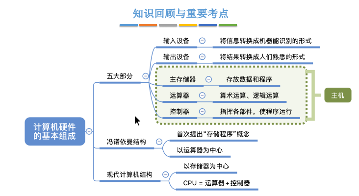
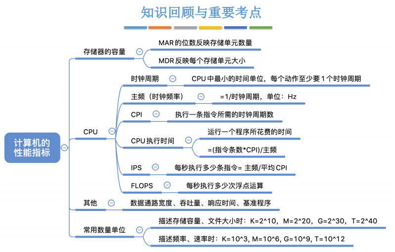
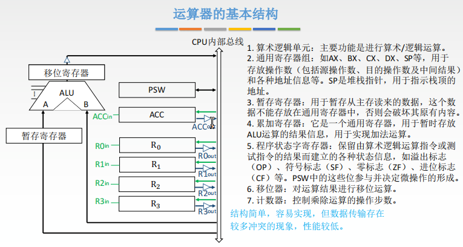
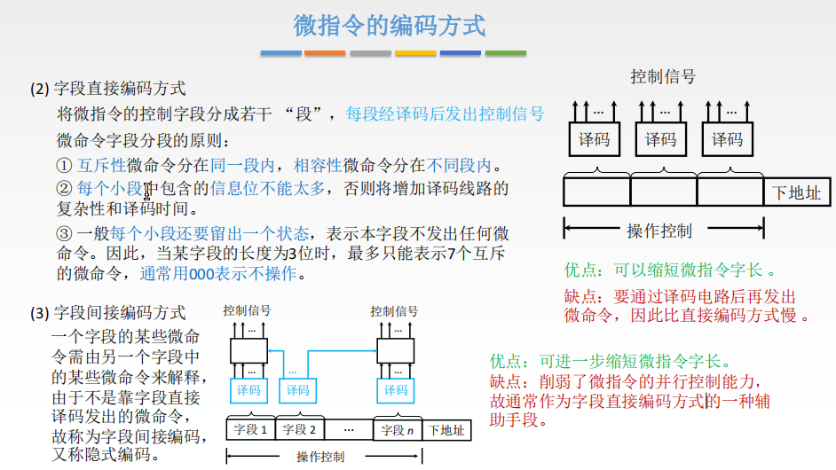
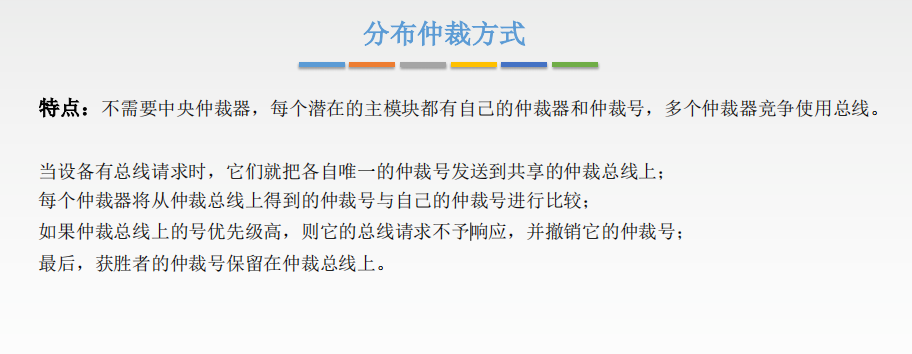
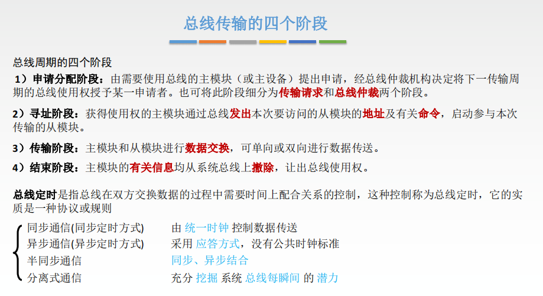
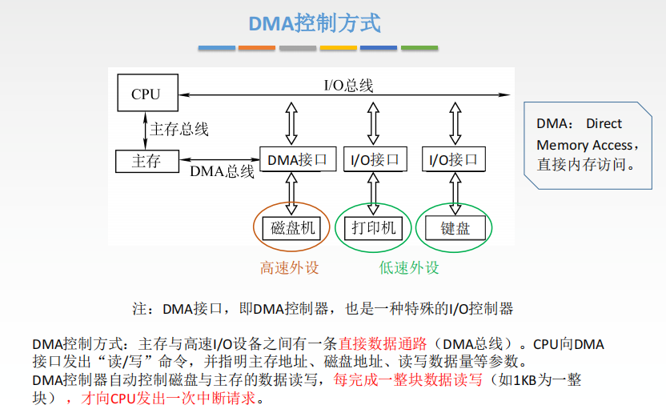
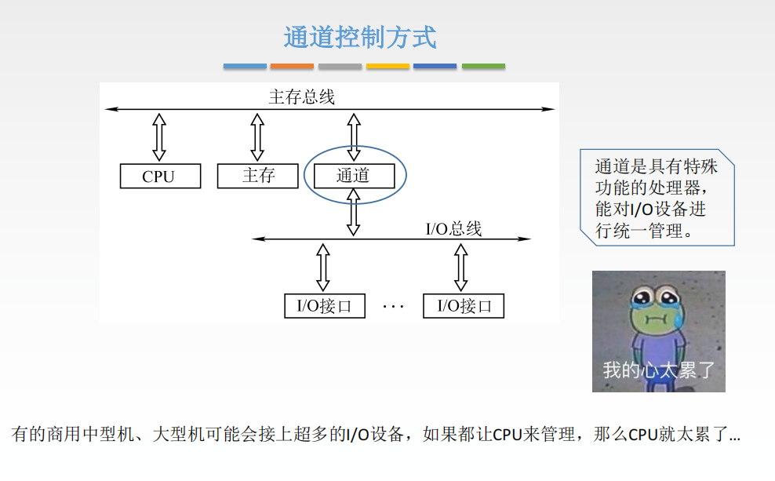
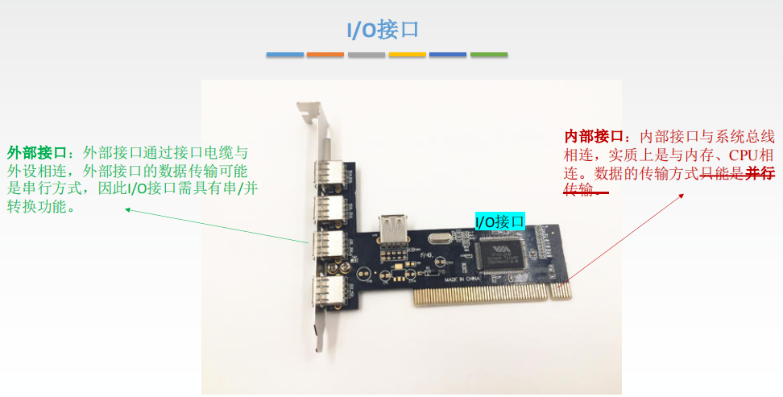
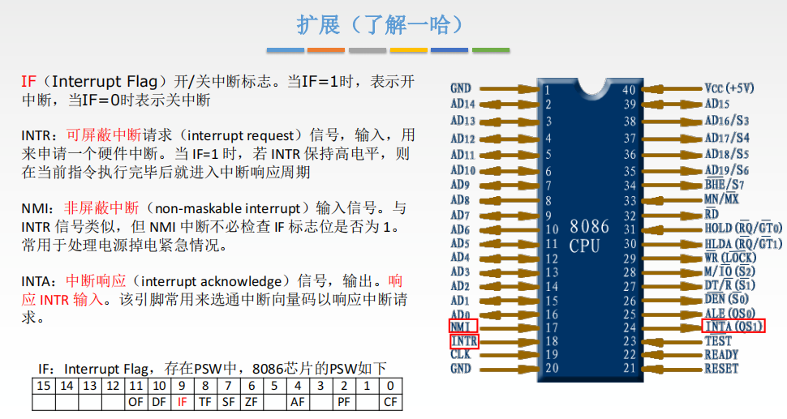

# 一、概览

**分数组成：**

- 选择题12-22，供22分
- 大题43-44，共23分

## 发展历程

​		**计算机系统 = 硬件 + 软件。**

​		硬件的发展历程：电子管、晶体管、中小规模集成电路（出现分时OS）、大规模集成电路。

## 硬件发展

**冯诺依曼结构**

​		**五大部件组成，以运算器为中心，存储程序。**

- 指令与数据同等地位存储
- 指令与数据用二进制表示
- 指令由操作码和地址码组成
- 存储程序
- 以运算器为中心

**现代结构**

​		**以存储器为中心。**

- CPU = 运算器（ALU）+控制器（CU）
- 主机由CPU与存储器构成（外存属于外设）

## 硬件分工

术语：

- **机器字长：**
- **存储字长：**存储单元中二进制的位数
- **存储元：**存储二进制的电子元件，每个存储元可存1bit
- **按字节编址：**每一个字节数据整体有一个地址

## 层次结构

​		**计算机体系结构：**如何设计硬件与软件之间的接口。

​		**计算机组成原理：**如何用硬件实现所定义的接口。

## 性能指标

- 基准程序执行得越快并不能说明机器性能越好，因为其中语句频度存在差异
- 主频高也不一定更好，因为 **IPS=主频/CPI**。
- 数据单位：K、M、G、T、P、E、Z

# 二、计算篇

# 三、存储篇

## 概览

### 层次

### 分类

**是否可被CPU读写：**

- 高速缓存、主存
- 辅存

**存储介质：**

- 半导体
- 磁介质
- 光存储

**存取方式：**

- 相联存储器（CAM）
  - 可按内容检索到存取位置进行读写（如快表）
- 随机存储器（RAM）
  - 读写时间与读写单元无关
- 顺序存储器（SAM）
  - 读写时间与读写单元有关，磁带
- 直接存储器（DAM）
  - 既随机、又顺序，磁盘。

**信息的可更改性：**

- 读写存储器
- 只读存储器

**信息的可保存性：**

- 断电
  - 丢失
  - 不丢失
- 读出
  - 破坏性
  - 非破坏性

### 性能指标

- 存储容量、单位成本（每bit价格）...
- 传输率
  - 数据宽度(存储字长) / 存储周期
- 主存带宽
  - 每秒从主存进出信息的最大数量
- 存储周期
  - 进行一次完整的读写操作所需的全部时间，等于：存取时间 + 恢复时间

## 主存

### 组成

> 存储元 -->存储单位(存储字) --> 存储体
>
> **如上图，DRAM存储元中的主要部分是一个电容器，所以每次读出后释放电荷，会导致信息丢失，所以需要刷新。**

> 一个内存条可能有若干的芯片，一个芯片就是一个存储体，当需要读取一个存储单元时，接通该芯片的片选信号，同时由译码器译码MAR的地址，接通某一个存储单元的电路。

### 连接

​		**当数据总线宽度大于存储芯片字长——位扩展。**

​		**当主存的字数不够用时，想要扩展字数——字扩展。**

​		**低位用于传送行列地址，高位用于选片，直接用高位信号选片，叫做线选法。译码后再选叫做译码片选法。**

### 提速

**1.双端口RAM**

​		对外暴露两个端口，可以优化多核CPU访问一根内存条的速度。但就必然会出现：两个端口同时对一块内存进行读写。

​		解决办法是，增加一个”忙“信号，冲突时有逻辑判断暂时关闭一个端口。

**2.多模块存储**

​		 增加模块数量，并行访问，同样也能提速，这样就需要有标志来声明并判别存储单元在哪个存储体中，对应的编码方式有：**高位交叉编址、低位交叉编址**。

​		由于地址多是连续的，所以采用低位交叉编址，可以达到流水线的作用。

**3.单体多字**

​		扩大每个存储单元存储的长度，同时也扩大总线宽度，一次多读出几个字，也能达到提速目的。

## RAM

### 分类

- DRAM，动态RAM，使用栅极电容存储
- SRAM，静态RAM，使用双稳态触发器存储

### DRAM

​		由于栅极电容时间的流逝和数据读出都会造成数据丢失，所以需要隔段时间加电进行刷新，并且每次读出后也需要重新写入。

- 一个单元一个单元刷新不太可能，所以刷新单位是行，并且分成行列之后可有效减少地址线数量。
- 集中刷新、异步刷新都会有死时间。
- **刷新有存储器独立完成，不需要CPU控制**

## ROM

### 分类

- M，生产时写好，之后不可写
- P，只可写一次
- EP，可多次重写
- UV，紫外线照射可擦除（全部信息）
- EEP，电擦除（特定字）
- **Flash，存储元为Mos管，位密度比RAM高，可多次快速擦（U盘、SD卡）**
- SSD，固态硬盘（控制单元+Flash芯片）。

> SSD是基于闪存技术的存储器，与U盘无本质区别，由若干闪存芯片和闪存翻译层组成。
> 
> 一个闪存通常有若干块，每块有若干页。只有每一页所在的整个块被擦除后，才能写这个页，一个块被擦除后，里面的页都可再写一次，一个块可写约10W次。
> 
> 随机写很慢，有两个原因：①擦除块很慢，比访问页慢一个数量级（1ms级）②若要写已有数据的页，那么整个块都要被先复制到另一个新的擦除过的块中
> 
> 由半导体存储器构成，没有机械移动设备，所以比机械硬盘快，但容易磨损，不过闪存翻译层会将擦除平均分配到每个块中，因此也没有想象中很快损坏。

## Cache

### 概述

​		**Cache的访问策略有两种：同时访问Cache与主存、先访问Cache与主存。**

​		若Cache速度与主存差很多，则是否同时则不重要，若Cache与主存相差不大，则非同时访问需要多等一个Cache时间。

​		**Cache与主存之间交换单位为"块"，也可称为"行"，在OS中也成为”页/页面/页框“。**

### 映射方式

​		**块长/行长决定了块内地址的位数（当然还要看编址方式，如按字节编址），主存空间大小决定了主存有多少行/块。**

**1.全相联映射**

​		随便放，不存在有空位放不下的情况。

​		**优点：利用率高、命中率高。**

​		**缺点：查找最慢，可能需要对比所有标记，可以用相联存储器进行优化（但是贵）**

**2.直接映射**

​		将主存空间映射到了一个更小的空间，相当于y=f(x)，但当Cache块数较多时，即值域较大，可能浪费空间，即有位置放不下，不过由于是多对一，所以不需要考虑替换算法。

​		**优化：因为是取模运算，所以标记中不需要再存储主存地址的行/块号，每一行/块的标记节省了m位，m为logn，n为块的数量，总共节省了n*logn的bit。（log要向上取整，不过一般块数都为2的倍数）**

​		**优点：速度最快，只需对比一个标记。**

​		**缺点：空间利用不充分，命中率低。**

**3.多路组相联映射**

​		**优化：分组再映射，相当于缩小了值域，增加了利用空间。同样的每个标记节省了m位，m为logk，k为组的数量，总共节省了n*logk的bit。（显然这里节省了的bit数没有直接映射节省的多）**

​		**优点：两种方式折中，速度、空间利用率兼具。**

### 替换算法

**1.RAND**

​		满了之后随机选择一块进行替换，实现简单，但没考虑局部性原理，效果不稳定。

**2.FIFO**

​		先进先出，实现也很简单，但没考虑时间局部性原理，最开始进入的也可能是目前使用使用频繁的，且频繁的换入换出可能会造成抖动现象。

**3.LRU**

​		设置计数器，满的时候替换掉计数最大的块。

​		**命中：计数清零，其它计数器加1.**

​		**未命中：不论是否新装入，访问块计数置0，其余加1。**

​		优化：计数器的值若没有上限，则需要的二进制位可能很多，故每次不能盲目的加1，考虑到最高次数的加1也没有用，所以每次命中时就只对比命中块计数小的块加1，这样依然能保持”相对位置不变“，淘汰时若有计数相同的块，则可以用FIFO，或者RAND淘汰。

​		**优化后，计数器就只需要m位即可，m为log2n，n为总块数**。因为考虑使其加1的情况，仅可能是新块装入内存时才会使最大值加一，所以最大值只可能加到2${^m}$-1

​		**LRU虽然优秀，仍有可能会产生抖动，当频繁访问的块（即OS中的工作集）大于Cache的块数时，也会频繁换入换出。**

**4.LFU**

​		每使用一次对其计数+1，每次淘汰计数最小的块。看似合理，不过可能导致某些块长时间不会出去 ，如以前频繁使用过，但之后不会再使用了，但目前其计数很大，导致相当长的一段时间内不会被替换出去，而且计数器无上限，可能增长到很大，需要很多二进制位。

### 写策略

**写命中**

**1.写回法（回写法）**

​		只修改Cache内容，设置脏位，替换会主存时，根据是否被修改过来决定是否同步到主存，未被修改过的话则直接将其覆盖。

**2.全写法（写直通法）**

​		修改完Cache改主存，可以采用写缓冲来解决速度不一致问题，但写过于频繁时可能会因缓冲区饱和而阻塞。

---

**写不命中**

**1.写分配法**

​		将主存块调入Cache。

**2.非写分配法**

​		只写主存，不调入Cache，只有读的时候才调入。

---

**搭配**

- **非写分配 + 全写法**，个人理解这个搭配没有那么侧重Cache，写不命中时也没有立即移入Cache，适用于二者差距不大的情况。
- **写分配 + 写回法**，个人理解这个搭配以Cache为主，读写时立即进入Cache，被替换时才同步，适用于二者差距大的情况。

> > 需要记录每一个Cache行的哪些消息？
> >
> > 有效位（1bit）、脏位（1bit，写回法）、标记（内存地址，可节省m位或k位）、替换算法计数位（LRU为log${_2}$n位）

> > **扩展**
> >
> > **Cache的不命中有哪些类型？**
> >
> > （1）强制性不命中（Compulsory Miss）
> >
> > ​		第一次访问一个块，该块不在Cache中，需要从下一级调入Cache。所以也称为冷启动不命中或首次启动不命中。
> >
> > （2）容量不命中（Capacity Miss）
> >
> > ​		如果程序执行所需的块不能全部调入Cache（工作集大于容量），则当某些块被调出后，之后再被访问就会出现不命中。
> >
> > （3）冲突不命中（Conflict Miss）
> >
> > ​		在组相联或者直接相联中，由于多个块被映射到同一行/组中，就会出现该组块被替换然后又被访问的现象。也成为碰撞不命中（Collision Miss）或干扰不命中（Interference Miss）。
> >
> > **如何提高Cache命中率？**
> >
> > ​		查阅资料数据知，强制性不命中率很小，其它运行时间较长的程序也是如此。冲突不命中的比率似乎很容易减少，增加相联度或者改成全相联即可（全相联的硬件成本较高，而且有可能降低处理器时钟频率，从而导致整体性能下降）。而容量不命中，只能是增加Cache容量。
> >
> > ​		三大不命中称为3C，下面给出一些降低不命中率的方法。
> >
> > （1）提高Cache块大小
> >
> > - 增强空间局部性，减少强制性不命中的几率。
> > - 提高了冲突不命中概率。
> > - 不命中开销增大
> >
> > （2）增加Cache容量
> >
> > - 简单粗暴，但会增加成本，还可能增加命中时间（命中也需要对比）
> > - 片外Cache使用较多
> >
> > （3）提高相联度
> >
> > - 8路的不命中率和全相联几乎一样，故没有必要用全相联
> > - 增加了命中时间
> >
> > （4）伪相联Cache（Pseudo Associate，又称列相联）
> >
> > - 既有多路的低不命中率，又保持了直接映像的命中速度
> > - 首先是按照直接相联进行访问，如果不命中，则检查另一个位置的块看是否匹配
> >   - 确认另一个块的简单方法是将索引字段的高位取反。
> >   - 故伪相联有一块一慢的两种命中时间，因此存在潜在的不足，故当出现伪命中时，就交换两个块的内容。
> > - 伪相联的多种命中时间会使CPU流水线设计复杂化，过多用于离CPU较远的Cache
> >
> > （5）硬件预取
> >
> > - 在处理器提出访存之前进行预取，预取内容可以直接放入Cache，也可放入比主存快的外部缓冲
> >
> > （6）编译器控制预取
> >
> > - 只有预取的同时处理器还能执行预取才有意义。这就要求Cache预取时还能提供数据，这种灵活的Cache称为非阻塞Cache或者非锁定Cache。
> > - 循环是预取优化的主要对象，但每次预取需要花费一条指令的开销，要保证开销不超过预取所带来收益
> >
> > （7）编译优化
> >
> > - 程序代码数据重组、内外循环交换、分块...
> >
> > （8）"牺牲"Cache
> >
> > - 在Cache和下一级存储器之间增设一个全相联的小Cache，专门用来存放被替换出去的块，因此称为”牺牲“Cache
> > - 仅仅在发生替换时起作用，可以有效降低冲突不命中率

## 操作系统

### 页式存储

​		对进程来说，逻辑上连续的页面其实是离散地存储在物理上的，所以就需要一个索引机构，来将逻辑页号转换为物理页号。

​		该索引机构就是页表，页表是结构化数据，每一条记录叫做页表项。页表在主存中（页表基地址寄存器指明了其存放地址），因而就需要进行访存，比较慢，所以引入快表（TLB），快表是一种相联存储器，可根据内容寻访。

### 虚拟存储器

​		

# 四、指令篇

## 指令格式

### 概述

​		指令（又称机器指令），指示计算机执行某种操作的命令**，计算机运行的最小功能单位**。

​		**一台计算机的所有指令的集合构成该机的指令系统，也称指令集。**

​		

### 分类

**按地址数分类**

**1.零地址指令**

- 不需要操作数
- 堆栈计算机，操作数隐含在栈顶和次栈顶

**2.一地址指令**

- 单操作数
- 双操作数，另一个隐含在某个寄存器

**3.二地址指令**

- 目的数、源操作数

**4.三地址指令**

- 操作数1、操作数2、目的数

**5.四地址指令**

- 操作数1、操作数2、目的数、下址

---

**按指令长度分类**

**1.定长操作码**

- 电路简单、灵活性低

**2.可变长操作码**

- 译码电路设计复杂、灵活性高

---

**按操作类型分类**

**1.数据传送类**

**2.算数逻辑类**

**3.移位操作**

**4.转移操作**

**5.输入输出类**

### 扩展

​		当指令定长时，可以通过扩展操作码来丰富指令种类。

​		**哈夫曼编码，较频繁指令采用较短指令，上一层留出m种状态，本层还有n个地址位，则可扩展m*2${^n}$种状态（注意下图三地址码和一操作码是一种东西）**

## 指令寻址

​		指令寻址：寻找下一条欲执行指令的地址（始终由程序计数器PC给出）

### 顺序寻址

​		取指周期取指完成后，PC会进行自动加一（由CPU控制）。这个加一是指加一个指令字长，指向下一条指令的首地址。

​		若采用定长指令字结构，每次加的值固定，若采用不定长，则需要加一个当前执行指令长度。

### 跳跃寻址

​		转移类指令会导致PC值改变，进而改变程序执行流。

## 数据寻址

### 数据寻址（一）

​		第一类寻址，一般将指令中的地址码叫做形式地址，真正的地址叫做有效地址EA（Effective Address），方括号/圆括号表示取出该地址中的内容，如：[EA]表示取出有效的操作数。

> > 寄存器介绍：
> >
> > x86处理器中有8个32位通用寄存器，为了向后兼容，EAX、EBX、ECX、EDX的高低各两位字节可以独立使用（E表示Extended）。
> >
> > 例如EAX的低两个字节称为AX，而AX的高低两个字节有可分别作为两个8位寄存器，分别称为AH和AL。
> >
> > 即：EAX：8位、8位、AX（AH、AL）
> >
> > 其它四个分别是：
> >
> > ESI、EDI（变址寄存器，S、D分别表示Source和Target，I表示Index）
> >
> > EBP、ESP（堆栈指针，B和S分别表示Base和Stack，P表示Pointer）

> > 汇编指令格式：
> >
> > 一般的汇编有两种格式：AT&T、Intel格式
> >
> > 区别：
> >
> > 1. AT&T（以下缩写A）只能小写，Intel（以下缩写I）大小写都行。
> > 2. A的格式：Source、Target；I的格式：Target、Source（即源操作数、目的操作数）。
> > 3. A中寄存器需要加前缀%，立即数需要加前缀$；I都不需要加。
> > 4. 内存寻址，A使用()，I使用[]
> > 5. ......

#### 直接寻址

- 优点：只需1次访存（大概率命中Cache）
- 缺点：地址码限制了寻址范围

#### 间接寻址

- 优点：扩大了寻址范围
- 缺点：增加了访存次数，可能需要多次间址

#### 寄存器寻址

- 优点：不需访存
- 缺点：寄存器较昂贵，数量较少

#### 寄存器间接寻址

- 寄存器存储的是内存单元的地址
- 特点：比一般间接寻址速度更快，但仍需访存

#### 隐含寻址

- 指令中暗含着操作数的地址
- 优点：有利于缩短指令字长
- 缺点：需要增加存储操作数或隐含地址的硬件

#### 立即寻址

- 优点：不需访存，指令执行时间最短
- 缺点：地址码位数限制了立即数的范围

- 注意：一次指令的整个执行流程，至少有一次访存，就是取指阶段，要与指令执行阶段的访存次数区分开。

### 数据寻址（二）

​		第二类，偏址寻址，以下偏址寻址，区别在于偏移的"起点"不同。

#### 基址寻址

​		EA等于基址寄存器中的内容加上偏移量，**基址寄存器由操作系统控制**，对一般程序员透明，操作系统程序员可见，当采用通用寄存器作为基址寄存器时，**可由用户决定哪个寄存器作为基址寄存器，但其内容仍由OS确定，EA=（BA）+A。**

- **优点**：可扩大寻址范围，用户不必考虑自己的程序位于主存哪一空间区域，**便于程序浮动（整段程序在内存里浮动），方便实现多道程序并发运行。**

​		

#### 变址寻址

​		地址码部分作为基地址，IX中存储偏移量，通过改变IX中的内容，可以编写循环程序。

- 优点：适合编制循环程序。

#### 相对寻址

​		A是相对PC当前位置的偏移量（PC当前指向下一条指令），所以地址码部分是相对**下一条指令的偏移量。**

- **优点：便于代码浮动（前面的基址寻址的浮动是整段程序/在OS中可广义理解为进程，这里的浮动是代码段在程序里的浮动，比如for循环在程序内浮动），广泛应用于转移指令。**

### 数据寻址（三）

#### 堆栈寻址

​		根据堆栈实现方式，**可分为硬堆栈和软堆栈**。软堆栈大部分时候，栈从高内存区向低内存区扩展，注意题目的SP是指向栈顶元素，还是待插入元素位置。

​		**注意与隐含寻址相区分。**

- **优点：可有效缩短指令长度**

​		考试总共考这十种寻址方式，注意区分：

- 基址与变址（一个OS管控，一个程序员可见）
- 隐含和堆栈（隐含可能在ACC，堆栈是在软/硬堆栈中）
- 立即与直接（字面相近）

## CISC和RISC

重要区别：

- 访存指令，RISC只有特定指令可以访存
- 寄存器数量，RISC较多。 
- 编译优化，RISC因为细粒度比较小，所以方便优化

# 五、控制篇

## 基本结构

### 功能

​		**CPU = CU + ALU**，即控制器加运算器。

所以需要实现两个部件的功能，主要为控制和运算。

控制分为：

- 指令控制
- 操作控制
- 时间控制
- 中断处理

运算分为：

- 数据加工

### 数据通路

### 运算器

### 控制器

## 数据流

### 指令周期

- **时钟周期：**最基本单位，也叫节拍、T周期，CPI中的C即Clock
- **机器周期：**也称CPU周期，因为存取时间较长，通常根据存取周期来设定。
- **指令周期：**取出并执行一条指令所需的全部时间。

​		**指令周期分为四阶段：FE、IND、EX、INT，每个阶段都会有访存。**

​		FE（Fetch）：取指令

​		IND（INDirect）：取有效地址EA

​		Ex（Excute）：取操作数

​		Int（Interrupt）：保存程序断点

​		一个指令的执行通常需要多个步骤，因此有多种执行方案。

- 单指令周期：所有指令的执行时间相同
- 多指令周期：指令周期不同，指令之间串行。
- 流水线方案：每个**时钟周期**启动一条指令。

### 取指周期

​		注意：取完指令后MDR中也有一份指令；PC加一是在CU控制下完成的。

### 间址周期

​		由于MDR中也有指令，所以根据MDR或者IR中数据的地址码部分来取有效地址均可。

### 中断周期

​		注意：一般是先改指针，后存数据。

## 数据通路

​		**数据在功能部件之间流经的路径叫做数据通路，包括部件。分为：CPU内部单总线、CPU内部多总线、专用数据通路。**

​		内部总线指的是同一部件，系统总线指的是同一台计算机系统的各部件。

### 单总线结构

​		ALU本身是没有存储功能的，所以需要配合暂存器使用。

### 专用数据通路

## 控制器

- 微命令：CU每发出一个微命令，可完成对应的微操作，可在一个节拍内共同完成的微命令称为”相容“的微命令。
- 微程序：每一种指令即一个微程序，每个微程序对应多个微指令，每个微指令可能发出多个微命令。

### 硬布线

​		**根据OP码、当前的机器周期（根据FE、IND等寄存器内容定位）、节拍信号、机器状态条件（PSW、ACC等）可确定当前节拍发出哪些微命令。**

​		硬布线需要考虑每个指令、每个周期会使用到的微操作，然后写出逻辑表达式（此过程通常称为前端设计）。

​		紧接着根据逻辑表达式进行电路设计（使用与或门、芯片等完成）

大致可总结为三个步骤：

1. 列出操作时间表
2. 写出微操作命令的最简表达式
3. 画出逻辑图

微操作序列的时序设计有三原则：

1. 先后顺序不得随意更改
2. 被控对象不同的微操作，尽量安排在一个节拍内完成
3. 时间较短的微操作，尽量安排在一个节拍内完成

---

**时序安排**

**写表达式**

​		可作图帮助写出表达式，列头为各个指令，行头为某一节拍下的微操作。

**画逻辑图**

优点：

- 执行速度快，一般用于RISC

缺点：

- 硬布线基本就”写死了“，扩充指令较困难，实现较复杂

### 微程序

​		在微程序实现的CU内部，也包含着类似CPU这个整体的结构，MAR、MDR、寄存器、PC等结构。

​		虽然名字只是多了个C，但每个部件都相当于”降级“了。

- CMDR（也称uIR）存储着正在执行的微指令

- CMAR（也称uPC），接受微地址形成部件送过来的地址

- CM（控存），用于存放微程序，因为指令集是固定的，所以使用ROM存储，构成微程序的微指令可以不连续存储

  

  **注意：FE、EX周期看起来像是执行的两个微程序，但从整体看，他们都归属于一个指令，所以”一条指令对应一个微程序“也对**

---

​		**微指令根据在此指令内”塞入“的微操作数量，分为：水平型、垂直型、混合型。**

**水平型**

​		在根据OP码发出多个相容的微操作，具体类似于主存芯片扩容（字扩展）时的线选法和译码片选法，分为**直接编码、字段直接编码、字段间接编码**。

- **直接编码**
  - 简单直观
  - 微指令字长过长，n个微命令需要n位
- **字段直接编码**
  - 有效缩短微指令字长，n位可发出2$^n$个微命令
  - 需要增加译码电路，增大硬件成本，且速度变慢
- **字段间接编码**
  - 进一步缩短微指令字长

---

​		**同样，类比CPU执行指令的方式：顺序流+转移指令，微指令执行也需要一个执行顺序。**

- **断定方式**
  - 直接由上一条微指令的下地址字段给出
- **由指令的OP确定**
  - 当指令取至IR后，其微指令地址由微指令地址生成部件形成。
- **增量计数器法**
  - 类比PC+1，（CMAR）+  1 --> CMAR
- **分支转移**
  - 同机器指令的转移，分为无条件、条件转移
- **通过测试网络**
- **由硬件产生微程序入口地址**
  - 第一条微指令
  - 中断周期的微程序首地址

​		测试网络的图片，来自网络。

---

​		**微程序控制CU的设计步骤：**

1. 分析各阶段微操作序列
2. 安排每个指令对应的微操作指令
3. 安排每个节拍对应的微命令
4. 确定格式，安排码点

​		**微程序的设计还可分为静态和动态**

- **静态**，采用ROM，微程序无需改变
- **动态**，采用RPROM，可擦除，有利于仿真

> > 类似于用微指令细化指令，当微指令过于庞大时，还可以用毫微指令来细化微指令。

---

优点：

- 指令规整、易扩充修改、一般用于CISC

缺点：

- 软件实现，相较于硬布线的硬件实现，速度较慢

比较：

## 流水线

​		**传统的冯诺依曼机采用顺序执行方式，又称串行执行方式**，控制简单，硬件代价小，但是任何时刻处理机中只有一条指令在执行，各功能部件利用率很低。

​		可从两方面提高处理机的并行性，**①时间，同一时刻执行多个任务，称为指令流水线；②空间，处理机内设置多个执行相同任务的功能部件，称为超标量处理机（详见后面多发技术）**

### 性能指标

**吞吐率**

**加速比**

**效率**

### 影响因素

**1.结构相关（资源冲突）**

**2.数据相关**

1. 暂停几个时钟周期：**硬件阻塞（Stall）和软件插入（NOP）**（资源冲突一般只需暂停一个周期）
2. **数据旁路**：在两个部件之间搭建专有的数据通路，被依赖的指令计算完成，通过旁路立即输送到依赖它的指令。
3. **编译优化：**编译器调整指令顺序。

​		**A表示After，RAR因为没有数据覆盖所以不存在冲突。**

**3.控制相关**

​		根本诉求是快速进入转移条件的判别，尽早生成目标地址，所以可以进行转移条件的预测，两种预测：写死猜True或Flase、统计得来

---

### 分类

**使用级别**

- 部件功能级
- 处理机级
- 处理器间

**完成功能**

- 单功能
- 多功能

**连接方式**

- 静态
- 动态：

**有无反馈信号**

- 线性
- 非线性

### 多发技术

**超标量流水线**（堆机器）

**超流水线**（编译优化，加大剥削力度）

​		"压榨员工休息时间"

**超长指令字**（编译优化，挖掘员工潜力）

​		"发现两个员工之间合作效率更高，部门优化"

# 六、总线篇

## 概述

### 特性

​		具体每个特性干什么见计网

- 机械
- 电气
- 功能
- 时间

### 分类

**传输方式**

- **串行：**传输线少，成本低廉，串并行转换问题
- **并行：**总线时序简单，线间有干扰

**连接部件**

- **片内：**芯片内部
- **系统：**计算机系统部件之间
- **通信：**计算机系统之间

**时序方式**

- **同步**
- **异步**

### 结构

**单总线**

- 结构简单
- 负载重、冲突多、不支持并发

**双总线**

- 将低速IO分离出去，但需要增加通道等设备

**三总线**

- 工作效率低

**四总线**

- 北桥：桥接高速设备
- 南桥：桥接低速设备

### 性能指标

## 仲裁

### 集中仲裁

​		所有的设备想用总线都由大哥哥（总线控制部件）分配。

​		**【总线忙信号是由获得控制权的设备发出的】**

**1.链式查询**

​		院子里的一群孩子想玩游戏机，大哥哥每次都从年龄大问到年龄小的（或者关系好的先问），但类似于串联电路，上游坏了，下游全都不能工作。

- **优点：优先级固定，实现简单**
- **缺点：对故障敏感，优先级低可能饥饿**

**2.计数器定时查询**

​		类似于以太网中的令牌环，大哥哥不再是从年龄大问到年龄小，而是轮流着问，上次一号第一，下次它就最后。

​		三根线：BR、BS、设备地址线，需要总线时，发送BR，如果设备地址线与本设备相同，则IO接口可将BS置为总线忙。

- **优点：故障不敏感、可改变优先次序**
- **缺点：增加了控制线数量（n个设备，需要logn位）**

**3.独立请求**

 		每个人都有大哥哥微信，可以单独联系大哥哥，多个人联系大哥哥时，由大哥哥自己决定将游戏机给谁。

- **优点：响应速度快，信号不用在设备之间传递、优先级控制很灵活**
- **缺点：控制线多（n个设备需要2n+1条线，BR和BG一个是请求，一个是响应/允许，BS是总线忙）**

### 分布仲裁

---

## 操作

​		**总线定时，本质上还是一种协议或规则。**

### 同步

​		总线控制器通常跟CPU时钟相同，在规定时间内没响应，就寄了，所以没有足够的时间进行有效位校验。

- **优点：简单**
- **缺点：强制性同步、但不能及时进行通信的有效校验**

### 异步

​		类比计算机网络，如果不需要进行同步，就是两个无关联的通信方，如何保证可靠，所以就需要引入确定机制。

​		学过计网就知道，确认也不能保证完全可靠，可能要一遍又一遍去确认对方的确认，所以就分为三种类型：**不互锁、半互锁、全互锁**（这里的锁不同于我们在讨论并发时对资源加的锁。）

- **不互锁：**不需要等待响应
- **半互锁：**需要等待响应
- **全互锁：**需要等待响应、需要等待响应的响应

- **优点：可兼容两个速度差距比较大设备**
- **缺点：变复杂了、速度比同步慢**

### 半同步

### 分离式

​		从模块准备数据时，主动放弃总线，提高了总线的利用率，使用时还是同步通信，不用等待对方回答。

## 标准

​		**系统总线：连接CPU与北桥芯片、CPU与主存等**

​		**局部芯片：未直接与CPU相连、连接北桥与重要设备**

​		**设备、通信总线：由南桥芯片控制，连接计算机与外部设备**

### 系统

**并行：**

1. **ISA**，工业标准架构
2. **EISA**，扩展为32bit，并且向下兼容，速度有限，被PCI取代

**串行：**

1. **FBS、QPI**

### 局部

**并行：**

1. **VESA**，视频电子标准架构，由CPU总线演化而来，传输活动图像的大量数据
2. **PCI**，周边组件互联
   - 高性能、支持突发传送
   - 提供数据奇偶校验
3. **AGP**，加速图形接口，显卡专用局部总线

**串行：**

1. **PCI-E**，巅峰之作。
   - 全双工、热插拔

### 设备

1. **RS-232C**，建议标准。
2. **SCSI**，小型计算机系统接口。
3. **PCMCIA**，个人电脑存储卡国际组织。
4. **USB，**巅峰之作，串行
   - 热插拔
   - 扩展性好，可链式连接127个外设
   - 差模信号传输，两根信号线
   - 双绞线绑在一起，抗干扰
5. **IDE（ATA）**，电子集成驱动器，硬盘光驱接口
6. **SATA**，串行ATA

> > Linux中硬盘文件
> >
> > 前两个字母：hd文件就表示是IDE接口硬盘，sd表示SCSI硬盘
> >
> > 第三个字母：表示第几块硬盘，如hda表示第一块hd硬盘
> >
> > 数字：表示硬盘分区的次序
> >
> > 从而hdb2就表示第二块IDE硬盘的第2个分区

> > 趋势上是 串行  到 并行  到 串行
> >
> > 因为并行之间存在线间干扰，速度不能过高，而且通常采用同步定时方式，各条线不能有长度差，长距离传输难。

# 七、外设篇

## 概述

​		**IO系统由IO硬件和IO软件组成**

### IO硬件

- 外设
- IO接口
- IO总线

### IO软件

- 驱动程序
- 用户程序
- 管理程序
- 升级补丁

## 控制方式

​		因为这些东西比较重要，所以每一个另设一个二级标题去详细讨论。

### 程序查询

- **CPU与IO串行工作**
- **只能和一台外设交换信息**
- 接口设计简单、设备量少

### 程序中断

- 设备发出中断信号

### DMA

- 以块为单位进行读写，读满一个块发出中断

### 通道

- 启动时，CPU告诉通道，通道程序的地址（通道程序在内存中）
- 通道执行完任务发出中断

## 外部设备

### 输入

​		键盘、鼠标，显示汉字可以采用点阵字库，如每个汉字采用16*16的点阵，则该点阵有256个元素，每个元素有0/1两种可能，即需要256个bit来表示一个汉字，即32B，若有7500个汉字，咋需要240KB的字库。

### 输出

​		显示器分为：阴极射线管（CRT）、液晶（LCD）、LED

​		**主要考点是：VRAM，带宽=像素点个数 * 灰度级 \* 帧频率，然后计算带宽容量之类的操作。**

​		集成显卡计算机，通常分配一片内存作为显存。

​		**打印机分为：击打式、非击打式（按打字原理）**

​		非击打式速度更快，但由于击打式是造成的物理凹陷，具有防伪性，所以还有很大的应用场景。

​		**打印机还可分为：针式、喷墨、激光（按工作方式）**

### 外存

---

**机械硬盘**

	

- **每个磁道的每个扇区存储的数据量是一样的，意味着越小的圆存储位密度越大。**
- **面密度是位密度（平均）和道密度的乘积**

- **硬盘属于机械式部件，串行读写。**
- **因为旋转需要一定时间，所以连续的扇区都是间隔式分布的（见OS）**

---

**磁盘阵列（RAID）**

​		RAID（廉价冗余磁盘阵列），分多个等级，等级越高容错性越好，冗余率越低。

- RAID0：无冗余无校验
- RAID1：镜像冗余
- RAID2：海明码校验
  - 逻辑上连续的几个bit分散在各个盘中，然后配上海明码校验
  - 磁盘越多，冗余率越低

---

**光盘**

- **CD-RW/CD-R**，后面的RW代表读写
- **CD-ROM，**不可修改

## IO接口

​		**IO接口，**又称IO控制器，设备控制器，是主机与外设之间的交接界面。

### 作用

- 地址译码、设备选择
- 主机与外设的通信联络控制
- 数据缓冲
- 信号格式转换（串并格式）
- 错误和状态检测

### 结构

- 状态寄存器和控制寄存器是时间上是错开的，所以可以合二为一，但**二者传送方向是相反的**
- 对数据缓存寄存器、状态/控制寄存器的访问是通过相应的指令（**IO指令**）完成的，只能由内核底层的IO软件使用（**特权指令**）
- IO接口可根据外部接口的数据传送方式分为串行或并行（注：内部接口总是并行的）

### IO端口

​		**IO端口是IO接口中可被CPU直接访问的寄存器**

- 端口和接口是不同的，接口是端口加上控制逻辑，从英文看更好理解

**统一编址**

- 不需要专门的IO指令，但速度慢
- 从地址码上区分是访存指令还是IO的指令

**独立编址**

- 需要专门的IO指令
- 无法从地址码上区分IO指令
- 需要增设IO读写控制线

## 中断系统

​		**程序中断是指计算机在执行程序的过程中，出现某些需要处理的异常或特殊请求，CPU暂时中止现行程序，转而去处理哪些异常情况或特殊请求**

- **实现CPU与设备并行**
- 处理硬件与软件故障
- 人机交互、多道程序切换
- **OS的目态与管态的切换**
- **多处理器系统处理器之间的交流与任务切换**

**内中断（Exception，来自CPU内部，与当前执行指令有关）**

- **陷入（trap）**，访管指令
- **故障（fault）**，硬件故障（缺页）
- **异常、终止（abort）**，如整数除0，浮点数上溢（下溢不会）

> 异常有时指Exception，即内中断，有时又指abort，发生不可挽回的错误

**外中断（Interuption，来自CPU外部，与当前执行指令无关）**

- 狭义的中断
- 外设请求
- 人工干预

---

**外部中断又分为可屏蔽中断和不可屏蔽中断**

**可屏蔽中断**

- **INTR线发出**

**不可屏蔽中断**

- **NMI线发出**
- 如断电（来自CPU外部，即电源，区别于重新启动，重新启动优先级很低，要等待所有任务都完成）

> > 易错点：
> >
> > 用户需要IO时，引起的中断是访管中断，不是IO中断，因为IO是由操作系统内核管理的

### 工作流程

1. **中断请求**
   - 中断系统对每个中断源设置请求标记触发器，这些触发器组成**中断请求标记寄存器**
   - 该寄存器可集中在CPU，也可分散在各个中断源中
2. **中断响应判优**
   - **硬件排队器实现**
   - **不可屏蔽 > 内部异常 >可屏蔽**
   - **内部：硬件故障 > 软件中断**
   - DMA大于IO设备
   - 高速大于低速、输入大于输出
   - 中断优先级包括：**响应优先级和处理优先级，响应优先级在硬件线路固定不便改动，处理优先级可利用中断屏蔽技术动态调整**
3. **CPU响应条件**
   - 中断源有中断请求
   - **CPU允许中断及开中断（不可屏蔽中断和异常不受此影响）**
   - 一条指令执行完毕（异常不必满足）
4. **响应过程**
   - **中断隐指令 + 中断服务程序**
   - **①关中断**，在保存断点时，不能响应更高级别的中断
   - **②保存断点**，保存在栈或者特定寄存器中
   - **③引出中断服务程序**，识别中断源，并将其对应的服务程序入口送入PC，有两种方法：硬件向量法（也称向量中断）、软件查询法（也称非向量中断）
   - 前三步称为中断隐指令，由硬件自动完成
   - **④执行中断服务程序**，不同计算机处理各具特色。

> > **现场与断点**
> >
> > 现场信息因为用户可以直接访问，所以通常在中断服务程序中通过指令将它们保存到栈。
> >
> > 而断点信息是PC和PSW（MIPS没有PSW），指令不可访问，所以有中断隐指令保存到内存栈（MIPS保存PC到特定寄存器）

> > **向量中断**
> >
> > 每个中断有一个唯一的类型号，对应一个服务程序，其入口地址，称为中断向量，所有的中断向量存放在存储器某一块，这个存储区称为中断向量表。
> >
> > 所以在中断向量表中找中断向量也是一次寻址，中断向量的地址，即服务程序入口的地址的地址，要执行服务程序，将其入口地址送到PC即可，即将其中断向量送到PC即可。
> >
> > 响应中断后，识别中断源获得类型号，然后获得其中断向量地址，接着将其中断向量送至PC。

> > **中断服务程序**
> >
> > 各计算机各具特色，但大致步骤都差不多
> >
> > 1. 保存现场和屏蔽字
> > 2. 开中断（允许更高级别的中断进入，仅限多重终端系统）
> > 3. 执行程序
> > 4. 关中断（保证在恢复现场和屏蔽字时不被中断）
> > 5. 恢复现场和屏蔽字
> > 6. 开中断
> > 7. 中断返回
> >
> > 中断返回由中断程序的最后一条中断返回指令完成，非无条件转移指令，因不仅要修改PC，还要将CPU中的所有寄存器恢复之前的状态。
> >
> > 一次开关中断，就可以理解为一次锁，由硬件完成，用来解决资源的互斥问题，所以关后必有开。

### 单重中断

### 多重中断

中断屏蔽技术，主要用于多重中断，需满足：

- 在执行服务程序（将这个也理解成正常指令流）前开中断
- 优先级高的中断有权中断优先级低的中断的服务程序

- 每个中断源对应一个中断屏蔽字，1越多代表优先级越高，通常同类中断源不能相互中断

## DMA控制

​		**DMA方式是一种完全由硬件进行成组信息传送的控制方式**，它具有程序中断方式的优点，即在数据准备阶段，CPU与外设并行工作。

​		它适用于网卡、显卡、磁盘等高速设备的传输，硬件开销比较大。

- 主存不再只有CPU可以访问
- 数据块传送时，主存地址的确定，传送数据的计数都有硬件电路实现
- 数据传输可以以单字节/字为基本单位，也可以以数据块为基本单位

### 组成

​		**对数据传送进行控制的硬件称为DMA控制器（DMA接口、DMAC）**，其中包括：

- **主存地址计数器（AR）**
- **传送长度计数器（WC）**
- 数据缓冲寄存器
- DMA请求触发器
- 控制/状态逻辑
- 中断机构

### 工作流程

- **预处理**（CPU控制）
  - CPU告诉AR主存起始地址
  - IO设备地址写入DAR
  - 数据个数写入WC
  - 启动IO设备
- **数据传送**
  - CPU继续执行主程序，DMA控制数据传输
  - DMAC接管CPU的地址、数据、控制总线，CPU的主存控制信号被禁用，所以DMAC必须具备控制系统总线的能力
- **后处理**
  - DMA发出中断，DUP执行中断服务程序结束处理
  - 包括校验数据正确性、测试传递过程是否出错（错误则转诊断程序）

> > **DMA与CPU访存冲突**
> >
> > 1. 停止CPU访存，总线控制权叫给DMAC
> > 2. 交替访存，适用于CPU工作周期大于存取周期，一个CPU工作周期内CPU只会访存一次，剩余的时间还有若干个存取周期，留给DMA使用
> > 3. 周期挪用
> >    - CPU正在访存，存取周期结束后，CPU让出总线占有权
> >    - CPU和DMA同时请求，CPU立即让出总线占有权，因为IO不立即访存可能丢失数据，此时IO挪用了若干个存取周期，之后立即放弃总线，是一种单字传送方式

---

**DMA与中断方式对比**

相同：

- CPU与外设均并行工作

不同：

- 数据传输串并行
  - 中断串行的
  - DMA并行的
- 数据传送
  - 中断由软件完成
  - DMA由硬件完成
- 请求部件
  - 中断请求的是CPU处理时间
  - DMA请求的是总线使用权
- 响应
  - 中断在一条指令执行完响应
  - DMA在一个总线事务完成后响应

