# 基本概念


## 交换方式

​		从通信资源的分配角度来看，交换就是按照某种方式动态地分配传输线路的资源。

### 电路交换

1. 通信时延小
2. 没有冲突，控制简单
3. 但难以规格化，灵活性差
4. 线路独占，使用效率低

步骤：

1. 建立连接（分配通信资源）
2. 通话
3. 释放连接


### 报文交换

1. 无需建立连接，动态分配线路
2. 缓存转发
3. 对报文长度无限制，需要有较大缓存空间
4. 有转发时延

### 分组交换

1. 无需建立连接，动态分配线路
2. 缓存转发
3. 报文分组，对分组长度有限制
4. 相比报文交换，减少了转发时延

 


## 性能指标

> > 注：在通信领域，K=10$^3$，M=10$^6$.

### 速率

单位：bit/s，bps（bit per second）

1M=10$^3$


### 带宽

​		信号所包含的各种不同频率成分所占据的频率范围，单位：Hz

​		**但在计网中表示单位时间内从网络中某一点到另一点所能通过的“最高数据率”，**个人理解就是水管的”横截面“，单位b/s


### 吞吐量

​		单位时间内通过某个网络的数据量，吞吐量受网络的带宽或额定速率的限制


### 时延

1. 发送时延：源主机将分组发往传输线路所需的时间。

   - 公式：分组长度 / 发送速率
   - 发送速率受网卡、信道带宽、接口速率影响，取其中最小值（短板效应）

2. 传播时延：分组的电信号在链路上传输的时间。

   - 公式：信道长度(m) / 电磁波传播速率(m/s)
   - **电磁波在传播媒体中的速率比自由空间(3*10$^8$)中低，铜线：2.3，光纤：2.0**

3. 处理时延：路由器收到分组后，进行存储转发处理的时间。

   - **排队时延和处理时延有时合并称为处理时延**

   ​		由于网络传输过程中有多个节点，所以会有多个传播时延和处理时延，但只有一个发送时延。

   


### 时延带宽积

传播时延与带宽的乘积，用以形容传播比特的管道的”体积“


### 往返时间

简写为RTT（Round-Trip Time）,双向交互一次所需的时间。


### 利用率

1. 信道利用率
   - 表示某信道有百分之几的时间是被利用的（有数据通过）
2. 网络利用率
   - 全网络的信道利用率的加权平均

根据排队论，当某信道的利用率增大时，该信道引起的时延也会迅速增加，因此，信道利用率并非越高越好。


### 丢包率

在一定时间范围内，传输过程中丢失的分组数量与总分组数量的比率。

分为接口丢包率、节点丢包率、链路丢包率、路径丢包率、网络丢包率。

分组丢失情况：

1. 分组传输中出现误码，被结点丢弃。
2. 分组到达一台队列已满的分组交换机时被丢弃。

丢包率反映了网络的拥塞情况


## 体系结构

​		计算机网络是一个复杂的工程，所以采取分层来将许多复杂的问题拆解成简单的问题来解决。

​		每一层的实现称为“协议”，并对上一层提供服务，最下面的一层是第1层，最上面的是最顶层，直接与用户接触。


### 原理体系结构 5层

#### 物理层

解决问题：

1. 采用怎样的传输媒体、介质
2. 采用怎样的物理接口
3. 采用怎样的信号表示比特0/1
4. .....


#### 数据链路层

解决问题：

1. 如何标识网络中的各主机（主机编址问题，如MAC地址）
2. 如何从信号标识中区分地址和数据
3. .....


#### 网络层（路由选择）

解决问题：

1. 如何表示各网络以及网络中的各主机
2. 路由器如何转发分组，如何进行路由选择
3. ......


#### 运输层

解决问题：

1. 如何解决进程之间基于网络的通信问题
   - 如同一电脑中的浏览器和QQ的网络通信如何区分
2. 出现传输错误时，如何处理


#### 应用层

解决问题：

1. 通过应用进程间的交互来完成特定的网络应用
   - 不同协议制定以支持不同应用，如FTP，HTTP，SMTP


### TCP/IP体系结构 4层

​		因为TCP/IP中的网络接口层不太清晰，所以被原理体系结构重新拆分为了物理层与数据链路层。


​		网络层提供**无连接不可靠**的数据报服务


### OSI体系结构 7层

​		过分臃肿且效率低下，所以只适用于学术，被TCP/IP砍掉了表示层与会话层。

#### 会话层（对话管理）

解决问题：

1. 解决进程之间进行会话的问题，是传输层的进一步拓展

#### 表示层（数据格式转换）

解决问题：

1. 解决通信双方交换信息的表示问题


## 术语

### 实体

​	任何可发送或接受信息的**硬件或软件进程**


### 对等实体

​	收发双方相同层次中的实体


### 协议

​	控制两个对等实体进行逻辑通信的规则的集合

​	要素：

1. 语法
   - 定义所交换的信息的格式
2. 语义
   - 定义通信双方所要完成的操作
3. 同步
   - 定义双方的时序关系 


### 服务

​	在协议的控制下，两个对等实体间的逻辑通信使得本层能够向上一层提供服务。

​	要实现本层协议，还需要下面一层所提供的服务。

​	实体看得见相邻下层所提供的服务，但不知道也没必要知道该服务的具体协议，也就是说下面的协议对上面的实体是“透明”的。


### 协议数据单元

​	**PDU（Protocol Data Unit）**，对等层次之间传送的数据包称为该层的PDU。


### 服务数据单元

​	所需SDU，同一系统内，层与层之间交换的数据包。


### 通信/资源子网

​		计算机网络首先是一个通信网络，各计算机之间通过通信媒体、通信设备进行数字通信，在此基础上各计算机可以通过网络软件共享其它计算机上的硬件资源、软件资源和信息资源。

​		从计算机网络各组成部件的功能来看，各部件主要完成两种功能，即**网络通信、资源共享**。

***


​		把计算机网络中**实现网络通信功能的设备及其软件的集合称为网络的通信子网**，而把网络中**实现资源共享功能的设备及其软件的集合称为资源子网。**

​		**通信子网（核心部分）**，设计一般有两种方式：点到点通道，广播通道。网络通信协议、通信控制软件等属于通信子网，是**网络的内层，负责信息的传输，为用户提供数据的传输、转接、加工变换等**，常见有：

1. 中继器
2. 集线器
3. 网桥
4. 路由器
5. 网关等硬件设备

​		**资源子网（边缘部分）**，主要由网络的服务器、工作站、共享的打印机和其它设备及相关软件所组成，**资源子网的主体为网络的资源设备**。包括：

1. 用户计算机
2. 网络存储系统
3. 网络打印机
4. 独立运行的网络数据设备
5. 网络终端
6. 服务器
7. 网络上运行的各种软件资源
8. 数据资源等


#  物理层

## 基本概念

​		物理层考虑怎样才能在传输媒体上传输数据比特流。

- 机械特性：接线器形状和尺寸，引脚数目和排列......
- 电气特性：各条线上的电压范围
- 功能特性：某一电平的电压表示的意义
- 过程特性：可能事件的出现顺序


## 传输方式

### 串并行

1. 串行传输
   - 数据是一个比特一个比特的发送的
   - 用于远距离传输
2. 并行传输
   - 一次发送n个比特
   - 需要n条传输线路，成本高，用于计算机内部传输

### 同异步

1. 同步传输
   - 字节以固定时钟传输，但面临同步问题
   - 外同步：收发双方之间添加一条单独的时钟信号线
   - 内同步：发送端将时钟同步信号编码到发送数据中一起传输
2. 异步传输
   - 异步指字节之间异步（字节之间的时间不固定）
   - 字节中的每个比特仍要同步（每个比特持续时间相同）

### 单双工

1. 单工
   - 只有一个通信方向，如收音机。
2. 半双工
   - 有两个通信方向，但一个时刻只有一个通信方向，如对讲机。
3. 全双工
   - 可双向同时通信，如电话。

双工需要两条信道，每个方向各一条。

注：传输媒体≠信道，若是双工传输，则一个媒体中会有两个信道。


## 编码与调制


### 编码


1. 不归零编码
   - 即整个传输过程中不会出现零电平，如用高电平表示1，低电平表示0。
   - 但有多个相同的电平，如**多个0电平连续在一起时，无法判断有几个零电平**，所以需要多一条线路来传递时钟同步信号。
   - 但通信传输中，宁愿用信道来传输数据，而不愿用来传输时钟，所以一般很少用不归零编码。
2. 归零编码
   - **每个码元结束后都要“归零”**，所以接收方只要在信号归零后进行采样即可，不需要时钟来进行同步。
   - 实际上，**归零编码相当于把时钟信号编码到了数据之内，这称为“自同步”信号**。
   - **大部分数据带宽用来传递归零编码了，也降低了效率**。
3. 曼彻斯特编码
   - 每个码元的中间时刻都会产生信号的跳变。
   - **跳变既表示时钟，又表示数据**，因为向下跳变表示1，向上跳变表示0。
   - 传统以太网使用该编码方式
4. 差分曼彻斯特编码
   - **跳变仅表示时钟。**
   - 码元开始处电平是否发生变化表示数据，如开始时由高变为低或者由低变为高表示0，没发生变化延续上个码元的电平的话表示1。


### 调制

将数字信号/模拟信号，**转换为模拟信号**，在模拟信道中传输，称为调制。

指对信号源进行处理加到载波上，一般的调制方式为调频（FM），调相（PM），调幅（AM）


## 信道极限容量

​		在信号传输过程中，由于种种原因可能造成码元的失真。


​		为防止码元失真，**奈奎斯特提出奈氏准则**：


​		波特率：码元 / s

​		实际信道所能传输的最高速率，要明显低于奈氏准则给出的这个上线数值，具体公式由香农公式给出。


 


# 数据链路层

## 基本概念

​		数据链路层分为：**逻辑链路控制层、媒介访问控制层**

​		数据链路层信道分为：**点对点信道、广播信道**

### 封装成帧

​		数据链路层将在协议数据单元（PDU）的首部和尾部添加字段，以将其构成帧，对SDU中和帧首部相同的字节，将会对其进行转义。

### 差错检测

​		在帧首部中，会有一部分字节来表示纠错码，以判断数据传输中是否出错，一般采用循环冗余校验码。

​		若发现数据传输中出现误码，则会将该帧丢弃

### 透明传输

​		


## 封装成帧

### 概念


​		因为多个帧在信道中传输是连续的，**所以需要标志来区分每个帧，大部分协议的帧头和帧尾的作用就是帧定界，但部分协议例外。**

​		如以太网V2协议，它区分帧的方法是物理层在MAC帧前面添加前导码，前导码中的前7字节是同步码，之后的1字节是定界符。

​		同时以太网协议还规定了固定的帧间间隔（96比特时间），因此，MAC帧并不需要帧结束定界符。

​		**为了提高帧的传输效率，应使帧的数据部分的长度尽可能大一些的，但考虑到差错控制等因素，每种数据链路层协议都规定了数据部分的长度上线，即最大传送单元（MTU）。**


### 透明传输

​		**指数据链路层对上层交付的传输数据没有任何限制，就好像数据链路层不存在一样。**

​		如对面向字节填充的链路：上层交付的数据单元中包含跟帧头帧尾同样的字节，会对其进行转义。（字节填充）

​		对面向比特填充的链路：同样会进行转义。（比特填充）


## 差错检测

### 概念

​		**实际的通信链路都不是理想的，传输过程中可能会产生差错，0变1，1变0，这称为比特差错。**

​		**在一段时间内，错误的比特占总比特的比率称为误码率（BER）。**

​		使用差错检测来检测数据在传输过程中是否产生了比特差错，是数据链路层所要解决得的重要问题之一。

### 检测方法

​		**检测码只能判断是否出错，无法纠错，要想纠错，可以加入更多冗余信息使用纠错码，但开销较大，计算机网络中较少使用。**

​		**通常使用检错重传的方式来实现纠错。**

1. 奇偶校验
   - 在待发送的数据后面添加一位，使整个数据（包括检验位）的“1”的个数为奇数或偶数。
   - 实现简单，但只有50%的几率发现错误，漏检率较高，一般不会用。
2. 循环冗余校验码（CRC）
   - 收发双方约定一个多项式G(x)，**CRC算法要求多项式必需包含最低次项**。
   - 发送方对于数据和多项式计算出校验码，将其添加到帧首部。
   - 接收方对数据通过多项式计算其校验码，判断是否一致。
   - **如：G(x)=x$^4$+x$^2$+x+1，多项式各项的系数为10111，然后数据除以此多项式，得到一个商和余数。**


## 可靠传输

### 概念

​		**一般而言，有线链路误码率较低，为了减小开销，不需要向上层提供可靠传输服务，即使出现了误码，也可由上层处理。**	

​		**无线链路易受干扰，误码率较高，因为要求数据链路层必须向上层提供可靠传输服务。**

​		可靠传输服务并不局限于数据链路层，其它各层均可选择实现可靠传输。常见的传输差错有：

1. 比特差错，可通过差错检测发现。
2. 分组丢失，分组经过网络中某个节点时，由于种种原因被该节点丢失了。
3. 分组失序，某一分组在某一节点中滞留了，导致其后面分组反而先行到达。
4. 分组重复，某一分组滞留时间过长，导致触发了发送方的重发机制，造成接收方接到的多个相同分组。


### 实现机制

因各层均可实现可靠传输，所以以下协议并不局限于数据链路层。

#### 停止等待SW

​		**SW（Stop and Wait）**，接收方收到正确的分组后，会给发送方发送ACK表示正确收到分组，否则发送NAK表示需要重传，发送方接收到NAK后立即重传。

​		因此，发送方发送完分组后并不能立即将其从缓存中删除，直到收到该分组的确认分组后方可删除。

​		此协议存在以下问题：

​		1. 发送方需要收到ACK才能发送下一分组，若ACK分组在中间丢失（在点对点的网络中很少出现），则会引起发送方的长时间等待，故又引入“超时重传”机制。

​		2. 如果ACK在中途丢失，就会引起发送方的“超时重传”，但接收方又无法知道发送方传递过来的是新的数据还是重传的数据，**因此需要发送方对数据编号**，仅需一个比特位即可，正常：0-->1-->0-->1，错误：1-->1-->0-->1-->0-->1，第2个1是重传的分组，被接收方丢弃。

​		3. 0号分组的确认分组ACK迟到，同时在此期间又发送了0号分组的重传和1号分组的传输，会让发送方误以为该ACK是1号分组的确认分组。**故还需要对ACK确认分组进行编号。**


​		SW因为需要ACK才能进行下一分组发送，因此信道利用率较低，故引入另外两个协议GBN和SR。


#### 回退N帧GBN

​		**Go-Back-N（GBN）**，SW协议必需等待接收方的ACK分组送达后才能进行下一分组的发送，若是应用在链路较长（如卫星链路），则效率极低。

​		发送方原理：如发送方采用3个bit给分组编号，则有0\~7序号的分组，然后维护一个大小小于7比如5个窗口，不在窗口内的分组不允许发送，这样可以达到流水线的目的。

​		接收方：从序号0~7开始接受，如果后面序号的分组提前到达，则先不予处理，这样可以解决顺序问题，每接收到一个分组回复一个ACK，发送方收到ACK则将分组从缓存中删除。

​		累计确认：接收方不一定要对收到的分组逐个发送确认，而是可以在收到几个数据分组后（由具体情况决定），对按序到达的最后一个数据分组发送确认。ACKn表示序号为n及以前的分组都已被正确接受。

​		此协议问题：

​		1.如发送1、2、3、4号的分组，若1号分组出现问题，则接收方一直等待1号，即使2、3、4到达也无法处理，发送方上次的ACKn为0，故会重传1、2、3、4所有分组，这也是回退N帧名字的由来，当通信线路质量不好时，GBN的信道利用率并不比SW高。

​		2.当窗口数量大于序号数时，当ACKn丢失时，发送方会重新传递旧的窗口中的分组，接收方无法辨认这是新数据还是旧数据。


​		


#### 选择重传SR

​		**SR（Selective Request）**，回退N帧协议的接受方的窗口大小固定为1，对序号偏后的分组提前到达时只能等待，这是对通信资源的一种浪费，故扩大接受窗口，等窗口内都收集齐了之后再交付上层。


​		

​		如下图：

​		开始两个窗口都在0、1、2、3，发送0和1分组，接收方正常接受并且发送了ACK分组，两个窗口都向前移动两位。

​		发送方此时发送2、3、4、5，但2号分组的ACK丢失，不可向前移动了，此时发送方仍可接受4和5的确认分组，等到2号分组的超时重传触发，就会向接收方再次发送2号分组，接收方再次收到2号，会将其丢弃，但仍会发送ACK，此时发送方收到ACK，窗口向前移动继续正常工作。


​		问题：

​		1.发送窗口必需小于等于序号长度的一半，否则接收方仍无法辨认新旧分组。


## 协议

### 点对点协议PPP

​		**PPP（Point to Point Protocol）是目前使用最广泛的点对点数据链路层协议。**

​		我们向ISP（移动联通电信）获得服务时，使用的就是PPP协议，**PPPoE是点对点协议在以太网上的应用**，即PPP over Ethernet，它使得ISP可以通过DSL、电路调制解调器、以太网宽带接入技术，以以太网接口的形式，为用户提供接入服务。另外，PPP也广泛用于广域网路由器之间的专用线路。

​		PPP协议可以针对上层的各种协议数据报封装成帧，实现方法是网络控制协议NCPs。


## 媒体接入控制

### 基本概念

​		**MAC（Medium Access Control，媒体接入控制，或Multiple Access Control，多路访问控制）**，MAC协议不面向连接，是不可靠的传输。

​		1.**受控接入，又分为集中控制、分散控制。**受控接入就是各站点在某种控制下接入共享媒体，所以不会发生碰撞。其中著名的有IEEE 802.4和802.5令牌环网等，但都已退出了历史舞台。

​				**集中控制，**就是有一个**主站点轮询**各站点，看它们有无数据要发送，缺点是存在单点故障问题。

​				**分散控制，**指**各站点平等**，并形成一个环形网络，一个特别的帧（token控制帧）沿环传递，**持有token的站点才有权发送数		据**，发送完之后将token传递给下一站点。

​		2.**随机接入**，就是所有站点随机地在信道上发送数据，虽然很方便，但也带来了数据在信道上碰撞的风险，因此需要避免碰撞或者能够检测到碰撞并在碰撞后做出措施，著名的以太网就是采用的随机接入控制。


### 静态划分信道

​		**复用是通信技术中的一个重要概念。复用就是通过一条物理线路同时传输多路用户的信号。**

​		当网络中的传输媒体的容量大于多条单一信道的总通信量时，可利用复用技术在一条物理线路上建立多条通信信道来充分利用传输媒体带宽。


​		常见的信道复用技术有：

​		**1.频分复用 FDM**

​		**2.时分复用 TDM**

​		**3.波分复用 WDM**

​		**4.码分复用 CDM**


#### 		频分复用

​		**FDM（Frequency-division multiplexing，频分复用）**，也叫分频多任务，是一种将多路的基带信号，调制到不同频率的载波上的复用技术。


#### 时分复用

​		**TDM（time-division multiplexing, 时分复用），**是将不同的信号相互交织在不同的时间段内，沿着同一个信道传输。


#### 波分复用

​		**WDM(Wavelength Division Multiplexing，波分复用)**，是将两种或多种不同波长的光载波信号在发送端经复用器(亦称合波器，Multiplexer)汇合在一起，并耦合到光线路的同一根光纤中进行传输的技术。


#### 码分复用


### 动态划分信道

​		动态划分又分受控与不受控，因受控接入使用较少，以下举例均为随机接入。

#### CSMA/CD

​		早期以太网采用CSMA/CD协议，即**CS（Carrier Sense，载波监听）、MA（Multiple Access，多址接入）和CD（Collision Detection，碰撞检测）**。

​		**CSMA/CD曾经用于各种总线结构以太网和双绞线以太网的早期版本中**，不适用于无线网络。（重点：总线结构）

​		**现在的以太网基于交换机和全双工连接不会发生碰撞，因此没有必要使用CSMA/CD协议。**


​		**多址接入：**即多个主机接入总线。

​		**载波监听：**主机要发送帧时，先检查信道是否空闲96bit时间，是则可发送帧。

​		**碰撞检测：**主机发送时，会检测是否有碰撞发生，有碰撞发生则退让一个随机时间之后再发送。


​	

​		**争用期：**设总线上单程端到端传播时延为x，则最多2x时间（即一来一回）就可以检测出是否发生碰撞。

​		显然，共享式以太网中，主机越多，总线越长，传播时延就越大，所以总线不能过长，主机也不能过多。


​		

​		**最小帧长：**若网络中帧的长度过小，其它主机可能检测不出信道被占用。


​		**最大帧长：**若帧过长，可能会导致其它主机因一直检测到总线被占用，导致得不到总线使用权。


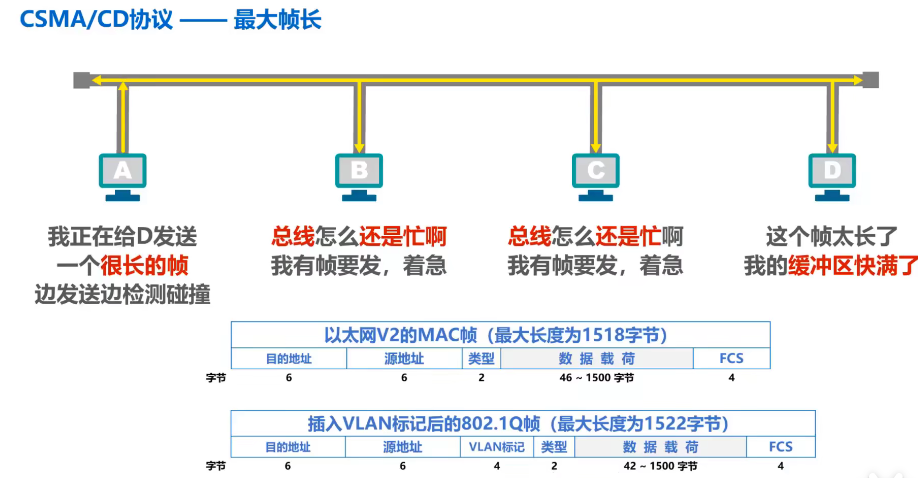


​		**退避时间：**截断二进制指数退避算法


​		**信道利用率：**帧尽量长、传播时延尽量小


​		**流程图：**


#### CSMA/CA

​		因为无线信道的传输条件特殊，其信号强度的动态范围非常大，接收信号往往远小于发送信号，因此CSMA/CD协议，在无线局域网中就不再适用了。


​		

​		因此**无线局域网不再使用碰撞检测技术（CD），而是使用碰撞避免（CA）**。因为碰撞不可完全避免，因为CSMS/CA还引用了**停止等待协议来确保可靠传输**。


## MAC、IP、ARP


### MAC地址

​		**MAC地址（Media Access Control Address，媒体存取控制协议），也称局域网地址**，MAC地址一般被编写在ROM中，因此MAC地址也被称为硬件地址。

> > **注意：MAC地址有时也被称为物理地址，但并不意味着它位于物理层。**


​		

​		MAC地址由两部分组成，每个厂商的OUI由IEEE固定，后面部分由厂商给出。


> > 补充：美国政府曾通过设备的MAC地址来监控个人网络的使用计划，所以很多移动设备，包括Windows、苹果等厂商就采取了**动态MAC技术**。


### IP地址

​		**IP地址属于网络层**，但因其与MAC地址联系广泛，所以在此提及。

​		IP地址分为两部分，网络号和主机号，网络号用以区分因特网中数以万计的网络，主机号用以区分网络中的各个主机。

​		以下图举例MAC地址和IP地址在网络传输中的变化：


​		

​		**传递过程中：IP不变，MAC变。**注：MAC3、MAC4是路由器的不同端口，路由器最上层只到达网络层。


### ARP协议

 		当网络层数据单元传递到链路层时，链路层无法知道目的IP对应的MAC地址，所以需要一个协议，能**根据IP地址查找MAC地址**。

​		事实上，每台主机都有一张**ARP高速缓存表**，windows电脑使用```arp -a```查看，可通过IP查找MAC地址，**若缓存表中没有，则对网络中发送ARP请求报文（广播）**，封装在MAC帧中的目的地址为```FF-FF-FF-FF-FF-FF```，用以知道某个目的地址的MAC地址。

​		网络中其它电脑受到ARP请求报文后，交付上层处理，上层查看想要请求的IP地址是否是本机的IP地址，不是则不予理会，是则进行响应，并将请求方的IP和MAC存入本机的高速缓存表。

​		


​		

​		**注：ARP协议只能在一段链路或一个网络中使用，而不能跨网络使用。**


### 总结


## 集线器与交换机

​		早期的总线型以太网如下，使用机械接头的无源电缆。


​		后来引入了集线器HUB，使用RJ-45（即水晶头），双绞线。


### 集线器

​		使用集线器可以在**物理层**扩展以太网，个人理解一个HUB就是一个总线结构，虽然也能扩大广播域，但碰撞域也扩大了。


### 交换机

​		以太网交换机工作在**数据链路层（也包括物理层）**，它收到帧后查找帧的目的MAC地址对应的接口，然后通过接口转发帧。

​		**以太网交换机是一种即插即用的设备，其内部交换表是通过自学习算法自动逐渐建立起来的。**

​		特点是：**全双工、无碰撞（不适用CSMA/CD协议）**


​		

### 区别

​		对于**单播帧**，集线器会将其转发给网络中各主机，各主机将该帧目的MAC与本机MAC对比，是则收下，不是则丢弃；交换机则会先缓存，然后对比内部的帧交换表，选择性的转发给网络中的主机。

​		对于**广播帧**，集线器会将该帧转发给网络中所有主机，所有主机都会将其接受；交换机会将其发送给除发送端口外的各主机。从效果上看二者没有区别。

​		**对于网络中同时有帧在发送时，集线器会产生碰撞，交换机会将帧都缓存下来，按序发送，不会碰撞。**


### 交换机工作流程

​		主机A向主机C发送帧，先登记或更新A的端口号，然后查找是否存在主机C的记录，不存在则进行盲目转发**（泛洪）**，泛洪时对网络中所有的主机均发送帧，即使已经登记在交换表中了。

​		交换表中各记录都有自己的有效时间，到期自动删除，因为MAC地址和交换机接口的对应关系并不是永久性的。


### 交换机生成树协议STP

​		当多个互联的以太网之间某条链路断掉后，整个网络将会变成若干个小型的网络。如下图AB断开后，BC将也无法通信。


​		解决方法是**增加冗余链路**，如BC间增加一条链路。

​		但增加链路就会导致**产生环路**，进而产生一系列问题，如**广播风暴**。

​		如：给BC间增加一条链路，当B中主机对外广播时，最后C又会广播回来，进而B又广播出去，**占用了大量的网络资源**。

​		同时还会使交换机的**交换表震荡**，如：最开始H1对应端口1，但是当C广播到B交换机时，B发现源MAC对应的帧是从端口2进来的，导致H1的对应关系改变，A广播到B时是同理的。


​		为了增加链路时又避免网络环路，以太网交换机使用**生成树协议STP（Spanning Tree Protocol）**，可以避免产生网络回路。

​		**它的做法大致是堵塞会造成环路的链路，当一条链路走不通时，又会重新计算生成树。**


## 虚拟局域网VLAN

### 诞生

​		随着交换式以太网规模的扩大，广播域也相应地扩大，虽然有STP协议来保证不会产生环路，但因**广播域过大**也会有各种弊端。


​		

​		首先能想到的方法就是尽量避免广播信息，但事实上，网络中会频繁地出现广播信息。


​		

​		**那么如何将大的广播域，隔离成小的广播域呢？**

​		使用路由器可以隔离广播域，路由器工作在网络层，由于路由器默认情况下不对广播数据包进行转发，因此路由器很自然地隔离广播域，然而**路由器成本很高**，局域网内部全部使用路由器隔离广播域是不现实的，因此虚拟局域网技术诞生了。


​		

​		虚拟局域网（VLAN，Virtual Area Network），是一种将局域网内的**设备划分成与物理位置无关的逻辑组的技术，这些逻辑组具有某些共同的需求。**

​		如图，将三层楼之间的主机划分成两个VLAN，同一个VLAN之内可以广播通信，不同VLAN之间不能广播通信。


### 实现原理

​		IEEE 802.1Q帧，是对MAC帧格式的扩展，插入了4字节的VLAN标记。

​		交换机**收到**某主机的帧时，会对该帧进行加工，即插入源主机的VLAN标记。

​		交换机**转发**某个802.1Q帧时，**可能**会删除该帧的VLAN标记，也可能不会删除。


​		交换机中的端口分为三个类型：

1. Access

2. Trunk

3. Hybrid

   **交换机的每个端口，有且仅有一个PVID。**


#### Access端口	

​		**第一，Access端口一般用于连接用户计算机。**

​		交换机**接收**到Access端口的帧时，会在帧中加入该端口PVID。

​		交换机**发送**Access端口发送过来并加工完后的帧时，会去掉帧中的PVID，并将其转发给相同PVID的端口。

​		如下，A发送一个广播帧，交换机收到后加入PVID=2，待到转发时，会先去掉PVID标识，然后只转发给相同PVID的B。


#### Trunk端口		

​		**第二，Trunk端口一般用于交换机之间、交换机与路由器之间的互连。**

​		**交换机会把其它端口发送的帧带PVID转发给Trunk端口。**

​		Trunk端口对帧的**接受**处理方法是，若发送端口与本端口PVID相同，则去PVID转发，若不同，则带PVID转发。

​		如下：

**去PVID转发：**

1. 当主机A发送广播帧时，会在帧中加入PVID=1发送给端口5

2. 端口5发现PVID相同，去掉PVID转发给交换机2

3. 交换机2的端口5接收到帧后，加上自己的PVID转发给主机内与本端口相同PVID的端口。

4. 从而将ABEF互连起来。

**带PVID转发：**

1. 当主机C发送广播帧时，发给端口5
2. 端口5发现PVID不同，直接将其转发给交换机2
3.  交换机2的端口5发现PVID不同，同样将其带PVID转发

   4. 交换机发现PVID与EF不同，不转发给这两个主机
   5. 只转发给主机GH。
   6. 从而将CDGH互连起来


#### Hybrid端口

​		**第三，Hybrid端口既可用于交换机、路由器之间的互连（同Trunk端口），也可用于交换机与用户之间的互连（同Access端口）**

​		Hrbrid相当于加入了**过滤规则**，当接收到帧时，会查看某端口的去标签列表中，是否有此帧的PVID，有才会发送给该端口。

​		如下：主机A可以给主机C发送广播帧，因为C的列表（10，20，30）中有主机A的PVID。但主机A不能给B发送广播帧，因为主机B的列表（20，30）中没有主机A。

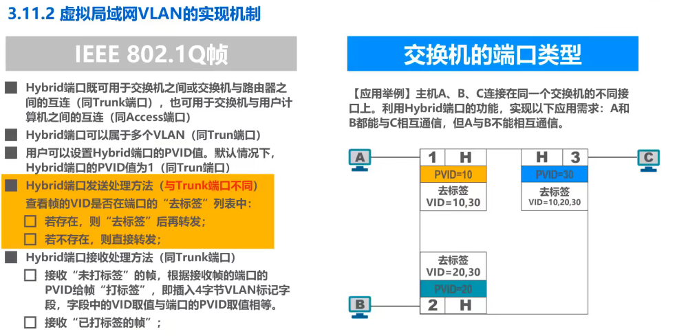


# 网络层

## 基本概念

​		网络层的主要任务是**实现网络互连，进而实现数据包在各网络之间的传输。**

​		网络层主要需要解决以下问题：

1. 网络层向运输层提供怎样的服务（可靠传输，还是不可靠传输）
2. 网络层寻址问题
3. **路由选择问题**


## 服务


### 面向连接的虚电路服务

​		通信双方通信前先建立一条**虚电路**，之后的分组首部中携带此虚链路编号进行通信。

​		值得注意的是，虚电路不同于电路交换中的物理链路，只是一条存在于虚拟网络中的链路，实际并不存在。

​		**可靠通信由网络来保证**


### 无连接的数据报服务

​		**不需要建立网络层连接，每个分组可走不同路径。**

​		**可靠通信由用户主机来保证。**因特网采用的就是这种设计思路，将复杂的网络处理功能置于网络的边缘（用户主机和其内部运输层），整个网络尽最大努力交付。

​		**可能出现的问题：误码、失序、丢失**


### 对比


## IPV4地址

​		IPV4是每个互联网**主机的一个唯一标识**，由32bit数字组成，通常由点分十进制表示，**2011年，IPV4地址已全部分配完毕。**


### 1.分类编址


#### A类地址

**固定前缀：0**

最小网络号：00000000（0），不指派。**特殊IP地址，表示“本网络中的本主机''，只可作为源地址使用，不可作为目的地址。**

最大网络号：01111111（127），**本地回环测试，不指派。**

**因此A类网络数量为：128 - 2 = 126个** 

**每个网络中可分配的IP地址数量为：2$^{24}$ - 2 = 167777214 （减2是因为全0和全1不分配）**


#### B类地址

**固定前缀：10**

最小网络号：10000000 00000000（128.0），某些教材说此网络号不可分配，但2002.9发表的RFC 3330文档指出其可以分配了。

最大网络号：10111111 11111111（191.255）

**因此B类网络数量为：2$^{16-2}$ = 16384个**

**每个网络中可分配的IP地址数量为：2$^{16}$ - 2 = 65534**


#### C类地址

**固定前缀：110**

最小网络号：11000000 00000000 00000000（192.0.0），某些教材说此网络号不可分配，但2002.9发表的RFC 3330文档指出其可以分配了。

最大网络号：11011111 11111111 11111111（223.255.255）

**因此C类网络数量为：2$^{24-3}$ = 2097152个**

**每个网络中可分配的IP地址数量为：2$^{8}$ - 2 = 254**


#### 总结

1. **0\~127是A类，128-191是B类，192\~224是C类**
2. **主机号全0或全1的都不可分配**
3. **A类中网络号为0和127的较为特殊，不可分配**


### 2.划分子网编址（子网掩码）

​		当一个大型网络，因为某些需求，又需要划分成不同的小型网络时，重新去申请网络号显得有些不实际，而且重新申请的话路由器的路由表又需要一段时间重新建立。

​		因为**借用主机号中的一部分，将其作为子网号。**但是，又如何知道那些位是子网号呢？

​		故引入子网掩码，32比特的子网掩码可以表明分类IP地址的主机号的哪些部分作为子网号。**网络号和子网号部分的子网掩码为1，主机号部分子网掩码为0。**子网掩码与IP地址**逻辑与运算**即可得到IP地址所在子网的网络地址（即主机号全0的地址）。


​		

​		**所有子网中的可分配主机数相加，小于不划分时的可分配主机数，因为每个子网中的全0和全1主机号不可分配。**

​		默认子网掩码是指，在未划分子网的情况下使用的子网掩码。

​		**A类默认：255.0.0.0  B类默认：255.255.0.0  C类默认：255.255.255.0**


### 3.无分类编址（CIDR）

​		划分子网在一定程度上缓解了因特网在发展中遇到的困难，但C类地址因其地址空间太小并没有得到充分利用，IPV4面临耗尽的威胁。

​		因而诞生了**无分类域间路由选择（Classless Inter-Domain Routing）**的编址方式，简称CIDR。


​		

​		CIDR使用斜线记法，斜线表示网络前缀所占的比特数量。

​		**注：聚合某类网络数量，即此网络中某类网络（如C类）的数量，因为CIDR可能同时包含多个类型（即A、B、C）网络。**


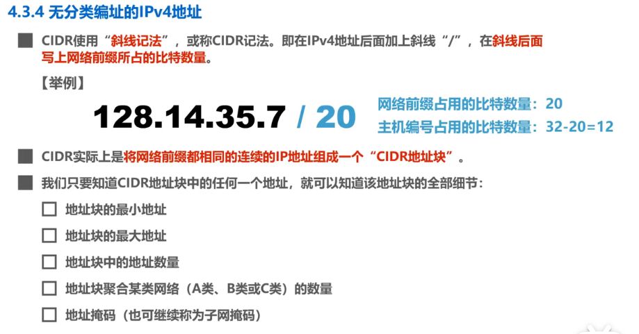

​		


​		

#### 路由聚合

​		CIDR可用来**路由聚合（也称构造超网）**，如下图，R1路由器有5个网络，若将该5个网络全部汇报给R2，则浪费了R2的路由表的空间，因此可以将该5个网络聚合成为一个网络，该网络拥有此5个网络的共同前缀。


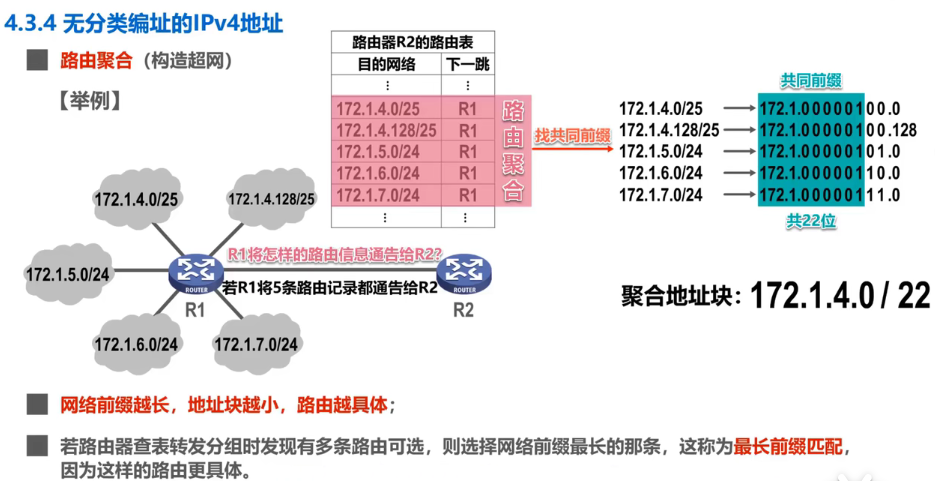


## IPV4规划

### 定长的子网掩码（FLSM）

​		**FLSM（Fixed-Length Subnet Mask）**

​		如图，下面有一个C类网络，要将其分成5个子网，则需要至少3个子网号来表示，可得到该C类网络最后划分完后每个子网的主机号为5位，即每个子网中最多有32个IP地址，但是有的子网如N1，仅有9台主机，造成了**IP地址的浪费。**

​		每个网络必须：网络地址（主机号全0）、广播地址（主机号全1）、接入路由器的接口的地址。


​		

​		如下图，每个子网可分配的主机数量都是一样的，造成了很多IP的浪费。

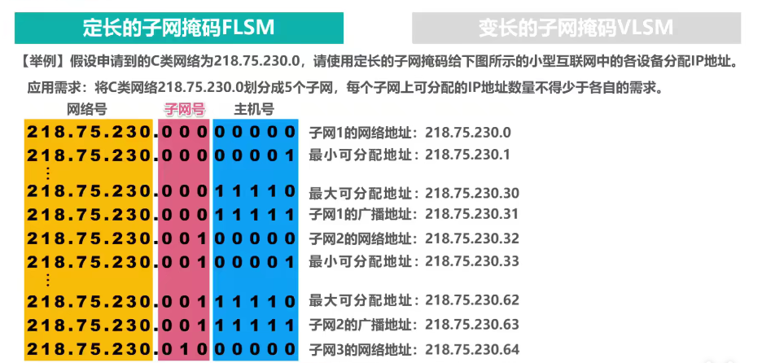


### 变长的子网掩码（VLSM）

​		但是若采用变长的子网掩码，即**每个子网的子网号长度是变长的**，最后通过一个路由器进行聚合连接到因特网上去，就大大减少了IP地址的浪费。


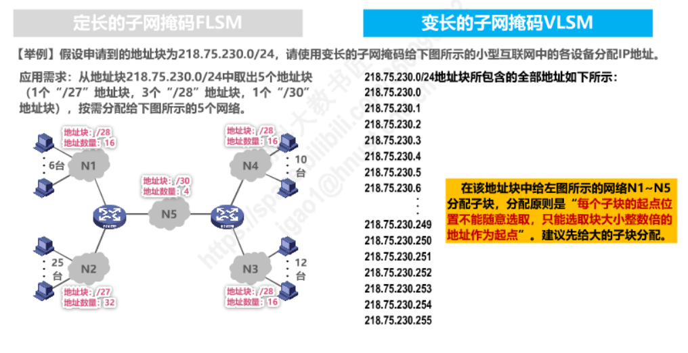

  		

​		如下，可以根据网络中所需的IP地址的数量，来决定主机号占多少位，大大减少了IP地址浪费。


##  IP报文发送转发

​		IP数据报的发送有两个步骤：**主机发送给IP数据报、路由器转发IP数据报**

​		同一网络中的主机之间可以**直接交付**，不同网络之间的主机可以通过路由器**间接交付**。


### 主机发送


> > **1.那么主机如何知道其它主机是否与自己处在同一网络呢？**

​		首先，本机要与某一主机进行通信，一定是建立在已经知道目的主机的IP地址的前提下。

​		发送前，**将本机IP与子网掩码进行与运算，得到本网络的网络地址，然后将目的网络地址与本机子网掩码进行与运算，得到目的网络的网络地址**，然后就可以判断是否处在同一网络。


> > **2.那么主机如何知道路由器的存在呢？**

​		对此，引入网关的概念，网络中的主机可将路由器的一个接口的IP地址，设为其默认网关，由网关将数据包交付出去。

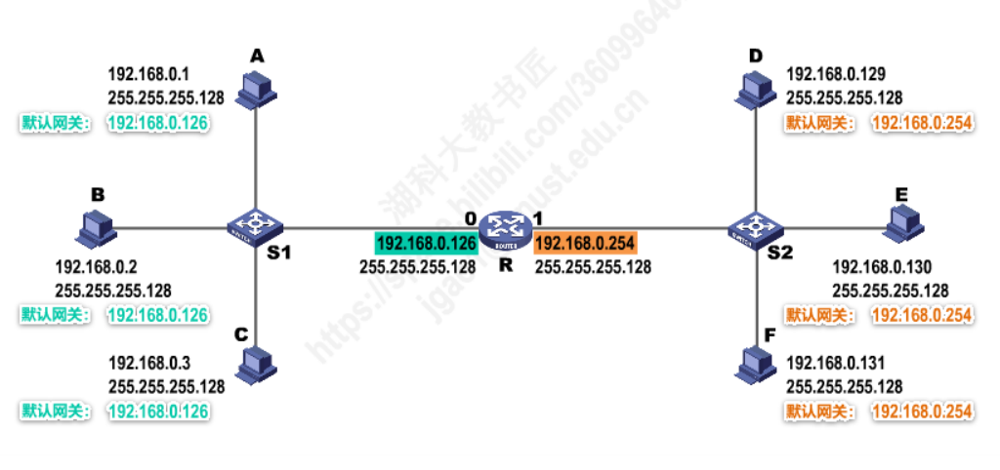


### 路由器转发


> > **3.那么路由器又是如何转发的呢？**

​		首先，检查是否出错，出错则丢弃并报告主机。

​		然后，查找目的地址在路由表中的对应条目，找不到则报告主机。


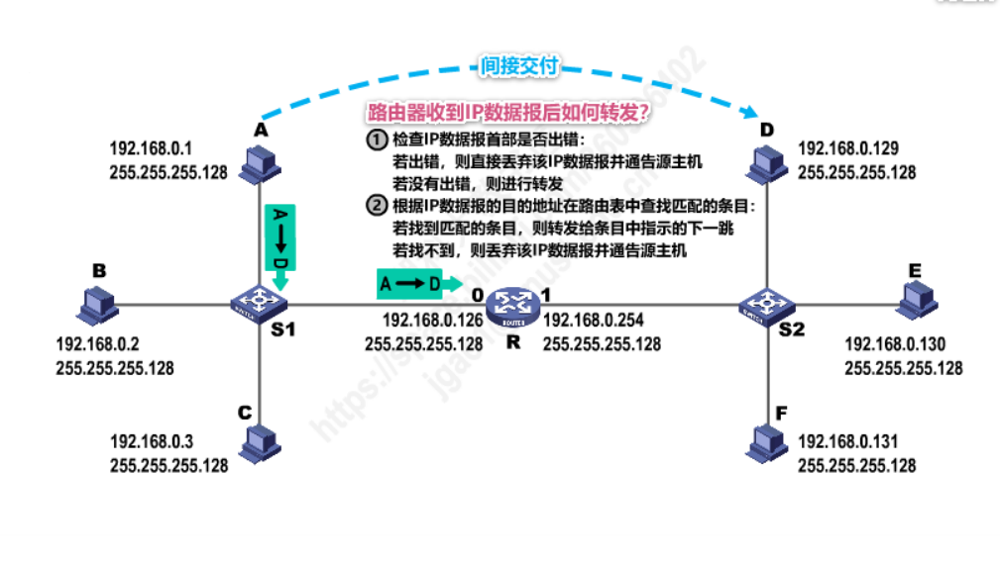

​		查找路由表时，将目的地址与表中条目的掩码依次与运算，与对应的网络相等则用该接口进行转发。

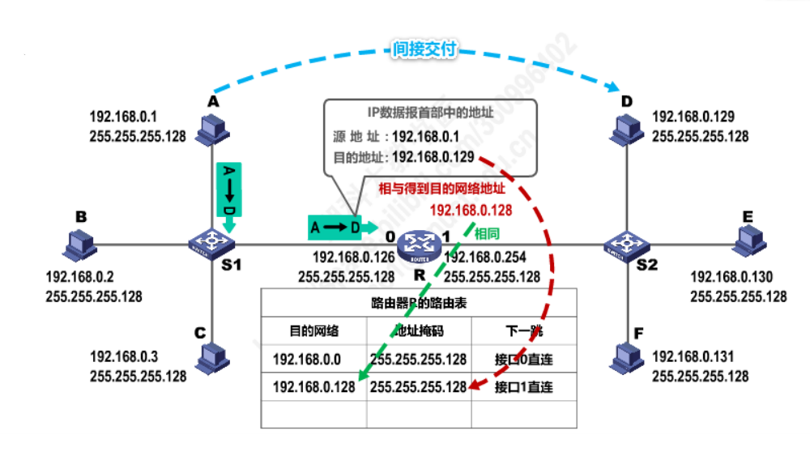

> > 注：网络中某主机对网络发出广播数据报时，也会发送到路由器，但路由器不会将其广播到其它网络。并且，主机给其他网络的广播地址发送数据报，路由器同样不会进行转发。


## 静态路由配置

​		路由表中有若干表项，每一个表项有：目的网络及其掩码（或者用CIDR表示），下一跳接口，表项类型。

​		静态路由，由人工进行配置，简单，开销小，但**不能及时适应网络状态等的变化**，一般只在小规模网络中采用。


​		因特网中网络众多，不可能全部都进行人工配置，所以可以配置一个**默认路由：0.0.0.0，子网掩码也是0.0.0.0**


​		同时，对于某些必须和特定主机通信的情况，还可以**针对特定主机设置静态的主机路由**，此时对于目的网络为该主机的报文，优先匹配此特定主机路由条目，因为其网络前缀（32位）最长，默认路由的网络前缀为0，最短。


### 配置错误导致环路

​		如下图，若人工配置路由表某条目时，错误地设置某个网络的下一跳，如R2对将该网络转发给R3，而R3对该网络的转发又是转发给R2，则IP对此网络的请求将会一直在这两个路由器之间兜圈子，形成环路。

​		**为了防止IP数据报在路由环路中永久兜圈，在数据报首部设有生存时间TTL字段，TTL变为0，则被路由器丢弃。**


### 聚合不存在网络导致环路

​		如下图，R1连接了两个网络，可以通过网络聚合将其形成超网，但此超网中还包含了两个不存在的网络。

​		若R2接口1发送请求到哪个不存在的网络，R1查表查不到此网络，则会走默认路由反给R2，如此就形成了环路。

​		所以可以在R2的路由表中设置黑洞路由，因为这两个网络的网络前缀一定比超网的前缀长，所以会走到此两个网络黑洞之中，从而不转发。


### 网络故障导致环路

​		若R1连接的某个网络的链路发生故障，如果直接删除此网络在路由器中的路由条目，则R2发往此网络的请求则会走默认路由，从而形成环路。

​		好的处理办法是针对这个故障的网络，设置路由黑洞，根据最长前缀匹配原则，对该网络的请求会优先进入路由黑洞。

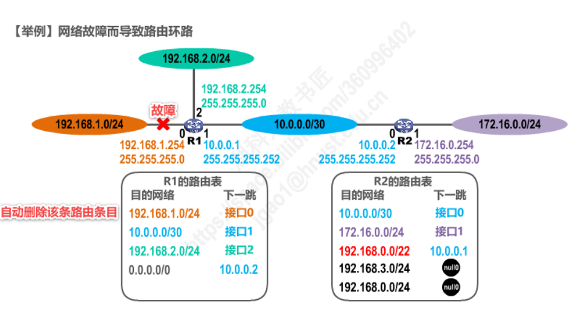


### 总结


## 路由选择协议

​		路由器的选择协议可分为：**静态路由选择、动态路由选择**。


### 静态路由选择

​		静态路由选择是指，由人工配置路由，见上一节静态路由配置。简单开销小，但是可能产生环路等，且不能适应网络状态的变化。


### 动态路由选择

​		因特网将整个大型的网络分为若干的大大小小的自治系统AS（Autonomous System），**每个自治系统内部有着自己的路由选择协议，外部则采用同一个路由选择协议与其它自治系统通信。**

​		AS内部的路由选择叫做：**域内网关选择IGP（Interior Gateway Protocol）**，是一种叫法，具体的实现看采用何种协议，一个自治系统内部使用的网关协议，与其它自治系统内部使用何种网关协议无关。

​		AS之间的路由选择叫做：**外部网关选择EGP（Exterior Gateway Protocol）**。

​		**补充：之所以叫网关（Gateway）而不叫路由器（Router），是因为早期起名时都叫网关，没有路由器这一称呼。**

​		**补充：路由器是一种具有读个输入输出端口的专用计算机，其任务是转发分组。**


​		

​		路由器可分为两部分：**路由选择部分、分组转发部分**，根据收到的数据报类型决定交给哪个部分进行处理。

​		如收到内部网关协议的数据报，即相邻路由器的数据报，则交给路由选择部分来更新路由表。

​		收到其它协议的数据报，则交给转发表查表转发。


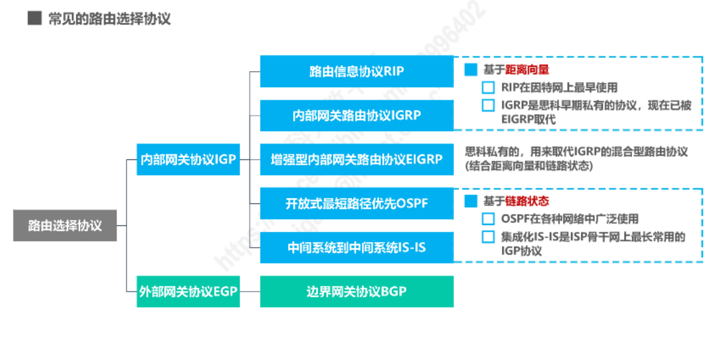


### 内部网关协议（IGP）

#### 基于距离向量

##### 1.RIP协议

​		**RIP（Router Information Protocol）协议是内部网关协议最先使用的协议。**每个路由器内部都维护一个它自己到其它每一个网络的距离向量DV（Distance-Vector）。


​		**RIP认为好的路由就是“距离短”的路由，并规定跳数为16即为不可达。**若是有多条距离相等的路由，则进行等价负载均衡，即将数据分到多条链路上进行传递。

> > RIP要考量的问题：
> >
> > 和谁交换信息？
> >
> > 交换什么信息？
> >
> > 什么时候交换信息？

​		使用RIP协议的路由器**每隔一段时间**就和**相邻路由器**交换自己的**路由表信息**。


​		对于相邻路由器发来的路由表信息，首先对其距离+1，然后将其下一跳改为相邻路由器。

​		然后与本路由器进行比对，**没有的路由则添加，更短的路由则更新。**


​		但是RIP存在**“坏消息传播得慢”**的问题，如下R1不能到达N1了，在它将自己的路由表发送到R2之前，R2发来它的路由表，R1会认为R2能到达N1，如此经过多个RIP周期之后，R1、R2到N1的跳数才会收敛到最大值。


​		环路问题是图算法不可回避的问题，对RIP的问题有下列解决方法，一旦路由表变化，立即发送RIP报文，这样即可快速收敛。


##### 2.IGRP协议

​		 **IGRP（Interior Gateway Routing Protool）**，属于Cisco（思科）**私有协议**。

​		IGRP和RIP一样，同属距离矢量路由协议，因此在诸多方面有着相似点。如：**IGRP也是周期性的广播路由表，也存在最大跳数（默认为100跳）。**

​		IGRP最大的特点是使用了混合度量值，同时考虑了**链路的带宽、延迟、负载、MTU、可靠性**5个方面来计算路由的度量值，而不像其他IGP协议单纯的考虑某一个方面来计算度量值。目前IGRP已经被Cisco独立开发的EIGRP协议所取代。


#### 基于链路状态

##### 3.OSPF协议

​		**OSPF（Open Shortest Path First ，开放最短路径优先）**，基于DJ斯特拉的最短路径算法，为克服RIP的缺点而开发出来的。


​		链路状态，指的是本路由与哪些路由器相邻，及其链路的代价。


​		

​		如下图，思科路由器计算方法是：100Mbps / 链路带宽，即链路带宽大于100Mbps一视同仁，越小于100Mbps代价越大。


​		

​		使用OSPF协议的路由器，自治系统内部维护着一个相同的数据库，**路由器每一个时间周期会给邻居发送问候分组（心跳），并且没收到邻居的问候包就会认为邻居不可达。**


​		每个路由器都会产生**LSA（Linked State Advertisement）**，其中包含其直连网络的链路状态信息、邻居链路状态信息，然后将LSA封装进LSU中，采用**洪泛法**发送。


​		

​		同时各路由器内部有一个LSDB，用来存储LSA，路由器之间通过发送的LSU达到LSDB一致。


​		

​		发送分组时，根据LSDB找到最短的一条路径进行转发。


​		

​		OSPF协议的五种分组类型：

1. **问候分组**，维护和发现邻居路由器的可达性。
2. **数据库描述**，向邻居路由器给出自己的LSDB的摘要。
3. **链路状态请求**，向邻居请求某些链路状态的详细信息。
4. **链路状态更新**，采用洪泛法通知全网更新某一链路状态。
5. **链路状态确认**，对链路状态更新分组的确认分组。


​		当R1需要某一链路信息时，发送请求分组，然后R2发送更新分组，R1收到后发送确认分组。

​		达到30分钟周期或者R1链接的链路发生变化时，发送洪泛更新分组。


​		

​		若每个路由器都与自己的邻居路由器建立连接，网络中的线路会变得很多，所以**选举出一个指定路由器DR和备用路由器BDR，所有路由器只与DR和BDR建立邻居关系**。


​		有时自治系统也很大，所以可以将自治系统划分为若干个**区域（area）**,每个区域有个对外路由器，整个自制系统也有一个对外路由器。


##### 4.IS-IS协议

 		**IS-IS（Intermediate System-to-Intermediate System，中间系统到中间系统）**最初是国际标准化组织ISO为它的无连接网络协议CLNP（ConnectionLess Network Protocol）设计的一种动态路由协议。

​    		为了提供对IP的路由支持，IETF在RFC1195中对IS-IS进行了扩充和修改，使它能够同时应用在TCP/IP和OSI环境中，称为集成化IS-IS（Integrated IS-IS或Dual IS-IS）。

   		 IS-IS属于内部网关协议IGP（Interior Gateway Protocol），用于自治系统内部。**IS-IS是一种链路状态协议，使用最短路径优先SPF（Shortest Path First）算法进行路由计算，与OSPF协议有很多相似之处。**


#### 基于距离向量和链路状态

##### 5.EIGRP协议

 		由于IGRP协议的种种缺陷以及不足，Cisco开发了EIGRP协议（增强型内部网关路由协议）来取代IGRP协议。EIGRP属于高级距离矢量路由协议（又称混合型路由协议），继承了IGRP的混合度量值，最大特点在于引入了非等价负载均衡技术，并拥有极快的收敛速度。EIGRP协议在Cisco设备网络环境中广泛部署。

 

### 外部网关协议（EGP）

​		由于各自治系统内部使用的对最佳路由的度量不同，而且受政治、费用、速率等因素的影响，很难得到到达某一自治系统的最佳路由。


#### BGP协议

​		**BGP（Border Gateway Protocol，边界网关协议）**，就是力求找到一条通往目的网络，通信较好的路由的外部网关协议。

​		每个自治系统中，需要选举出一个BGP发言人，用以与邻站之间交换路由信息。


​		BGP接受邻站发来的距离向量，若本自治系统也包含其中，则到达目的网络不可走该邻站，否则产生回路，BGP依次来避免产生环路。


​		BGP有四种报文：**保活（Hello）报文、通知报文、更新报文、打开报文**


​		常见的这几个路由选择协议，**RIP采用UDP（520端口），OSPF直接采用IP，BGP采用TCP（179端口，因为与其它AS的通信必须可靠所以用TCP）**


## IPv4数据报首部

​		为方便记忆，将首部每32比特（即4个字节）划分为1行，对每一行分别描述。事实上，IP首部每一行的字段之间都是有关联或者有着相似作用的。

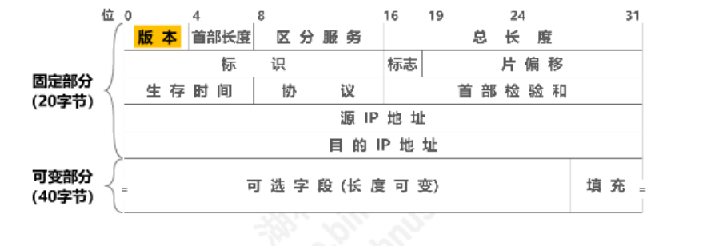

### 第一行（desc）

​		第一行主要是对**整个IP数据报的一个描述**。

​		**版本、首部长、区分服务、总长**。

​		**1.版本：**4bit，一般皆为IPV4的4。

​		**2.首部长度：**4bit，**其单位为4字节**，如：首部长度为5，即表示首部长度为20字节，所以需要首部的长度为4字节的整数倍，若不是，则需要可选字段部分进行填充。

​		**3.区分服务：**8bit，用来获得更好的服务，只有使用区分服务时，该字段才起作用，一般不用。

​		**4.总长度：**16bit，其单位为字节，16个bit最大可表示数字为64M（65535），即表示IP数据报最大可有64MB。


### 第二行（fragment）

​		第二行主要是对**IP数据报分组的描述**，**标识、标志、片偏移**。

​		**1.标识：**16bit，表示分组后的IP数据报最开始来自于哪一个IP数据报，数值来自于源主机，其内部维护了一个计数器，每发送一个IP数据报，计数器加一。**每个IP数据报不管分多少次，每一小片的标识都是相同的。**

​		**2.标志：**3bit，分别为：**DF（Don't Fragment，不允许分片）、MF（More Fragment，更多的分片）、保留位（恒为0）**。

​			DF：是否禁止分片，为1表示此数据报不允许分片。

​			MF：本分片后面是否还有分片，为1表示后面还有分片，为0表示本分片是最后一个分片。

​		**3.片偏移：**13bit，**其单位是8字节**，表示此数据报分片相对于最原始数据报偏移了多少，因为单位是8字节，所以数据报智能被划分为8字节倍数的长度。

​		举例：下面data为3800的数据报被分为3片，每片的标识相同，片偏移计算不算首部。


​		举例：分片2再次被划分，两个分片的MF均为1，因为后面还有分片3，片偏移是相对于最原始的数据报（即分片的第一个序号除以8）。


### 第三行（control）

​		第三行是一些**数据报控制字段**。

​		**生存时间、协议、首部校验和。**

​		**1.生存时间（TTL）**，8bit，最开始以秒为单位，255s为送达即丢弃，后来以跳数为单位，跳数变为0则丢弃。

​		**2.协议**，8bit，表示使用IP协议的上层协议，TCP为6，UDP为17。

​		**3.首部校验和**，16bit，没有CRC那么复杂，但每经过一个路由器都需要校验一次，因过于耗时，IPV6去掉了这一步骤。


​		常见的一些协议的IP首部如下。


### 第四行（source）

​		第四行是源主机的IP地址。

### 第五行（target）

​		第五行是目的主机的IP地址。

### 后续行

​		后续行是一些可供扩展的字段，必须要满足是4字节的倍数，不满足则使用全0进行填充。


### 总结

​		第一行：描述整个IP数据报。

​		第二行：描述IP数据报分片情况。

​		第三行：IP数据报的控制字段。

​		第四、第五行：源地址、目的地址。

​		注意：分片的**数据长度**必须是8个整数倍（最后一个分片可以不用满足，因为是偏移量必须为8的整数倍），每个数据报首部必须是4的整数倍（单位均为字节）。


## 网际控制报文协议ICMP

​		为了**更有效地转发IP数据报和提高交付成功的机会**，在网际层使用了**ICMP（Internet Control Message Protocol，网际控制报文协议）**。

​		主机或路由器使用ICMP来发送：**差错报告报文、询问报文**。

​		ICMP报文被封装在IP数据报中发送，其中**IP首部的协议字段的值为1**。


### 差错报告报文

​		当IP数据报的发送出现错误或者异常时，链路上的路由器/主机就会向源点发送ICMP差错报告报文。

​		以下情况不应发送差错报告报文：

- 差错报告报文出错
- 第一个分片的后续数据报片不发送
- 对于多播地址的数据报出错
- 特殊地址出错


#### 终点不可达

​		当**目的主机不可达时**，终止处的主机/路由器会向回发送重点不可达的ICMP报告报文。

​		如：R1不知道N3网络该走哪个路由，也没配置默认路由。


#### 源点抑制

​		当链路上的**某一主机/路由器由于拥塞而丢弃某一报文时**，就向源点发送抑制报文，源点就会降低发送速率。


#### 时间超过

​		当路由器收到目的地址不是自己的IP数据报，数据报的TTL就会减1，**若TTL变为0**，就会向源点发送时间超过的ICMP报文。

​		或者**终点在预先规定的时间不能收到某一数据报的全部数据分片**，也会向源点发送时间超过的ICMP报文。


#### 参数问题

​		若链路中的**某一路由器发现检验字段不符**，则会丢弃数据报并向源点发送参数问题的ICMP报文。

​		因为链路中的每个路由器都会计算一次校验字段，所以还是有一定的出错几率的。


#### 改变路由（重定向）

​		因为AS内部有沟通且能达到共识，所以当某一路由器知道有更短的路径时，就会向主机发送ICMP报文报告。


### 询问报文

#### 回送请求和回答

​		用以测试目的站是否可达，以及了解其状态。


#### 时间戳请求和回答

​		跟目的主机/路由器进行时钟同步。


### ICMP应用

#### 分组网间测试（ping）

​		**ping(Packet InterNet Groper，分组网间测试)**，这同时也是一个命令，可直接在shell中使用，是应用层直接使用的ICMP（没通过运输层）。


#### 跟踪路由（traceroute）

​		使用ICMP可以跟踪网络通信中经过了那些路由器，原理：先将TTL设为1可得到第一个路由器，然后将TTL设为2.....一直如此操作直到达到目的主机或者TTL到达16。


## 虚拟专用网VPN

​		如图，同一公司的两个异地部门，无法通过路由器连通起来，想让两地的两个网络通信该怎么办？


​		引入**VPN（Virtual Private Network，虚拟专用网）**技术，借用共用的因特网作为本机构各专用网之间的通信载体。


​		同时，由于很多情况下，机构能申请到的ip远小于主机数量，所以网络内通信可以用私有地址代替。以下三类私有地址，分别可以用于不同规模的网络。

​		**10/8，有24位主机号，可以分配给16M个主机，适用于大型网络。**

​		**172.16/12，有20位主机号，可以分配给1M个主机，适用于中大型网络。**

​		**192.168/16，有16位主机号，可以分配给64K个主机，适用于一般的中小型网络。**


​		如图，A部门的一主机在得知B部门内一主机的IP后，封装IP数据报发送给路由器，然后路由器将源地址和目的地址，分别改为A部门、B部门的网关，同时数据报中还会保存一个端口信息，下次B部门回信时，报文中也会有一个端口信息，这就是NAPT技术。


## 网络地址转换NAT

​		为了缓解IPV4耗尽后所带来的问题，引入**NAT（Network Address Translation，网络地址转换）**技术。

​		一个AS内有多全球IP地址，网络中的每个主机都是用私有地址（也可叫内网地址），主机与因特网通信时，就会将IP数据报中的源IP地址换成全球的IP地址，然后记录在表中，下次目的主机回信时根据表中记录发回主机。


​		但这样的弊端很明显，一个全球IP只能对应一个主机，而且不知道主机什么时候用完，当IP分配完了之后，其它主机要与互联网通信就做不到了，所以引入**NAPT（Network Address and Port Translation）**技术，**多个主机可以用一个公网IP通信**。

​		具体举例见VPN技术的最后一段，实际上运营商给普通用户也是这样分配的IP地址，公网IP需要去申请。

​		**使用私有地址的主机不能做服务器**，因为该主机未向外通信过的话，路由器中就没有记录，而且表中记录不会一直固定不变，所以外部主机无法直到主机的具体地址。一些P2P因为需要外部主机主动与内网主机通信，可以用一些NAT隧道技术解决问题。

​		另外，**因为NAPT技术对外网屏蔽了内网主机的地址，所以可以对内网主机提供一定的安全保护**。

​		

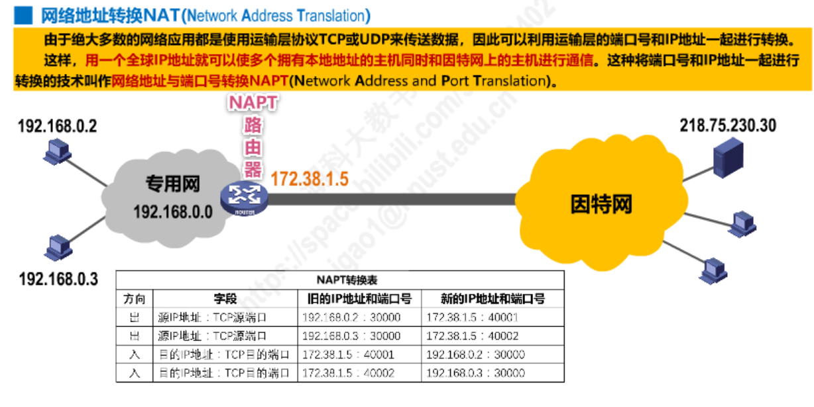


# 运输层

## 概述

​		运输层下面的层，实现了主机到主机之间的通信。但**实际上网络中上的通信的实体是主机上的进程**。

​		**如何为运行在不同主机上的应用进程提供通信服务是运输层要解决的问题。**

​		根据应用需求的不同，因特网运输层为应用层提供了两种不同的协议，**面向连接的TCP、无连接的UDP。**


### 端口

​		因为要将通信的主机，细化成主机上的进程，虽然每个主机上的进程都有pid来区分，但网络上的主机的OS不统一，所以引入端口来区分主机上的进程。

​		端口号分为：**熟知、登记、短暂**。

​		**熟知端口号，**一些常见的应用层协议会使用，如FTP使用20/21（21是SFTP，更安全），DNS使用53，HTTP使用80等等。

​		**登记端口号，**为没有熟知端口号的进程使用，也是长期的。

​		**短暂端口号，**短时间使用，通信结束后，这个端口号可供其它客户进程使用。


​		**注意：IP数据报头部也有一个协议字段，与端口号是不同的，它是用来区分使用IP协议的是哪一个协议。**


### 复用分用

​		两个主机之间的多个进程之间通信时，发送方可以对TCP和UDP进行复用，然后TCP又可以使用IP分用，以达到资源利用率的最大化。

​		接收方则对IP进行分用，然后再分别对UDP、TCP进行分用，发送给对应的进程。


## TCP与UDP对比

### 连接性

​		TCP是提供可靠的传输服务的，所以需要建立连接来确保可靠传输。

​		UDP提供的是不可靠的传输，所以不需要建立连接。


### 广播性

​		因为UDP不需要建立连接，所以其支持单播、多播以及广播。

​		因为TCP需要与通信方建立连接，所以很显然只能单薄。


### 可靠性

​		UDP提供的是不可靠的传输服务，所以适用于电话、视频会议等一些实时应用。不能容忍延迟的游戏，一般都用UDP。

​		TCP提供可靠的传输服务，所以适用于一些要求可靠传输的应用，例如文件传输。UDP丢包无法检测，所以一些需要游戏也用TCP。

​		


### 首部

​		UDP首部仅8字节。

​		TCP首部最小20字节，最大60字节。


### 方向

​		TCP是全双工的。

​		UDP是半双工的。


### 其它

​		**UDP是面向报文的**，发送方的UDP对应用层交下来的报文，不合并，不拆分，只是在其上面加上首部后就交给了下面的网络层，也就是说无论应用层交给UDP多长的报文，它统统发送，一次发送一个。而对接收方，接到后直接去除首部，交给上面的应用层就完成任务了。因此，它需要应用层控制报文的大小

​		**TCP是面向字节流的**，它把上面应用层交下来的数据看成无结构的字节流来发送，可以想象成流水形式的，发送方TCP会将数据放入“蓄水池”（缓存区），等到可以发送的时候就发送，不能发送就等着，TCP会根据当前网络的拥塞状态来确定每个报文段的大小。


## TCP首部格式

​		同IP协议一样，便于记忆，每32bit（4字节）记为一行，逐行分析。


### 第一行（port）

​		第一行，**描述通信的两个实体**。

​		**源端口、目的端口，**16bit，最大为65536。


### 第二行（seq）

​		第二行，因为TCP是面向字节流的，所以**用序号来描述报文段在整个流中的位置。**

​		**序号（sequence，检测seq），**32bit，指的是数据载荷中第一个字节的序号，当序号达到最大时，又重新从0开始计数。


### 第三行（ack）

​		第三行，**TCP采用累计确认**，确认号n表示确认了包括n-1之前的所有字节，并表示希望收到序号从n开始的报文。

​		**确认号（小写的ack），**32bit，因为序号是32bit，所以确认号必须要和序号有相同的取值。

​		**只有第四行的ACK有效时，确认号才有用，否则被忽视。**

​		**连接建立后，后续的报文ACK都是1。**


### 第四行（control）

​		第四行，用来**对TCP通信进行控制**。

​		**偏移量，**4bit，其单位为4字节，表示数据载荷部分相对于整个报文的偏移量，实际上就是指首部的大小，最大值15也表示了首部的最大值60字节。

​		**保留，**6bit，暂无用处。

​		**标志位，**6bit，分别是：**URG、ACK、PSH、PST、SYN、FIN**，有些标志的具体作用见三次握手、四次挥手。

​				**URG（Urgent，紧急的），**控制第5行的紧急指针是否有效，1为有效。

​				**ACK（Acknowledge，确认），**确认标志位，控制第三行的确认号是否有效，1为有效。

​				**PSH（Push，推送），**接收方的TCP收到该标志位为1的报文会尽快上交应用进程，不必等到接收缓存都填满再向上交付。

​				**RST（Reset，置位），**用来复位TCP连接，为1时，表明TCP出现了异常，必须释放连接，然后再重新建立连接，也可以用来拒绝一个非法的报文段或拒绝打开一个TCP连接。

​				**SYN（Synchronize，同步），**用于连接建立时同步信号。

​				**FIN（Finish，完成），**用来释放连接。

​		**窗口位，**16bit，其单位为字节，作为接收方，让发送方设置其发送窗口的依据，用于流量控制。


### 第五行（other）

​		第五行，用于**校验和紧急情况**。

​		**校验和，**16bit，检验范围包括首部和数据载荷两部分。计算校验和时，要在TCP报文段前面加上12字节的伪首部。

​		**紧急指针，**当有紧急数据时，可将紧急数据插队到发送缓存最前面，并立刻封装到一个TCP报文段中进行发送。紧急指针会指出本报文段数据载荷部分包含了多长的紧急数据，紧急数据之后是普通数据。**仅URG字段有效时才有效。**


### 扩展行

​		常用来但不限：

​		**最大报文段长度MSS选择，**TCP报文段数据载荷部分的最大长度。

​		**窗口扩大选择，**为了扩大窗口。

​		**时间戳选择，**用来计算往返时间RTT，用来处理序号超范围的情况，又称为防止需要绕回PAWS。

​		**选择确认选项。**

​		扩展字段不是4字节倍数时需要进行全0填充。


## TCP三次握手

### 概念

​		主要解决三个问题：

​		使TCP双方能够确认对方的存在（**即双方的收、发都没问题**）。

​		使TCP双方能够**协商一些参数**（如最大窗口值、是否使用窗口扩大、时间戳选择、服务质量等）。

​		使TCP双方能够**对运输实体资源（如缓存大小、连接表中的项目等）进行分配。**


> > 使用TCP的进程有一个传输控制块，其中有一个TCP连接表。
> >
> > 表中有：
> >
> > 指向发送、接受缓存的指针。
> >
> > 指向重传队列的指针。
> >
> > 当前的发送和接受序号。


### 过程

​		**第一次握手**，客户进程主动打开TCP连接，发送SYN=1，seq=x（取决于TCP连接表中的发送序号），表示申请建立同步连接，并且客户TCP进入**SYN-SENT（同步已发送）**。

​		**第二次握手**，服务端TCP处于监听状态，接收到SYN包后，发送SYN=1，ACK=1，seq=y（取决于TCP连接表中的发送序号），ack=x+1（对客户的x进行确认），然后进入**SYN-RCVD（同步已接受）**。

​		**第三次握手，**客户端收到服务端的确认报文后，再发送一个ACK=1，seq=x+1，ack=y+1（对服务器的y进行确认），然后进入**ESTABLISHED（连接已建立）。**服务端**收到这个包后同样进入ESTABLISHED**。


> > 第一次、第二次握手不能传递数据，第三次可以。
> >
> > 因为如果第一次握手可以传递数据，则客户端可以不等建立连接就给服务端发送大量的数据，堵住缓冲区，极易被攻击。第二次不能传递数据是同理。**虽然不能携带数据，但是这两次握手需要消耗掉一个序号。**
> >
> > **TCP标准规定，普通的确认报文段，如果不携带数据，则不消耗序号。**


### 可能问题

#### 如果两次握手

​		如果是两次握手，则服务端发送完第二次握手报文后，就进入了连接已建立状态，并不知道客户端是否成功收到了它的第二次握手报文。

​		如下，若某一次建立连接时，第一次握手报文在网络中滞留了，则客户端会认为发送失败了，进行重新发送，服务端此时立即第二次握手，等整次通信完了，之前的滞留报文送达，服务端发送第二次握手报文，直接进入连接状态，浪费资源，而多出一个SYN-RCVD状态则可进行缓冲。


#### SYN洪水攻击

​		若第二次握手的报文一直发送失败，服务端连接会一直处于SYN-RCVD状态，浪费了资源。

​		有的恶意攻击者就是利用这个特性，伪造大量了随机IP（因为相同的IP的TCP连接可以复用），给服务端发送SYN包，因为IP是伪造的，所以服务端的第二次握手一定会失败，导致了服务端中的SYN连接队列溢出，这就被称为**SYN洪水攻击**。

​		解决方法：Linux下默认会进行5次重发SYN-ACK包，重试的间隔时间从1s开始，下次的重试间隔时间是前一次的双倍，5次的重试时间间隔为1s, 2s, 4s, 8s, 16s，总共31s，第5次发出后还要等32s都知道第5次也超时了。

​		但这样的解决方法无法完全根治，由于SYN超时需要63秒，所以攻击者可以在这极短的时间内进行攻击，导致服务器瘫痪。

​		我们所做的是尽可能的减轻SYN攻击的危害，常见的防御 SYN 攻击的方法有如下几种：

1.缩短超时（SYN Timeout）

2.时间增加最大半连接数

3.过滤网关防护SYN

4.cookies技术


## TCP四次挥手

### 概念

​		**前两次挥手，是表示客户端没有数据要发送给服务端了**，服务端对其进行确认。**在接收到第三次挥手之前，客户端仍是可以接受数据的。**

​		**后两次挥手，是表示服务端没有数据要发送给客户端了**，客户端对其进行确认。

### 过程

​		**第一次挥手，**Client端向Server端挥手。发送FIN=1（要终止了），ACK=1（确认号有效），seq=u(客户端最后的序号)，ack=v（对服务端之间报文的确认）。**并进入FIN-WAIT-1（终止等待1）。**

​		**第二次挥手，**Server端向Client端挥手。发送ACK=1（确认号有效），seq=v(最后的序号)，ack=u+1(对客户端之前报文的确认)。**并进入CLOSE-WAIT（关闭等待）。**

​		**第三次挥手，**Server端向Client端挥手。发送FIN=1（要终止了），ACK=1（确认号有效），seq=w(服务端最后的序号)，ack=u+1(再次对客户端的确认)。**并进入LAST-ACK（最后确认）。**

​		**第四次挥手，**Client端向Server端挥手。发送ACK=1（确认有效），seq=u+1(客户端最后的序号)，ack=w+1(对服务端序号的确认)。**并进入TIME-WAIT（时间等待）**，经过2MSL后进入关闭状态，服务端收到报文立即进入关闭状态。


### 可能问题

#### 为什么四次挥手

​		假设是一次挥手，客户端发送完就不管了，服务端若没有收到这次挥手则会一直处于连接建立状态。

​		假设是两次挥手，仅表示客户端没有数据要发送了，服务端再想发送数据就不行了。

​		假设是三次挥手，服务端挥手完就关闭，则客户端不一定能收到，会一直处于终止等待2状态。


#### 为什么TIME-WAIT（防止服务端无法关闭）

​		若客户端在第四次挥手之后直接进入关闭状态，若最后一个报文丢失，服务端会认为它的第三次报文没有送达，会一直重发，无法进入关闭状态。

​		如果等上2MSL时间，则服务器超时重传时客户端能感知到。


## TCP流量控制

### 概念

​		一般的，我们总是希望数据传输得更快一些，但是如果发送方数据传输过快，则接收方可能来不及接受。**流量控制（Flow Control）**，就是让发送方的速率不要太快，让接收方来得及接受。

​		TCP采用**滑动窗口**来进行流量控制。

​		发送方有一个**发送窗口**，接收方有一个**接受窗口**，发送方会根据接收方的反馈来动态的调整发送窗口的大小，使得接收方可以适应发送速度。


### 过程

​		发送方发送窗口有一个初值（大小为拥塞窗口，具体见下一节）。

​		发送方按窗口中的顺序依次发送字节数据，每发送一个报文段，就会启动一个超时重传计时器，一旦超时，则会重传。

​		接收方采用累计确认的确认方法，确认是会发送一个**rwnd（recieve window）**字段来说明自己的接受窗口的大小，发送方根据确认的ack值，**先向前移动自己的发送窗口（同时删除已经被确认的字节的缓存），然后根据rwnd调整自己的窗口大小。**

​		如下，接收方确认了201以前的字节，发送方先向前移动发送窗口到201，同时删除1~200号字节的缓存，然后根据rwnd为300，调整自己窗的大小为300。


### 可能问题

​		若接收方接受窗口满了，则对发送方进行流控，发送rwnd=0，然后发送方调整自己的发送窗口也为0。

​		过一段时间后，接收方窗口有空闲了，通知发送方，但通知报文丢失了，此时若不采取措施，则双方则会一直处于等待的死锁局面。


​		解决方法：发送方的发送窗口一旦变为0，则开始持续计时器，计时器到时间后，则会试探性地向接收方发送**零窗口探测报文**，接收方若回复接收窗口仍为0，则持续计时器重新开始计时。

> > 为什么接收方窗口满了还能接受零窗口探测报文？
> >
> > **因此TCP标准规定，即使窗口满了，也必须能够接受零窗口探测报文、确认报文。**
> >
> > 若零窗口探测报文也丢失了怎么办？
> >
> > **零窗口探测报文也有超时计时器，到时间后会采取一定的解决措施。**


## TCP拥塞控制

### 概念

​		在某段时间，若网络中**某一资源的需求超过了所能提供的可用部分**，网络性能就要变坏。这种情况就叫做**拥塞（congestion）**。

​		网络中的链路容量（带宽）、节点的缓存、处理机等都是网络资源，**若出现拥塞不进行控制，则网络的吞吐量会随着负荷的增大而下降。**参考堵车，一段公路，车子越多，该公路的车辆吞吐量越大，但若不进行车辆拥塞控制（交警指挥交通），车子一多就会开始堵车。

​		TCP的拥塞控制方法有：**慢开始、拥塞避免、快重传、快恢复**。

​		介绍这四种算法的基本原理，假定如下条件：

1. 数据是单方向的传送，而另一个方向只传送确认。
2. 接收方有足够大的缓存空间，因而发送方发送窗口的大小由网络的拥塞程度来决定。
3. 以最大报文段MSS的个数为讨论问题的单位，而不是以字节为单位。


​		因为假设接收方的缓存足够大，所以接收方在发送确认报文时不会报告自己的接受窗口大小让发送方调整。

​		发送方维护着一个**拥塞窗口cwnd(congestion window)**，**只要网络没拥塞，cwnd就扩大，一发生拥塞，cwnd就缩小。**

​		对网络拥塞的判断依据：**没有收到应当到达的确认报文（即发生超时重传）。**

​		发送方还要维护一个**慢开始门限ssthresh**：

​				当cwnd < ssthresh 时，使用慢开始算法。

​				当cwnd > ssthresh 时，使用拥塞避免算法。

​				当cwnd = ssthresh 时，二者均可。

​		


### 方法

​		为更好的看出变化规律，**传输轮次**的每一轮次，代表将拥塞窗口中的报文全部发送并收到了确认。

#### 慢开始、拥塞避免

​		**慢开始（slow-start），**每一轮次拥塞窗口呈指数倍数增长：1-->2-->4-->8-->16.....直到增长到ssthresh。

​		**拥塞避免（congestion avoidance），**当拥塞窗口增长到ssthresh阈值时，开始启动拥塞避免，拥塞窗口变为线性增长，增长到出现拥塞（拥塞标志：有报文超时了），执行两个操作：

​				①ssthresh阈值变为一半。

​				②拥塞窗口变为1，并重新开始慢开始算法。


> > 慢开始，是指开始时向网络中发送的得慢，就像一条公路刚开放，慢慢得放入车辆，而且每次准入值越来越大。
> >
> > 拥塞避免，并非指完全避免拥塞，像是公路达到理论或者预估车辆上限后，还是允许车辆进入，但是变为慢慢地放车辆进入，等到发生堵车，立马采取措施。


#### 快重传、快恢复

​		采用慢开始、拥塞避免算法，若网络中**仅个别报文出现了超时，实际上并没有拥塞时**，这两个算法却过于“小心翼翼”，直接退回了起点又重新慢慢开始，一定程度上限制了网络带宽。


​		**快重传（fast retransmit），**是让发送方尽快的进行重传，而不要等到超时再重传，因为某一报文已丢失/即将超时，发送方是能感知到的，即发送了丢失报文后面的报文，却反复收到对丢失报文前面报文的确认，达到3次后，即可认为这一个报文丢失，立即重传避免超时。

​		但若一连篇报文丢失（即网络拥塞），如下M3开启了快重传，但若是M4、M5也丢失，发送方反复收到对M3的确认，即认为M4丢失，对其开始快重传，避免了M4的超时，但是此时M5大概率是超时了。


​		**快恢复（fast recovery），**发送方一旦收到3个重复确认，不仅进行快重传，而且进行快恢复，虽然避免了直接进行慢开始，但是仍然要将拥塞窗口调整为一般，并使用拥塞避免算法。


## TCP可靠传输

### 滑动窗口

​		由上面小节，我们知道发送方有一个**发送窗口**和一个**拥塞窗口**，接收方有一个**接受窗口**，每次对收到的报文进行确认时，发送方可以告诉发送方对发送窗口进行调整，发送方调整时同时还要计算网络拥塞情况。

​		所以**发送窗口 = min (接受窗口，拥塞窗口)**，即既要进行流量控制，又要避免网络拥塞。


​		滑动窗口采用三个指针来描述。


总结：

- 发送窗口的调整根据接收窗口和拥塞窗口进行调整。
- 对不按序到达的分组，接收方有两种交付策略
  - 直接丢弃，但会浪费很多网络资源。
  - 先存在接收窗口中，缺少的字节收到后，再按序交付上层。
- 接收方必须有**累计确认**和**捎带确认**，这样可以减少传输开销。
  - 虽然有累计确认，但是接收方**不能过分推迟确认**，不然引起大片的发送方超时重传既浪费网络资源，又影响体验。
- TCP是**全双工**的，应要弄清楚某一时刻谈论的是哪一方的窗口。 


### 超时重传

​		内部实现了一个**重传计时器**来保证数据能传输到对方。每发送一个数据报，就给这个数据设置一个重传计时器。如果没有收到该数据报的确认报文，则开始发起重传。这种机制叫做**ARQ (Automatic Repeat reQuest，自动重传请求)。**ARQ 表明重传的请求是自动进行的。接收方不需要请求发送方重传某个出错的分组 。

​		计时器超时的时间被称为**RTO（Retransmission Time Out，重传超时时间）**，这个时间的确定取决于**RTT（Round Trip Time，一个连接的往返时间）**。

​		RTO的值的选择是一个复杂的问题，考虑如下两种情况：

​		①若RTO的值比RTT小，则还不等确认报文到达发送方，就超时了，引起了不必要的重传。

​		②若RTO的值比RTT大太多，则要很长一段时间才知道某一报文发送失败，会使网络空闲时间增大，降低了传输效率。

​		**所以应将RTO设置为略大于RTT的值，而RTT的值又是波动的**，因为TCP下层是负责的因特网环境（不同数据报可能经过不同的网络，不同的路由、线路），RTT有时可能突然变得很大，有时又可能很小。

​		**为了尽可能地减小RTT的方差，**采用下面的计算方法：

​		**RTTS（加权平均往返时间，大概可以理解为RTT的平均值，但经过加权）。**

​		**RTTD（偏差的加权平均，大致可以理解RTT每次差值的平均）**。


​		同时，关于RTT还有问题要考虑，若发生了超时重传，**因为TCP是全双工的，发送和接受同时进行，所以无法确认一段确认报文是对源报文的确认还是对重传报文的确认。**


​		对这个问题，Karn提出：**只要一段报文重传了，就不计算该报文及其重传报文的RTT**，但引来了新的问题，超时重传就一定是网络传输有一定的问题（可能是拥塞），若拥塞持续一段时间，这段时间内很多报文其实能够到达，只是其RTT过大，但RTO的计算并未考虑这些传递得慢的报文，导致了更大量的重传。

​		所以一种改进方法是，**只要发生重传，就将RTO增大一些**。


# 应用层

## Http协议

## 邮件协议

SMTP发邮件 

POP3收邮件 110

## TLS握手

### 概述

​		Http应用在网络上是明文传输的不太安全，所以引入Https，Https并不是一个单独的协议，而是在Http基础上引入SSL/TLS进行加密，这样通信就不容易受到拦截和攻击，Https默认端口号443。

​		**SSL（Secure Socket Layer，安全套接字协议）是TLS（Transport Layer Security，传输层安全协议）的前身，**它们都是加密安全协议，现在绝大部分浏览器都不支持SSL，而是支持TLS，但因SSL名气很大，所以在谈论时谈论SSL，其实就是TLS。

​		**TLS的过程中用到的加密算法，既有非对称加密，又有对称加密。**

​		对称加密只有一个密钥用于加密解密。

​		**非对称加密有一对公钥和私钥，公钥加密用私钥才能解，私钥加密用公钥才能解。**

***


​		**首先考虑TLS对加密算法的采用，假设选择单种加密算法。**

​		假设只选择对称加密，服务端总得需要通过某种办法绕过中间人，将密钥送给客户端，而且对每个客户端密钥还不能一样，不然攻击者只需要充当一次客户端，即可知道每次的密钥，等于不安全。

​		假设只选择非对称加密，还是同样的问题，服务端要针对每个客户端给一个公钥，而且公钥要绕开中间人或者说让中间人不可知的情况下传递给客户端，同时每次都使用非对称加密，开销也是很大的，需要进行考量。

***


​		**那么如何做到既不会被中间人知道密钥，还能每个客户端一个密钥，同时保证性能呢？**

​		TLS大致是这样做的，每次会话前先进行TLS握手。

1. 客户端收到服务端的公钥和证书，先对证书进行验证。
2. 然后生成一个随机数，并根据随机数，计算出一个会话密钥，用公钥对随机数进行加密并发送给服务端，因为只有私钥能解开这个密码，所以这个随机数在传递过程中是安全的。
3. 服务端解开后，再根据这个随机数和客户端进行相同的处理，得到一个会话密钥。
4. 至此握手完毕，之后的通信都采用会话密钥进行对称加密。


### 客户端问好

​		**客户端在与服务端建立TCP连接后，开始TLS握手**，并告诉服务端自己的支持的TLS版本、加密套件，同时生成一个随机数，简记为第一随机数，一起发送给服务端。


### 服务端问好

​		服务端根据客户端支持的TLS版本、加密套件进行选择，同时生成一个随机数，简记为第二随机数，一起发送给客户端。


### 服务端出示证书

​		服务端依次将自己的证书、公钥交给客户端，客户端对证书进行验证，然后服务器会再次发送一个问候完毕的报文。


> > **客户端怎么验证证书呢？**
> >
> > 1. 对证书的所有者、有效期进行检验，检验网站域名与证书域名是否一致。
> > 2. 浏览器开始查找操作系统中内置的信任CA，与服务器发来的证书的CA进行对比。
> > 3. 如果找不到该CA，则进行报错，提示该网站证书不可信任。
> > 4. 如果找到，取出该CA的公开密钥，对证书里的签名进行解密。
> > 5. 浏览器使用相同的hash算法计算出证书的hash值，将这个值与证书中签名做对比。
> > 6. 对比一致，证书合法。

> > **客户端为什么那么验证证书？**
> >
> > 1. 服务端申请证书时，CA审核完成，会对证书中的明文信息采用非对称加密生成一串散列（即信息摘要、签名）。
> > 2. 客户端找到证书对应的CA，使用该CA相同的hash函数，和公钥，对签名进行验证，如果服务端想伪造，则必须使得其生成的散列/签名，被CA的公钥解密之后与明文相同（即hash碰撞）
> > 3. 客户端对签名解密后与明文对比一样，则说明此证书是由该CA颁布。

​		**可以看到下面有多个Certificate，分别表明了域名api.vc.bilibili.com，二级CA：GlobalSign GCC.....，顶级CA：GlobalSign，如果顶级CA是可信的，而下面级别的CA就也是可信的。**


### 生成预主密钥

​		客户端验证完证书之后，生成一个随机数，简记为第三随机数，然后用公钥对其加密，称为预主密钥，发送给服务端，服务端用私钥解密，得到预主密钥，并根据第一第二随机数和预主密钥，得到会话密钥，之后的会话都采用会话密钥进行对称加密。


### 总结

​		可以看到，整个握手过程，开销是非常大的，进行了多次通信和加密解密。

​		在开发中我们可能会使用到OpenSSL，mbedTLS，其实SSL/TLS只是一种协议，而OpenSSL等则是其具体实现，类似于TCP/IP协议与socket。


# 设备

### 物理层

- 中继器(Repeater)
- 集线器(Hub)

### 数据链路层

- 网桥(Bridge)（过滤帧）
  - **用于连接两个局域网网段**，网桥要分析帧地址字段，以决定是否把收到的帧转发到另一个网络段上。确切的说，网桥工作于MAC子层，只要两个网络的MAC子层以上的协议相同，都可以用网桥互连。
- 交换机(Switch)
  - 可以识别数据帧中的MAC地址信息，根据MAC地址进行转发，并将这些MAC地址与对应的端口记录在自己内部的一个地址表中。

### 网络层

- 路由器(Router)
  - 用于连接多个逻辑上分开的网络。逻辑网络是指一个单独的网络或一个子网。
  - 有着很强的异种网络互连能力，互连网络的最低两层协议可以互不相同，通过驱动软件接口到第三层而得到统一。

### 应用层

- 网关(Gateway)
  - 在一个计算机网络中，当连接不同类型且协议差别较大的网络时，则要选用网关设备。
  - 网关在OSI模型的最高层，它将协议进行转换，将数据重新分组，以便在两个不同类型的网络系统之间进行通信。


