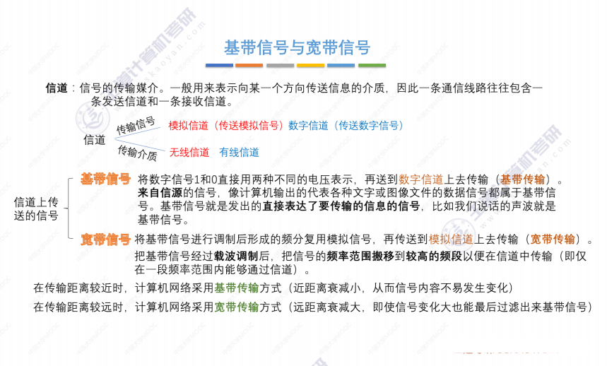
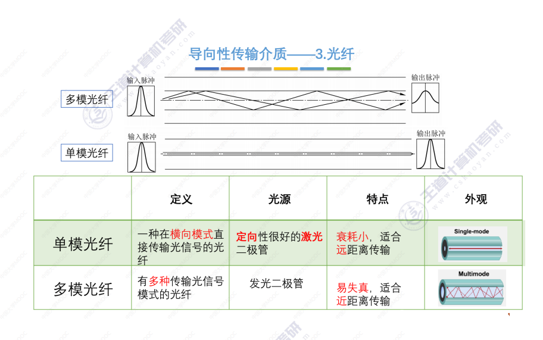

# 一、概览

**分数组成：**

- 选择题33-40，共16分
- 大题47，共9分
- 总分25分

## 定义

​		计算机网络是一个将分散的、具有独立功能的计算机系统，通过通信设备与线路连接起来，由功能完善的软件实现资源共享和信息传递的系统。

​		不同阶段，人们给出了不同的定义，可大致分为三类。

- **广义观点**
  - 能实现远程信息处理的系统或能进一步达到资源共享的系统
- **资源共享观点**
  - 以能够相互共享资源的方式互连起来的自治计算机系统的集合
- **用户透明性观点**
  - 整个网络像一个大的计算机系统一样对用户是透明的

## 组成

- **组成部分**
  - 硬件、软件、协议
- **工作方式**
  - 边缘部分：所有连接到因特网上、供用户直接使用的主机，C/S和P2P
  - 核心部分：大量的网络和连接这些网络的路由器
- **功能组成**
  - 通信子网：传输介质、通信设备、网络协议
  - 资源子网：实现资源共享的设备及其软件的集合

## 分类

- **分布范围**
  - 广域网、城域网、局域网、个人局域网
- **使用者**
  - 公用网、专用网
- **交换技术**
  - 电路交换、报文交换、分组交换
- **拓扑结构**
  - 总线型、星型、环型、、网状型
- **传输技术**
  - 广播式、点对点
- **传输介质**
  - 有线、无线

## 功能

- **数据通信**
  - 所有功能的基础，没有通信就不谈共享
- **资源共享**
- 分布式处理、提高可靠性、负载均衡

## 发展

- **第一阶段**
  - ARPANET,1983接受TCP，选定Internet为主要通信系统
- **第二阶段**
  - 三级结构，主干、地区、校园网，国家科学基金网NSFNET
- **第三阶段**
  - 多层次ISP结构

## 模型

- **实体**
  - 第n层中的活动元素称为n层实体，同一层实体称为对等实体
- **协议**
  - 为对等实体数据交换而建立的规则、标准或约定【水平】
  - 语法：传输数据的格式
  - 语义：所要完成的功能
  - 同步：各种操作的顺序
- **接口**
  - 也称访问服务点（SAP，Service Access Point），上层使用下层服务的入口
- **服务**
  - 下层为相邻上层提供的功能调用【垂直】
  - SDU：服务数据单元，为完成用户所要求功能而应传送的数据
  - PCI：协议控制单元，控制协议操作的信息
  - PDU：对等层次之间传送的数据单位

---

- **应用层**
  - 用户与网络的界面
- **表示层**
  - 数据格式转换、加密、压缩恢复（语法、语义）
- **会话层**
  - 向上层提供建立连接并在连接上有序传输数据
  - 建立、管理、终止会话
  - 使用校验点可使通信从校验点/同步点恢复通信，适用大文件
- **传输层**
  - 端到端通信，单位是报文段or用户数据报
  - 可靠/不可靠传输、差错控制、流量控制、复用分用
- **网络层**
  - 传递分组、路由选择，单位是数据报
  - 路由选择、流量控制、差错控制、拥塞控制
- **数据链路层**
  - 将数据报组装成帧，单位是帧
  - 封装成帧、差错控制、流量控制、访问接入控制
- **物理层**
  - 在物理媒体上实现比特流的透明传输，单位是比特
  - 定义接口特性、传输模式、速率、比特同步、编码

---

**相同点：**

- 都分层
- 基于独立的协议栈的概念
- 可实现异构网络互联

**不同点**

- 网络层、传输层的区别，TCP的网络层(即IP层)是无连接的

## 性能指标

**速度相关：**

- **速率**
  - 数据传输率或比特率，单位b/s
- **带宽**
  - 原本指某个信号具有的频带宽度，即最高频与最低频之差，单位Hz
  - 计网中指某一点到另一点所能通过的最高数据率，单位b/s
- **吞吐率**
  - 单位时间内通过某个网络的数据量，单位b/s

**时间相关：**

- **时延**
  - 发送/传输时延：从发送分组的第一个比特到该分组的最后一个比特发送完毕所需的时间
  - 传播时延：信道上传播所需的时间
  - 排队时延：分组在路由器中等待输入输出链路可用的时间
  - 处理时延：数据在交换节点为存储转发而进行的必要处理所需的时间
- **时延带宽积**
  - 传播时延 * 带宽，单位bit
  - 又称以比特为单位的链路长度
- **往返时间RTT**
  - 从发送方发送数据开始，到发送方收到接收方的确认的时间
- **利用率**
  - 信道利用率：有数据通过时间 / (有+无)数据通过时间
  - 网络利用率：信道利用率加权平均

# 二、物理层

## 概念

### 定义

​		**物理层解决如何在各种传输媒体上传输数据比特流，而不是指具体的传输媒体。**

​		**主要任务：确定与传输媒体接口有关的一些特性。**

### 功能

- **机械**
  - 物理连接的规格
- **电气**
  - 线路上的电压范围、传输速率、距离等
- **功能**
  - 指明各信号的意义，各个信号线的用途
- **规程**
  - 时序关系

## 通信基础

### 术语

- **信道**
  - 信号的传输媒介

- **码元**
  - 用一个固定时长的信号波形（数字脉冲），代表不同数值的基本波形
  - k进制码元表示有k个离散的状态，大于2时称为M进制码元

- **码元传输速率**
  - 别名调制速率、符号速率，单位波特（Baud）
  - 码元速率与进制数无关，只与码元长度有关

- **带宽**
  - 最高频率与最低频率的差值
- **信号**
  - 基带信号：数字信道传输，直接表达了要传输的信息的信号
  - 宽带传输：模拟信道传输，调制后的信号

### 编码

​		**将数据变成数字信号，称为编码。**

**设备：**

- 数字数据：数字发生器
- 模拟数据：PCM编码器

---

- **非归零编码**
  - 【NRZ，None Return Zero】，1高0低
  - 没有检错功能，无法判断一个码元开始结束，难以同步
- **归零编码**
  - 【RZ，Return Zero】，高低表示1，低低表示0，后半部分归零
  - 一个码元之内都要恢复到0，自同步，但也降低了效率

- **反向不归零编码**
  - 【NRZI，None Return Zero Inverse】，同NRZ，但非绝对的1高0低，与前一个码元不同则跳变
- **曼彻斯特编码**
  - 高低表示1，低高表示0，中间跳变，用于传统以太网
  - 每个码元被调成了两个电平，所以数据传输速率只有调制速率的一半
- **差分曼彻斯特编码**
  - 开端1同0异，中间跳转，常用于局域网
  - 1的码元开端没有跳变，0的开端有跳变，每个码元中间都有跳变
- **4B/5B编码**
  - 比特流中插入额外的比特来打破连串的01，用每5个bit去编码4个bit

### 调制

- **幅度**
  - 离开平衡位置的最大距离
- **频率**
  - 周期：完成一次全振动所需的时间
  - 频率：单位时间完成全振动的次数
- **相位**
  - 各个时刻所处的不同状态

- **采样定律**
  - 采样：对模拟信号周期性扫描，将时间上连续的信号变成时间上离散的信号
  - 量化：将采样所得的电平幅值按照一定标准转化为对应数值
  - 编码：将量化结果转化为对应的二进制编码
  - **为了保证信号不失真，f$_{采样频率}$≥ 2f**

### 公式

- **奈氏准则**
  - 在理想低通（无噪声、带宽受限）条件下，为了避免码间串扰，极限码元传输速率为 v$_{max}$= 2W (Baud)
  - 给出了码元传输速率的限制，但并没有对信息传输速率给出限制，因此需要采用多元制的调制方法。
- **香农定理**
  - 在带宽受限且有噪声的信道中，为了不产生误差，信息的数据传输速率有上限值，v$_{max}$= W log$_2$(1+S/N)
  - S/N没有单位，也可用 k = 10log$_{10}$(S/N)  (dB)，故S/N = 10$^{k/10}$

### 交换方式

- **电路交换**
  - 独占资源，适用于数据量大、实时性要求高情况

- **报文交换**
  - 站点一次性发送数据块、数据报长短不一致

- **分组交换**
  - 数据报方式
  - 虚电路方式

---

**数据报方式**

- 为网络层提供无连接服务，可能失序、重复、丢失
- 对故障适应能力强，适用于突发性通信，不适用于长报文、会话式通信

**虚电路方式**

- 为网络层提供连接服务，结合了数据包方式和电路交换特点
- 故障敏感，某个结点故障，整条链路将遭到破坏

## 传输

### 分类

**通信方式：**

- **单工**
  - 只有一个方向的通信无反方向的交互
- **半双工**
  - 也称双向交替通信，需2条信道
- **全双工**
  - 也称双向同时通信，需2条信道

**数据通信：**

- **串行**
  - 速度慢、费用低、适合远距离
- **并行**
  - 速度快、费用高、适合近距离

**时序：**

- **同步**
  - 传送以区块为单位，因此也称区块传输，先同步再传输
- **异步**
  - 发送方可在任何适合发送，接收方不知他们何时到达

### 介质

> 传输介质也称传输媒体/媒介，物理通路
>
> 传输媒体也称第0层，物理层规定了电气特性，因此能够识别比特流

- **导向型**
  - **双绞线**
    - 非屏蔽、屏蔽
    - 模拟信号：放大器
    - 数字信号：中继器
  - **同轴电缆**
    - 50Ω：基带信号，局域网
    - 75Ω：宽带信号，有线电视系统
  - **光纤**
    - 单模：激光二极管、衰耗小，远距离
    - 多模：发光二极管、易失真、近距离

- **非导向型**
  - **无线电波**
    - 穿透强、远距离，手机通信
  - **微波**
    - 地面微波接力、卫星通信
  - **红外线、激光**
    - 传递红外信号、激光信号

## 设备

- **中继器【Repeater】**
  - 对信号再生和还原
  - 两边同类网络、速率相同
- **集线器【Hub】**
  - 对信号再生放大转发
  - 各端口主机平分带宽

# 三、链路层

> 数据链路：链路（物理通道） + 硬件 + 软件 = 逻辑通道
>
> 加强物理层传输原始比特流的功能，将物理层提供的可能出错的物理连接改造成为逻辑上无差错的数据链路，使之对网络层表现为一条无差错的链路。

## 功能	

- **为网络层提供服务**
  - 无连接无确认
  - 无连接有确认
  - 面向连接有确认
- **链路管理（针对面向连接服务）**
  - 连接建立、维持、释放
- **封装成帧**
  - 透明传输
- **流量控制**
  - 限制发送方
- **差错控制**
  - 帧错、位错

> 有连接一定有确认！

---

### 封装成帧

- **字符计数**
  - 首部使用一个计数字段
- **字符/字节填充**
  - 首尾添加SOH、EOT，中间关键字转义
- **零比特填充**
  - 首尾添加01111110作为帧定界符
  - 发送端，每5个连续1后面填入一个0
  - 接收端，每5个连续1，删除后面的0
- **违规编码法**
  - 曼彻斯特编码中，高高、低低未使用，可用来作为帧定界

---

### 差错控制

- **热噪声**
  - 也称随机噪声、全局性的
  - 解决办法：提高信噪比，对传感器下手
- **冲击噪声**
  - 外界特定的短暂原因造成，局部性的
  - 解决办法：通过利用编码技术解决

- **奇偶校验码**
  - 仅检错无法纠错
- **循环冗余码**
  - 有纠错能力但没有使用，硬件完成

- **海明码**
  - 纠正一位错误

> 两个码字异或结果中1的个数，称为二者的海明距离（码距）
>
> 编码集中的最小码距称为该编码集的码距
>
> 海明不等式：2$^r$ ≥ m + r +1，r表示纠错码位数，m表示数据位数，不等式的意义表示：纠错码的任何一种情况，应该能cover住m+r位出现错误的情况加上一个全都正常的情况。

---

### 流量控制

- **停止-等待协议**
  - 发送窗口：1，接受窗口：1
  - 浪费了信道利用率
- **后退N帧协议**
  - 发送窗口：N，接受窗口：1
  - 窗口大小：W ≤ 2$^n$-1（小于序号组长度），超过则横跨了两个序号组，接收方无法辨别。
  - 连续发送数据帧提高了信道利用率，重传时导致效率降低
- **选择重传协议**
  - 发送窗口：N，接受窗口：N
  - 窗口大小：W ≤ 2$^{n-1}$（小于半个序号组长度），超过的话，当窗口前进半个序号组时，发送方无法辨别ACK包。

> 信道利用率：$\frac{发送时间}{发送时间+RTT}$

> 甲发完窗口内所有帧需要80ms
>
> 第一个帧发送时延 + 确认帧发送时延(此题为0) +双向传播时延 = 100.08ms
>
> 1000 * 8 * 1000 / 100ms = 80Mbps 

## 介质访问控制

- **信道划分介质访问控制（MAC，Multiple Access Control）**

---

### 静态划分

- **频分复用【FDM】**
  - 给用户分配一定频带，通信过程始终占用该频带
- **时分复用【TDM】**
  - 时间片轮转，达不到最高
  - 动态分配时隙，能达到信道最高速率
- **波分复用【WDM】**
  - 光的频分多路复用，一根光纤中传输不同波长光信号
- **码分复用【CDM】**
  - CDMA是码分复用的一种方式
  - -1表示0，1表示1

---

### 动态划分

- **轮询**
  - 轮询协议
  - 令牌传递协议
- **随机**
  - ALOHA
  - CSMA
  - CSMA/CD
  - CSMA/CA

---

**ALOHA**

- **纯ALOHA**
  - 不监听信道、想发就发、冲突就随机等待一段时间
- **时隙ALOHA**
  - 划分时间片，所有用户在时间片开始时刻同步接入信道，冲突则下个时间片再发

---

**CSMA**

- **1-坚持**
  - 忙则一直监听，空闲后马上传输
- **非坚持**
  - 忙则等待一个随机事件再监听
- **p-坚持**
  - 空闲则p概率传输，1-p概率下个时间槽传输
  - 忙则持续监听，直到空闲时p概率发送

---

**CSMA/CD**

- 争用期：经过2t时间就能检测到发生了碰撞
- 截断二进制指数规避算法
  - 定义参数k：重传次数但不超过10，k = min[重传次数，10]
  - 基本退避时间：2t（争用期）
  - 冲突时从[1,2,3...2$^k$-1]中选一个数，乘以基本退避时间
  - 若重传16次仍不成功，向高层报告错误
- 最小帧长：帧过小，则会在发送完毕才检测到碰撞，因此要规定最小帧长

> $\frac{帧长}{传输速率}$ ≥ 2t，以太网最短帧长64B

---

**CSMA/CA**

- 帧间间隔（InterFrame Space），简称IFS
  - 所有的站发送完后，必须等待一段很短的时间才能发送下一帧
  - SIFS（短IFS），短，分隔一段对话各帧
  - PIFS（点协调IFS），中，PCF操作中使用
  - DIFS（分布式IFS），长，异步帧竞争访问时延

> 与CSMA/CD异同：
>
> 相同：
>
> 都要先监听信道，发现空闲才能进行接入
>
> 不同：
>
> - 传输介质不同
>   - CD用于总线式以太网（有线）
>   - CA用于无线局域网（无线）
> - 载波检测方式不同
>   - CD通过电缆电压变化检测
>   - CA采用能量检测、载波检测和能量载波混合检测三种方式
> - CD检测冲突，CA避免冲突

---

**轮询协议**

- 轮询开销
- 等待延迟
- 单点故障

> 类比IO方式中的程序查询方式

---

**令牌传递协议**

- 令牌开销
- 等待延迟
- 单点故障

## 局域网

广域网与局域网异同：

|          |      广域网      |        局域网        |
| :------: | :--------------: | :------------------: |
| 连接方式 |    点对点连接    | 普通采用多点接入技术 |
| OSI层次  | 物理、链路、网络 |      物理、链路      |
|  着重点  |     资源共享     |       数据传输       |

> 二者平等，非包含关系
>
> 连接到一个局域网/广域网的主机在该网内通信时，只需使用其网络的物理地址

### 组成

- **网络拓扑**
  - 星型拓扑
  - 总线型拓扑
  - 环型拓扑
  - 树型拓扑
- **传输介质**
  - 有线：双绞线、同轴电缆、光纤
  - 无线：电磁波
- **介质访问控制方法**
  - CSMA/CD，适用于总线型
  - 令牌总线，适用于总线型/树型
  - 令牌环，适用于环型，如令牌环网

### 标准

> IEEE 802是IEEE 802 LAN/MAN标准委员会制定的局域网、城域网技术标准（1980年2月成立，故称802），其中的以太网、令牌环、无线局域网等被广为使用。
>
> IEEE 802将链路层又细分为LCC子层和MAC子层，LCC负责识别网络层协议，对其进行封装。MAC负责帧的解封装、链路管理、差错控制等，其存在屏蔽了不同物理链路种类的差异。

- 802.3标准：以太网
- 802.4标准：令牌总线网
- 802.5标准：令牌环网
- 802.8标准：FDDI（光纤分布数字接口）
- 802.11标准：无线局域网

|          |     以太网     | 令牌环 |  FDDI  |
| :------: | :------------: | :----: | :----: |
| 逻辑拓扑 |     总线型     |  环型  |  环型  |
| 物理拓扑 | 星型、拓展星型 |  星型  | 双环型 |

### 以太网

- **拓扑结构**
  - 逻辑上总线型
  - 物理上星型（Hub连接）
- **传输介质**
  - 粗/细同轴电缆、双绞线
- **介质访问控制**
  - CSMA/CD协议，曼彻斯特编码
- **标准**
  - DIX Ethernet V2
  - IEEE 802.3
- **服务**
  - 无连接：无握手过程，不建立连接
  - 不可靠：发送方不对帧编号，接收方不发送确认，差错帧直接丢弃，差错纠正交由上层负责

> 10BASE-T以太网
>
> BASE表示基带信号、T表示无屏蔽双绞线（UTP）、速率为10Mbps
>
> 100Base-T以太网
>
> 双绞线、CSMA/CD、全双工无冲突（不使用CSMA/CD，下同）
>
> Gbit以太网
>
> 光纤或双绞线、CSMA/CD、支持全双工/半双工，速率1Gbps
>
> 10Gbit以太网
>
> 光纤上传送、只支持全双工、无争用问题

|          |    10BASE5     |    10BASE2     |   10BASE-T   | 10BASE-FL |
| :------: | :------------: | :------------: | :----------: | :-------: |
| 传输媒体 | 同轴电缆（粗） | 同轴电缆（细） | 非屏蔽双绞线 |  光纤对   |
| 拓扑结构 |      总线      |      总线      |     星型     |  点对点   |

> 编码方式都采用曼彻斯特编码

### 无线局域网

- 有固定基础设施
- 无固定基础设施

### 虚拟局域网

**诞生**

- 隔离广播域
- 单位不同部门隔离，信息保密

> 广播域过大可能产生广播风暴，STP协议（最小生成树）就是用来避免环路的

**优点**

- 简化网络管理
- 提高网络安全
- 有效共享网络资源

---

**帧格式**

- 地址后面插入4字节，仅最后12bit表示VID

---

**划分办法**

- **基于端口**
  - 交换机端口组划分为一个VLAN，简单有效
- **基于MAC地址**
  - 当主机物理位置转换，仍然属于一个VLAN
- **基于IP地址**
  - 可以跨越路由器进行拓展，连接多个局域网主机

---

**交换机端口**

- **Access**
  - 用来连接用户计算机，仅限同一VLAN中通信
  - 端口接受未打标签的帧，打上标签发送出去
  - 只会转发同标签的帧，标签相同则转发
- **Trunk**
  - 交换机、路由器之间
- **Hybrid**
  - 既可用于交换机之间，也可以用于计算机与交换机

## 协议

### PPP

- 只支持全双工链路

**三大组成**

- 封装方法
- LCP，链路控制
- NCP，网络控制

---

**PPP帧格式**

- 面写字节
- F、A、C、协议、信息、校验、F
- F为7E（7D转义）、A为FF（不变）、C为03（不变）

> 既可以异步线路，又可以同步线路。在异步线路采用字节填充法（默认），在同步电路采用硬件完成比特填充（同HDLC）
>
> 点对点，非总线型，无须采用CSMA/CD，故无短帧，信息段0-1500B

### HDLC

- 面向比特流、全双工通信
- 零比特填充、信息编号、CRC校验

---

**HDLC帧格式**

---

**PPP与HDLC对比**

### 帧格式

**以太网MAC帧**

- 目的、源、类型、数据、校验
- 不需要结束码，因为有帧间隙
- 最短帧64B，减去18B帧头帧尾，最短数据为46B
- 最长数据1500B，规定。

---

**802.11局域网帧格式**

- 控制、生存周期、地址1,2,3、控制、地址4
- 地址12是AP的接受发送，地址34是帧的接受发送

## 设备

- **网桥【Bridge】**
  - 根据目的帧对帧进行转发和过滤
  - 隔离了冲突域，但不能隔离广播域
  - 转发表开始为空，采用自学习
  - 分为透明网桥、源路由网桥
- **交换机【Switch】**
  - 多接口网桥，分为直通式、存储转发式
- **网卡【NIC】**
  - 全称Network Interface Card
  - 与局域网通信：串行，通过电缆或双绞线
  - 与计算机通信：并行，通过IO总线

> 直通式联想计组中的Cache写策略：写直通法

# 四、网络层

## 功能

- **异构网络互联**
  - 将不同传输媒体、协议的网络互联起来 
- **拥塞控制**
  - 开环控制，静态
  - 闭环控制，动态
- **网络编址**
  - 分类编址
  - 子网划分
  - CIDR划分
- **路由选择**
  - 静态路由
  - 动态路由
    - 距离向量
    - 链路状态

### 网络编址

- **分类编址**
  - 哈夫曼树，分成5类，D类地址用来组播
- **子网划分**
  - 部分主机号作为子网号，整个大的网络对外仍表现为一个网络
- **CIDR划分**
  - 全称Classless Inter-Domain Routing
  - 消除基本分类编址，IP地址/网络前缀

---

**分类编址**

> 以下采用x:y表示网络号:主机号，方便记忆
>
> 0:0，代表整个Internet，用作默认路由
>
> 0:y，代表本网某个特定主机
>
> 1:1，代表本网广播地址，路由器不转发
>
> x:0，代表本网络
>
> x:1，直接广播地址，对特定网络所有主机广播
>
> 127:n，环回地址
>
> 私有地址：
>
> 10
>
> 172.16-172.31
>
> 192.168.0-192.168.255

---

**子网划分**

- 部分主机号作为子网号

> 所有子网中的可分配IP加起来一定小于不划分子网时可分配IP的总和，因为每个子网的全0和全1的IP不可分配

---

**CIDR编址**

- 路由聚合/构成超网：路由器报告路由信息时若报告所有子网，浪费空间

---

**子网掩码**

- **定长掩码【FLSM】**
  - 全称Fixed Length Subnet Mask，每个子网的掩码长度固定
  - 有的子网用不上那么多IP地址，有的子网IP数量不够用
- **变长掩码【VLSM】**
  - 全称Variable Length Subnet Mask，每个子网的掩码长度可变
  - 联想计组中的变长指令设计，也是哈夫曼树的应用

> 1. 根据网络所需IP地址个数确定主机号长度
>    - 主机个数、路由器接口、全0网络地址、全1广播地址
> 2. 所需IP最多的子网号最短，开始哈夫曼编码

### 报文转发

- **主机发送**
  - 本机IP与掩码相与得到网络地址，目的IP与掩码相与得到目的网络
  - 同一网络则直接交付，不同网络则通过网关交付
  - 主机可将路由器的一个接口的IP地址设为默认网关地址

- **路由器转发**
  - 检查是否出错，出错发送ICMP差错报告报文
  - 根据目的地址在路由表中进行匹配，地址与掩码相与等于目的网络则匹配上
  - 多个匹配上则最长前缀优先，没有一个匹配上则走默认路由
  - 交付时若数据报超过MTU则分片，不能分片则丢弃报错

### 路由选择

- **静态路由配置**
  - 配置错误导致环路
  - 聚合不存在网络导致环路
  - 网络故障导致环路
- **动态路由算法**
  - 距离向量算法/分散性
  - 链路状态算法/全局性

---

**静态路由配置**

- **配置错误导致环路**
  - 错误配置两个路由器的下一跳，导致两个路由器互相交付

- **聚合不存在网络导致环路**
  - 如下R1聚合出的网络有不存在的网络，R2会将超网的全部数据报转发过来
  - R1匹配不到不存在的网络，交给默认路由R2，形成环路
  - 解决办法设置黑洞路由，不存在的路由走黑洞路由

- **网络故障导致环路**
  - 某个网络的链路发生故障，若手动删除了该网络的路由条目，则该网络的路由报走默认路由，形成环路

---

**动态路由选择**

- **内部网关协议【IGP】**
  - 距离向量：RIP
  - 链路状态：OSPF
- **外部网关协议【EGP】**
  - 协议：BGP

---

**距离向量算法**

- **与谁交换信息**
  - 相邻路由器
- **交换的信息**
  - 自己的路由表
- **交换时间**
  - 每30s一次

> RIP中路由器收到路由表
>
> 1. 将距离加一
> 2. 将下一跳改为对应的路由器
> 3. 对比自己的路由器进行更新
>
> 类似RIP的还有思科的私有协议IGRP，IGRP也是周期广播路由表，默认最大100跳，综合考虑链路的带宽、延迟、负载、MTU、可靠性，但已被其EIGRP取代

---

**链路状态算法**

- **与谁交换信息**
  - AS中所有路由器，洪泛法即广播
- **交换的信息**
  - 相邻的所有路由器的链路状态
- **交换时间**
  - 链路状态变化时才发送

> 与OSPF相同的协议还有IS-IS协议，使用最短路径优先SPF算法进行路由计算。
>
> 由于IGRP种种缺陷不足，思科发布增强IGRP协议EIGRPP，是一种基于距离向量和链路状态的协议，拥有极快的收敛速度，还引入了非等价负载均衡技术。

---

**外部网关协议**

- **与谁交换信息**
  - 邻站AS发言人
- **交换的信息**
  - 网络的可达性信息，即达到某个网络所要经过的AS
- **交换时间**
  - 发生变化时更新有变化的内容

## 协议

### IP

- 除最后一个分片，每个分片数据长度一定是8个整数倍
- 总长度单位：1B，片偏移单位：8B，首部单位：4B
- 超过链路层MTU但不能分片，会发送ICMP差错报告报文
- ICMP协议1，TCP协议6，UDP协议17

### ARP

- 完成主机或路由器IP地址到MAC地址的映射
- 协议自动完成，对上层透明

### DHCP

- 主机获得IP地址可通过静态配置：IP地址、子网掩码、默认网关
- DHCP则是动态配置主机IP地址，所有的报文均是广播形式

> 发现-提供-请求-确认
>
> 主机发送请求报文为什么是广播形式？
>
> DHCP发送提供报文时会将IP地址暂时锁定，处于不可分配状态，主机广播请求报文是告诉没有成功提供的服务器尽快解锁IP地址

### ICMP

- **终点不可达**
  - 路由器、主机无法交付数据报
- **源点抑制**
  - 网络拥塞，频繁丢数据
- **时间超过**
  - TTL=0
- **参数问题**
  - 首部校验不通过
- **改变路由**
  - 有更好的路由，重定向

---

**ICMP报文类型**

- **差错报告**
  - 差错报告报文出错，不再报错
  - 第一个分片之后的数据报片，不再报错
  - 组播地址报文，不发送报错
  - 特殊地址（如127.0.0.0），不发送报错
- **网络探询**
  - 测试目的站是否可达及相关状态
  - 请求目的站当前日期时间，进行时钟同步

> ICMP应用：
>
> - Ping
>   - 应用层直接交付给网络层，用ICMP处理
> - Traceroute
>   - 设置TTL依次递增，接受ICMP报错来探查路由

### RIP

- 应用层协议，使用UDP传送数据
- 坏消息传得慢，适合小网络

### OSPF

- 直接用IP数据报发送，收敛很快
- 每隔30min，刷新一次数据库中链路状态
- 为了用于更大网络，可以将AS再划分若干取与，每个区域一个32位标识符

---

**OSPF分组类型**

- **问候分组【Hello】**
  - 测试邻居可达
- **数据库描述【DD】**
  - 向邻居发送数据库摘要
- **链路状态请求【LSR】**
  - 向邻居请求某些链路信息
- **链路状态更新【LSU】**
  - 洪泛发送某一链路状态
- **链路状态确认【LSA】**
  - 对更新分组的确认分组

### BGP

- 应用层协议，使用TCP传送数据
- 四种报文：open、update、keepalive、notification

### IGMP

- 全称网际组管理协议，管理互联网组播组
- 采用IP数据报来传递报文
- 主机：向路由器发送报文声称入组，路由器发给因特网其它组播路由器
- 路由器：周期性探询主机，只要有一个主机响应则认为组活跃，否则认为组不活跃

## 应用

### NAT

> 一些P2P因为需要外部主动与内部主机通信，但由于主机未向外通信过，路由器中没有记录，所以就诞生了NAT隧道技术，也叫内网穿透。

> 将内网地址与外网地址对应的技术叫做NAT，但这存在一个问题，至多只有N个内网主机能够同时和因特网上主机通信。
>
> 因此借助传输层端口号进行映射，一个全球IP地址就可以使多个拥有内网地址的主机同时和因特网上主机进行通信，称之为NAPT技术。

### VPN

- 利用公用的因特网作为专用网之间的通信载体

### IPV6

- **地址空间更大**
  - 16B，冒号16进制记法，8部分，每部分2B
  - 压缩记法，1连串0用一对冒号取代
  - FF05:0:0:0:0:0:0:B3缩写为FF05:B3
- **移除校验和**
  - 减少没跳处理时间
- **扩展首部**
  - 固定40B基本首部，首部标签指向"下一个首部"的偏移量
  - 首部为8B的整数倍，IPv4为4B的整数倍
- **即插即用**
  - 不需要DHCP协议
- **只能在主机分片**
  - 分片过大时有ICMPv6报错

---

**过渡策略**

- **双栈技术**
  - 设备同时启用IPv4和IPv6协议栈，如果设备为计算机，它将同时拥有两个协议的地址
- **隧道技术**
  - 用其他协议的数据报包裹IPv6的数据报

### 组播

- 组播组中主机可以在同一物理网络，也可以来自不同物理网络（如果有组播路由器支持）
- 组播地址为D类地址，，只能作为目标地址，源地址总是单播地址
- 不提供可靠交付，应用于UDP，不产生ICMP差错报文

- **硬件组播**
  - 组播MAC地址以01-00-5E打头，低23位由IP转换而来

- **因特网范围组播**
  - IGMP协议让路由器直到本局域网是否有主机加入或退出某个组播组
  - 组播路由协议，以源点为根结点的组播转发树，分为基于链路状态、距离向量、协议无关的组播

### 移动IP

- 三个角色：归属代理、外部代理、移动节点
- 两个网络：归属网络、外部网络
- 两个地址：转交地址、永久地址

> 移动节点：
>
> - 拿到转交地址，发送注册报文给归属代理（包含永久地址、转交地址）
>
> 归属代理：
>
> - 保存转交地址与永久地址的映射
> - 返回注册响应报文

## 设备

- **路由器【Router】**
  - 早期叫做网关，也叫三层交换机，是一种具有多个输入、输出端口的专用计算机，任务是转发分组
  - 有两个结构：路由选择、分组转发
  - 转发表由路由表得来，可用软件、也可用硬件实现，每一行必须包含要到达网络的输出端口和某些MAC地址信息的映射
  - 工作在网络层，但NAT路由器还需要查询传输层端口

# 五、传输层

## 概述

- **端口**
  - 是传输层SAP，标识主机中的应用进程
- **套接字**
  - （主机IP地址，端口号）

## 功能

- **可靠传输**
  - 校验、序号、确认、重传
  - 超时重传、快速重传
- **流量控制**
  - 局部的，描述接收端接受能力
  - 滑动窗口机制
- **拥塞控制**
  - 全局的，描述整个网络的情况
  - 慢开始、拥塞避免
  - 快重传、快恢复

### 可靠传输

- **校验**
  - TCP与UDP一样，增加伪首部
- **序号**
  - 一个字节占一个序号
- **确认**
  - 累计确认
- **重传**
  - 自适应算法，动态改变重传时间RTTs
  - 收到3个冗余ACK时就会进行快速重传

> 超时重传的报文不参与RTT的计算，但超时重传的报文也能说明网络的RTT情况，故还可以改进为重传后就将RTO增大一些

### 流量控制

- 接受窗口：rwnd，拥塞窗口：cwnd
- 发送窗口 = min (接受窗口，拥塞窗口)
- TCP建立连接和每次数据通信时可以沟通接受窗口大小
- 接受窗口变为0，发送方会启动持续计时器，计时器到期，发送零窗口探测报文，收到回应重新计时

### 拥塞控制

- **慢开始、拥塞避免**
  - 发生超时，ssthresh设为窗口大小的一半，窗口从1重新开始
  - 一个传输轮次表示发送一批报文段并受到它们的确认的时间

- **快重传、快恢复**
  - 收到冗余ACK进行快重传，同时ssthresh和窗口大小都设为此时窗口值一半
  - 若下次指数增长的值超过了ssthresh门限值，则窗口调整为ssthresh值，而不是指数值

## 协议

### UDP

- 无连接、不可靠、面向报文、实时应用、8B首部
- 首部：源端口、目的端口、总长度、校验和

---

**UDP校验**

- 加上伪首部（8B），包括源地址、目的地址、UDP数据长度、协议类型、填充（0x0）
- 数据部分按16bit对齐，对不齐则用零填充
- 按每16bit反码求和，并在高位补零得到一个32位求和结果
- 如果32位结果高16位不为0，则高位加低位再得到一个32位结果，直到高16位为0，将低16位取反得到校验和

### TCP

- 端口、序号、确认号、控制段、校验和紧急指针、扩展

---

**TCP连接管理**

- 三次握手
- 四次挥手

# 六、应用层

