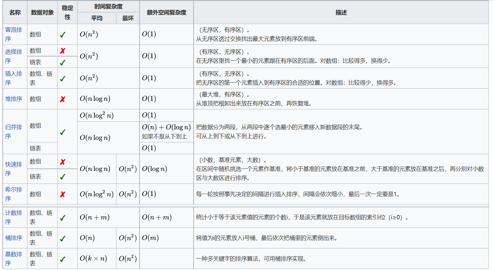

# 前言


​		本博客主要参考`《LeetCode 101 - A LeetCode Grinding Guide (C++ Version)》`一书，为了以后能快速复习，所以没有写太长，如果有幸能被你看到，希望能帮到你。

​		ps：E表示Easy，M表示Medium，H表示Hard。


# 1. 二分查找


## 剖析

​		我们可以用数学的方式定义二分查找，给定一个在区间[a,b]内的单调函数f(x)，若f(a)和f(b)正负性相反，那么必定存在一个解c，使得f(c)=0（中值定理）。

​		二分查找也可以看作双指针的一种特殊情况，但一般会将二者区分。双指针的题，通常是一步一步移动的，而在二分查找里，指针每次移动半个区间长度。

​		需要注意的是，二分查找只能用在有序的数组中，时间复杂度为O(logn)。


## 心得

**步骤：**

1. 定义变量low，high，mid
2. while循环low<=high（看情况要不要等于）
3. mid = low + (high - low) / 2
4. 进行边界条件判断

**注意：**

1. mid的计算如果是按照 ( low + high ) / 2进行计算，部分语言可能溢出，所以不建议这样使用。
2. while循环结束后要返回值，一般是返回low或者flase、-1之类的不存在状态值，具体返回值建议画图判断。


## 题目

- 4 寻找两个正序数组的中位数（H）
- 34 查找区间（M）
- 35 搜索插入位置（E）
- 69 求开方（E）
- 81 旋转数组查找数字Ⅱ（M）
- 154 寻找旋转排序数组中的最小值Ⅱ（H）
- 278 第一个错误的版本（E）
- 540 有序数组中的单一元素（M）
- 704 二分查找（E）

Easy：35、69、278、704

Medium：34、81、540

Hard：4、154


## 解答

### 34.查找区间

#### 分析

​		查找target在nums里的区间，**重点是要找到区间的左右端点。**

​		确定了这一点之后再来分析如何找到左右端点，因为左右端点值相等，所以可以利用二分查找来找到该值的下标，但又如何知道找到下标一定是区间的端点？

​		所以我们可以找到一个大于target的值的下标，然后减一即可找到右端点，找到**第一个大于等于target**的值的下标，基本思路有了！

​		即左端点：第一个 >= target的下标；右端点：第一个 > target的下标。

​		所以可以写一个二分查找的辅助方法，来**查找大于或者大于等于target**的值的下标，为了复用可以设置一个参数来判断是否可以等于。

​		根据步骤来，定义low和high，写循环条件。然后我们可以定义一个变量来存储返回值，然后每一次的循环，只要mid是大于或者大于等于（根据flag来），就将返回值设置为mid，这样最终跳出时，返回值就是第一个要找的下标。


#### 代码

​		下面的ans=mid，个人觉得是有一定的贪心的思想在里面的，只要mid大于target，就是一个局部解，随着一次次循环，会逐步接近最优解（第一个大于target的值）。

```java
class Solution {
    public int[] searchRange(int[] nums, int target) {
        int[] ans = new int[] { -1, -1 };
        // 找到 第一个 >= target 的元素的下标
        int left = binarySearch(nums, target, true);
        // 找到第一个 > target 的元素的下标
        int right = binarySearch(nums, target, false) - 1;
		// left有可能越界，所以要先进行判断，right减了一所以肯定不会
        if (left < nums.length && nums[left] == target && nums[right] == target) {
            ans[0] = left;
            ans[1] = right;
        }
        return ans;
    }

    // 二分查找，查找第一个大于target的元素的下标，flag表示是否可以等于
    public int binarySearch(int[] nums, int target, boolean flag) {
        int low = 0, high = nums.length - 1, mid, ans = nums.length;
        while (low <= high) {
            mid = low + (high - low) / 2;
            if (nums[mid] > target || (flag && nums[mid] >= target)) {
                high = mid - 1;
                ans = mid;
            } else {
                low = mid + 1;
            }
        }
        return ans;
    }
}
```

------------- update：2022/1/8 ---------------

可直接用普通的二分找到一个点，然后分别向左向右扩展，更简单，更符合常规想法。

```go
func searchRange(nums []int, target int) []int {
	n := len(nums)
	i, j := 0, n-1

	for i <= j {
		mid := (i + j) / 2
		if nums[mid] < target {
			i = mid + 1
		} else if nums[mid] > target {
			j = mid - 1
		} else {
			p, q := mid, mid
			// 分别向左向右扩展
			for p > 0 && nums[p-1] == target {
				p--
			}
			for q < n-1 && nums[q+1] == target {
				q++
			}
			return []int{p, q}
		}
	}
	return []int{-1, -1}
}
```


### 81 旋转数组查找数字Ⅱ

#### 分析

​		首先，二分查找的先决条件：数组有序。这题数组被旋转，那么我们就从中寻找有序数组！

​		还是定义low和high，然后计算mid，以mid为中点，**可以发现mid将数组分成了两部分，其中一部分一定有序！**

​		两部分分别是 [0 , mid]，[mid+1 , n-1]，根据mid和0的大小关系可判断有序性，若target落在了有序的一部分，则将low和high调整为此区间即可，若没有落在有序部分，该怎么办？

​		假设此数组取值范围[a , b]，那么target的取值就有三种，又mid将数组的分类情况有两种（左侧有序，右侧有序），则有总共会有6种情况，我们慢慢分析。

​		先考虑左侧有序的情况，如5、6、7、8、9、2、3、4，被mid分成了[5 , 6 , 7 , 8]和[9 , 2 , 3 ,4]，然后考虑target的情况

​		①大于b，那么就要根据右侧无序区间进行判断，我们可以看到此无序区间也是类似于初始的情况（将2、3、4、9翻转为9、2、3、4），那么可以递归求解。

​		②小于a，那么就要根据右侧无序区间进行判断，同①在无序区间内取值。

​		③大于a小于b，那么既可能根据有序区间判断（直接简单二分），也可能根据无序区间判断（递归）

​		然后考虑右侧有序的情况，如6、7、8、1、2、3、4，被mid分成了[6 , 7 , 8 , 1]和[2 , 3 ,4]，同样考虑target的情况，通过上面的分析，我们发现target总要选择一个区间进行判断（无序或有序）。

​		按照步骤来，定义low和high，写循环条件。然后判断是那一边的区间有序，然后看target是要根据那一侧的区间进行判断。


#### 代码

​		需要注意的是，上面说的递归只是一个简单的想法，将问题暂时搁置，虽然确实可以用递归解决，但函数的栈切换是一种性能损耗，能不用尽量不用。注意到我们已经在while(low<=high)的循环中了，所以可以直接利用这个循环当作“递归”。

​		同时，因为这一题元素可以重复，碰到[1，0，1，1]这种情况就不能判断哪一个区间是有序区间了，此时将low和high分别移动一次即可，同时不要忘记了while循环出来后返回不存在的状态。

```go
func search(nums []int, target int) bool {
	n := len(nums)
	if n == 0 {
		return false
	}
	if n == 1 {
		return nums[0] == target
	}
    
	low, high := 0, n-1
	var mid int
	for low <= high {
		mid = low + (high-low)/2
		if nums[mid] == target {
			return true
		}
		// 避免形如[1,0,1,1,1]这种判断不了哪个是有序区间的情况
		if nums[low] == nums[mid] && nums[mid] == nums[high] {
			low++
			high--
			continue
		}
		// 左侧区间有序
		if nums[low] <= nums[mid] {
			// 如果target根据此区间判断,直接开始二分
			if nums[low] <= target && target < nums[mid] {
				high = mid - 1
			} else {
				// 根据无序区间进行判断
				low = mid + 1
			}
		} else {
			// 右侧区间有序
			// 如果target根据此区间判断,直接开始二分
			if nums[mid] < target && target <= nums[high] {
				low = mid + 1
			} else {
				// 根据无序区间进行判断
				high = mid - 1
			}
		}
	}
	// 二分查找出来的话说明不存在
	return false
}
```


​	

## 总结

​		二分的思想很简单，但写起来是有一定难度的，特别是存在的一些变形，而且有些时候也不能一眼看出来是二分，遇到题还是要多画图，多考虑边界条件，while循环出来记得返回值，返回值可以为指针指向（low或者high）或者false、-1之类的不存在状态值。


# 2.双指针


## 剖析

​		双指针主要用于遍历数组，两个指针指向不同的元素，从而协同完成任务。

​		常见的用法有：滑动窗口，快慢指针，前后指针。

​		滑动窗口，两个指针之间的内容被称为窗口，然后整个窗口滑动向前，窗口大小有时固定有时会变化。

​		快慢指针，两个指针移动速度不同，如满指针每次向前移动一步，快指针每次向前移动两步。

​		前后指针，前指针从数组头部开始向后移动，后指针从数组尾部向前移动。

​		**总结起来就是两个指针的遍历方向是否相同，方向相同就是滑动窗口/快慢指针（通常用于区间搜索），方向不同就是前后指针（通常用于排好序的数组的搜索）**，当然，这都是指向同一个数组的用法，部分题会指向多个数组，如归并两个有序数组及其延申归并多个有序数组，还有Vue用的diff算法等等.....

- 指向同一个数组
  - 遍历方向相同（区间搜索）
    - 滑动窗口
    - 快慢指针
  - 遍历方向不同（元素搜素）
    - 前后指针
- 指向不同的数组
  - 归并多个有序数组
  - Vue的diff算法
  - .....


> > 拓展：
> >
> > **指针与常量（C++）**
> >
> > int x = 1;
> >
> > // p中存放变量x的地址，即p指向x
> >
> > int *p = &x;  
> >
> > // 指针可以指向其它地址，但指针指向值不可修改，即不可用p1去修改x的值
> >
> > const int * p1 = &x;  
> >
> > // 指针可以去修改x的值，但p2就只能指向x，即指针中存储的内容（x的地址）不可改变
> >
> > int * const p2 = &x;   
> >
> > // 指针中存储的值不可改变，而且指针也不可去改变它指向的地址空间的值
> >
> > const int * const p3 = &x;  
> >
> > **指针与函数（C++）**
> >
> > // 指针函数，返回类型是一个指针
> >
> > int * add (int a, int b) { return new int(a+b); }
> >
> > // 函数指针，指向函数的指针
> >
> > int sub (int a , int b) { return a-b;  }
> >
> > int (* p) (int , int) = sub;


## 心得

​		因为双指针的运用类型很多，所以没有固定的解题方法，只需要根据题目快速判断出类型解答即可。

​		**链表的题目可以设置一个哑指针，其next指向head，可解决如head为null的特殊情况。**

​		**指针的移动和判断先判断再移动，如先判断right+1是否满足条件，在进行right++。**


## 题目

**前后指针：**

- 167 两数之和（E）
- 977 有序数组的平方（E）


**快慢指针：**

- 142 环形链表Ⅱ（M）
- 283 移动零（E）


**滑动窗口：**

- 76 最小覆盖字串（H）
- 567 字符串的排列（M）


**其它：**

- 88 归并两个有序数组（E）


## 解答

### 142 环形链表Ⅱ

#### 分析

​		这题是141改编，141只用判断是否有环，此题需要返回环起点，但是可以使用同样的解法——快慢指针（Floyd判圈法）。可类比生活中两个人跑步，一个人跑得快，一个人跑得慢，跑得快的人早晚是会追上跑得慢的人的，而且跑得快的人只可能比跑得慢的多1圈（自行证明）。

​		至于如何找到环，有多种理解，以下给出一种理解方法，先设环的长度为n，设慢指针到达环起点时快指针在环的第x个位置处（也可能在此与慢指针相遇），从物理的角度理解，设慢指针速度为1，以其为静止，则快指针速度为1，要走n-x个单位才能到达慢指针处，距离/速度=时间，即n-x个单位时间才能追上慢指针，此时不以慢指针为参考系，慢指针在n-x个单位时间内，一定走不到一圈，所以可以得出结论：**慢指针进入环内的第一圈，就会与快指针相遇。**

​		**若两者像跑操一样都是从环起点开始跑，则第一次相遇时快指针肯定是在跑第二圈，但是两者的起点不是环起点，起点到达环起点还有一段未知距离（见下图，如果a很长，则慢指针进入环的时候，快指针可能已经跑了很多圈）**，所以不知道相遇时快指针已经跑了多少圈，设为k。

​		任一时刻S$_{快}$ = 2S$_{慢}$，见下图，即 a + k(b + c) + b = 2 (a + b)，因为快慢指针相遇点再走c步即可到达起点，所以将c看出未知量。

​		化简得：a = c + (k - 1)(b + c)，就是说a等于m圈再加上c，若我们将一个指针ptr设在head，让他和slow指针同时移动，则ptr走了距离a时，slow一定走了m圈加上一个c，即到达起点。


#### 代码

```go
func detectCycle(head *ListNode) *ListNode {
	if head == nil {
		return nil
	}
	slow, quick := head, head
	for quick.Next != nil && quick.Next.Next != nil {
		quick = quick.Next.Next
		slow = slow.Next
		// 开始相遇
		if quick == slow {
			// 回到起点
			quick = head
			for quick != slow {
				quick = quick.Next
				slow = slow.Next
			}
			return quick
		}
	}
	return nil
}
```

------------- update：2022/1/22 ---------------

可以多用点空间创建一个哈希表，用哈希表保存遍历过的节点，如果出现重复得，说明碰到了环。

```go
func detectCycle(head *ListNode) *ListNode {
	hash := map[*ListNode]struct{}{}
	for head != nil {
		if _, ok := hash[head]; ok {
			return head
		}
		hash[head] = struct{}{}
		head = head.Next
	}
	return nil
}
```

> > 扩展：
> >
> > 当我们用golang中的map来做set使用时，可将value类型设为struct{}，而不是bool，布尔类型在有的语言中是1bit，有的语言中是1Byte（填充了padding来做内存对齐），在go中bool是1Byte，而空结构体类型是不占空间的，所以用空结构体更好。


### 76 最小覆盖字串

#### 分析

​		此题与567（字符串的排列）颇为相似，但更复杂，567是在A串中找到B串的一个排列的字串，此题是要寻找包含B串所有字符的最小字串，如A：nAmCBD，B：ABC，则最小字串为nAmCB。

​		首先肯定要知道B串中每个字符的数量（数组/哈希表），然后在A中查找包含这个数量字符的区间，查找区间即可联想到滑动窗口和快慢指针，很明显这题快慢指针不符合，所以我们可以先找到一个包含B串字符的窗口，然后精简窗口。

​		**滑动窗口分为：固定窗口大小（如567）和不固定窗口大小**。此题由上述分析可知为不固定大小，不固定大小的解题步骤：1.右指针前进，直到边界或者满足条件。 2.左指针前进，直到碰到右指针或者满足条件。 3.循环1、2步骤，在循环中找最优解。

​		具体到此题，左右指针开始都在起点，右指针前进，直到窗口囊括B的所有字符，然后左指针前进（精简窗口），直到不满足条件。


#### 代码

```go
func minWindow(s string, t string) string {
	len1, len2 := len(s), len(t)
	cnt1, cnt2 := map[byte]int{}, map[byte]int{}
	// 记录答案的起始位置和长度
	start, length := -1, math.MaxInt64
	// 先记录t的字符情况
	for i := 0; i < len2; i++ {
		cnt2[t[i]]++
	}
	// 检验窗口是否包括t串的所有字符
	check := func() bool {
		for k, v := range cnt2 {
			if cnt1[k] < v {
				return false
			}
		}
		return true
	}
	// 右指针向前进
	for left, right := 0, 0; right < len1; right++ {
		// 计数
		cnt1[s[right]]++
		// 判断窗口情况，如果已经包括了t的所有字符，开始精简
		for check() {
			// 先记录答案
			if right-left+1 < length {
				start, length = left, right-left+1
			}
			cnt1[s[left]]--
			left++
		}
	}
	if start == -1 {
		return ""
	}
	return s[start : start+length]
}
```


## 总结

​		首先对问题做好抽象，看是否是数组/链表，是否是需要遍历数组，数组是否有序，是需要搜索出一个区间，还是某一个元素，如果种种条件符合，考虑用双指针，特殊情况二分查找，然后判断是哪种类型的双指针。


# 3.排序算法

## 剖析

​		排序，在常规语言的标准库中均有对应的实现，C++可通过std::sort()排序，golang可通过sort包下的各种方法排序，但熟悉各种排序算法的最佳/最坏/平均时间复杂度，以及是否稳定，可以增加自己对算法的基本理解。


## 心得

常见排序算法及其比较如下（取自维基百科）：




**不稳定：**（快希选堆）

- 快速
- 希尔
- 选择
- 堆

**需空间：**（快归）

- 快速
- 归并

**高效排序：**（快归堆）

- 快速
- 归并
- 堆


## 题目

**快速排序：**

- 215 数组中第K个最大元素


**堆排序：**

- 215 数组中第K个最大元素


**桶排序：**

- 451 根据字符出现频率排序


## 解答

### 215 数组中第K大的元素

#### 分析

​		题目要找第K大，下意识就要想到要进行排序，但一定要对整个数组进行排序后再进行存取嘛？当然不是，我们可以只排序前k个数字。

​		回想快速排序的标准解题步骤，每次partition，都会将数组分成左右两部分，并返回一个i，左边全是小于i的数，所以我们可以进行多次partition，直到i等于k-1（第k个）为止。

​		当然解法不是唯一的，联想到堆排序，一般是用来寻找最大/最小的元素，所以我们可以每次将最大/最小元素pop出堆，然后重新调整堆，直到pop出k-1个元素为止，调整后即可得到堆顶元素为第k大元素。

#### 代码

快排

```go

```

堆排

```go

```


### 451 根据字符出现频率排序


## 总结

### 插入排序

- 插入排序未借助其它结构，或者递归，所以空间复杂度均为O(1)。
- 希尔排序的复杂度跟增量的选择有关，一般选择增量为长度的一半。

|          |  最好  |  最坏  |   平均    |   稳定   |
| :------: | :----: | :----: | :-------: | :------: |
| 直接插入 |   n    | n$^2$  |   n$^2$   |    √     |
| 折半插入 |   n    | n$^2$  |   n$^2$   |    √     |
| 希尔排序 | depend | depend | n$^{1.3}$ | **不稳** |


### 交换排序

- 快速排序用到了递归，需要进行函数栈切换，形成一棵“排序树”，树高为log$_2$n+1，所以牺牲了空间。
- 快速排序是冒泡的改进算法，最坏情况是待排序列已然有序。

|          |  最好  | 最坏  |  平均  | 空间  |   稳定   |
| :------: | :----: | :---: | :----: | :---: | :------: |
| 冒泡排序 |   n    | n$^2$ | n$^2$  |   1   |    √     |
| 快速排序 | nlog n | n$^2$ | nlog n | log n | **不稳** |


### 选择排序

- 选择排序是每次选择最大/最小元素，进行移位操作。

|          |  最好  |  最坏  |  平均  | 空间 |   稳定   |
| :------: | :----: | :----: | :----: | :--: | :------: |
| 简单选择 | n$^2$  | n$^2$  | n$^2$  |  1   | **不稳** |
|  堆排序  | nlog n | nlog n | nlog n |  1   | **不稳** |


### 归并排序

- 归并排序第一次将每两个归为一组排序，第二次将四个归为一组排序.....
- 实现归并需要和待排记录等数量的辅助空间。

|          |  最好  |  最坏  |  平均  | 空间 | 稳定 |
| :------: | :----: | :----: | :----: | :--: | :--: |
| 归并排序 | nlog n | nlog n | nlog n |  n   |  √   |