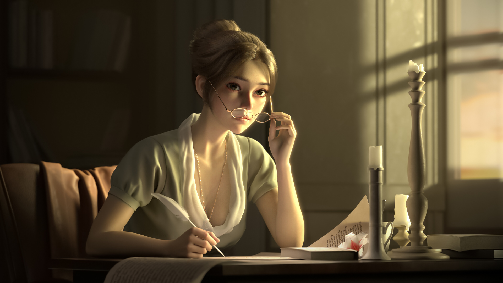

# 第一周的Plog

​		今天是2022年1月2日，距离考研还剩357天。今天是第一周的总结。这周可能是复习物理的原因，感觉过得格外漫长，也是大学第一次在寝室跨的年，看到B站有一个热门视频：《每年最害怕跨年了》，里面有一句话很有感触：最害怕热闹的时候了，越是热闹的时候越是孤独，越是有遗憾。今年过得实在是乏善可陈，觉得相较于与去年，改变了太多也失去了太多，过多的消极情绪我也不想写在Plog里了，明年是关键的一年，希望能够更加努力向上，flag就不立了，立了反而不容易完成，加油！

# 每周总结

简单总结下这周吧。

Completed some tasks：

- 单词打卡五天
- 图形学GAMES101看了4P
- C++基础复习了一遍

No Completed tasks：

- 每日双语新闻只看了两篇
- 手机使用时间和熬夜情况没有改善

​		本周大部分时间都在复习大物和摸鱼划水，感觉很难进入哪种很完美的心流的状态，大学物理学得也很难受，不过马上就能回家了，开启充实的寒假！
