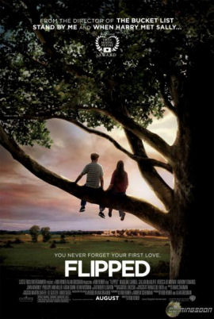

# 第二周的Plog

​		今天是2022年1月9日，放假的第一周，感觉状态调整的还算可以，每天学的不多但很充实，也算轻松，中间表哥结婚的两天没学习，也算给自己一个放松了。背单词的积极性有点不高，内心还是有点抗拒，要克服。

# 完成情况

Completed some tasks：

- 单词打卡4天
- Leetcode打卡7天
- 运动打卡5天

No Completed tasks：

- 服创项目还未开始准备
- 双语新闻放假来还没看过

​		这周学习情况还算可以，要克服对英语的恐惧，不然明年CET-6和考研肯定会拖后腿。

# 电影

​		这周看了砰然心动，在我眼中这部影片不仅仅只是一步青春爱情片，反而我觉得其中的哲思和对生活中苦难的反思更多。里面有青春男孩的幼稚，犯了很多又蠢又傻的错误，也有生活，女主的傻子叔叔、阶级的对立、男主尖酸刻薄的父亲。

​		其中令我影响最深刻不是哪些爱情片段，反而是男女主两家人一起吃饭时，女主的两个哥哥谈论到音乐时，问到男主父亲年轻时也曾玩过音乐，尖酸刻薄的男主父亲出现了罕见的沉默，也许，他陷入了回忆，他也曾有青葱的过往和热血的梦想，但想来最终应该是放弃了。我想到了一句名言：“人不会老去，直到悔恨取代了梦想”，我猜想他的尖酸刻薄也许就来自于对自身的痛恨吧，他取得了金钱和社会地位上的成功，但是在他心里，是少了些什么的，哪些只有他自己知道。

>  some of us get dipped in flat，some in satin some in gloss. But every once in a while you find someone who's iridescent. And when you do nothing will ever compare.
> 
>  有的人浅薄，有的人金玉其表败絮其中。但是有一天，你会遇到一个彩虹般绚烂的人，当你遇到这个人后，会觉得其他人都只是浮云而已。

​		这段翻译是我觉得最好最自然的一段，不过印象最深的还是没那么出名的一段：

>  Mr.Loski was clean and smooth on the outside but it seemed like there was something rotten buried just beneath the surface.
> 
>  洛斯奇先生外表看起来光鲜体面，但似乎看起来心里装着，什么腐烂掉的东西。

