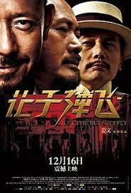

# 第四周的Plog

​		今天是2022年1月24日，又是晚了一天写这一周总结，寒假在家自律实在是太难了，而且总是有各种各样的琐事来耽误，唉有点后悔报名服创比赛和接下别人找过来的项目了，当初本是能拒绝的，但我总是这样，一面临抉择就犹犹豫豫，服创和项目确实是对个人有好处，当初也是这么想的，可是其实自己心里也明白，它们会耽误很多的时间，总是以为自己是超人，太过相信个人能力了，以后要改正，可惜现在也没有回头路走了，还是以考研学习为重吧。

# 完成情况

Completed Some Tasks：

- C++侯捷课程
- 单词平均每日40个
- 算法每天平均两个题+总结

No Completed Tasks：

- 服创进度停滞
- 英语阅读进度停滞

Future Plans：

- 恋念有词，每天1.5h
- 服创学习，每天1h
- C++，每天2h
- 其他项目，每天2.5h

​		唉，开始后悔当初接下哪个项目了，开始是想着从零上线一个自己的项目的，域名、服务器、前后端.....，当是对自己技术学习的一个总结和考试，但自己的精力还是太有限了，而且想学的、未知的东西太多了，不禁感慨起光阴的有限，还是得做好每天的规划，预则立，不预则废，争取每天学够7h，终会上岸，加油！

​		看侯捷老师的视频，其中一句话，个人认为是对我校校训的一个很好的注解和补充，以此自勉：

> 厚德博学，崇实去浮，勿在浮沙筑高台。

# 电影

​		这周抽空看了被传为经典的《让子弹飞》，看完很震撼。

​		张麻子说，他来麻城只为办三件事，公平，公平，还TM的是公平，他当麻匪却不图钱，只为还老百姓一个公平，他当县长不为权力，不让百姓跪他，只为启发民智。

​		他是一个土匪，劫道抢劫，同时他也是一个革命者，给松坡将军当过手枪队队长，参与过护国战争，这些事情，多么难以将其与一个土匪联系起来呀，不过也正如张麻子说的：”张麻子的脸上一定要有麻子嘛？“，是啊，人心中的成见就如同一座大山，难以逾越。

​		不过他虽然成了麻匪，但我觉得他是始终没有忘记他的初心的。在他的记忆里，肯定始终没有忘记那段在松坡将军身边的经历。松坡将军于他的人生而言，应该是一个重要的端点吧，他随松坡将军参加护国战争，但反抗黄四郎，何尝又不是他的护国战争呢？但我觉得他同时又是一个非常悲壮的人，身边的人背叛他，老百姓懦弱贪婪不肯支持他，师爷摇摆不定左右骑墙，何其可悲。
​       但他始终却没放弃他的理想，也许正是有了这许许多多坚持自己理想的人，才有我们今天这美好的社会吧。希望自己在未来的道路上，也能坚持自己的理想。

>  待我成尘时，你将见我的微笑
>
>  ——鲁迅