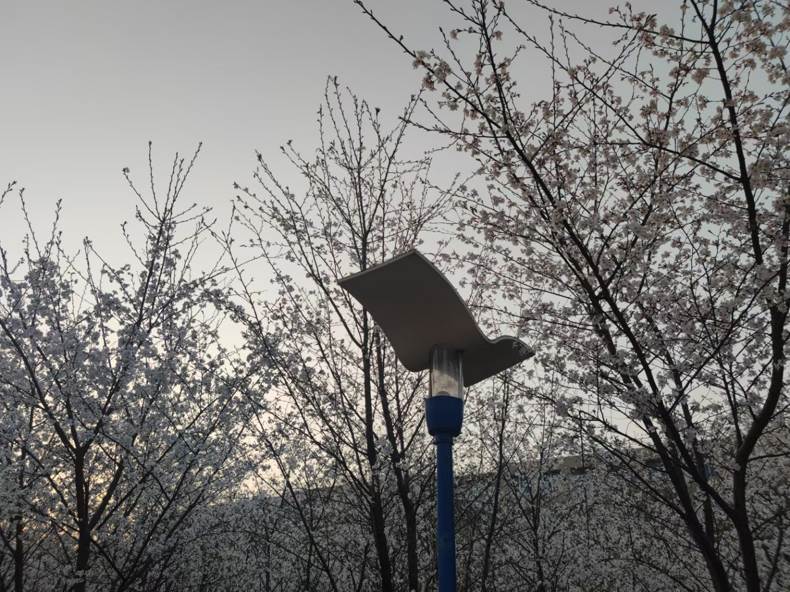

# 第十周的Plog

​		今天是2022年3月15日，星期二，总结一下上周。这周开始上课了，不过万幸，学院可能知道压力大，3门课都成了线上的，有更充分的时间去复习了，不过每天去图书馆不去教室感觉又有点容易懈怠，自律吧。到今天为止，一些学习之外的事情差不多算是没那么紧急了，每天的学习时间也能更悠然自得了，不过还是得抓紧时间，经常有种时间不够用的感觉，时不我待，每天少偷懒，多做正事！

# 完成情况

Completed Some Tasks：

- 恋念有词Unit5（上）
- 高数复习至第八讲
- 每日50个单词

Uncompleted Some Tasks：

- 蓝桥杯习题没刷
- 英语阅读没写

Future Plans：

- 刷学校的历年高数卷子
- 加大单词背诵量和记忆
- 数据结构复习

​		这周高数看完了第八讲，也就是说高数上全部看完了，打算周四做几套学校的历年考试试卷总结下，现阶段打好基础比较重要，尽量建立个比较全面的理解。

​		同时打算开始慢慢复习专业课，同时加大单词的记忆，主要从单词量和记单词的方法上下手，逐步加大每日记忆量，以及多多记忆理解一些词根词缀，方便更快的记忆。

​		想慢慢地给自己加压力，因为只有期待150%，才能达到100%的效果，而现在连期待80%都没有到。

>  巨大的压力之下才能诞生巨大的英雄人物

# 樱花

​		春天来了，学校的樱花开了，在学校读了3年，从没有像今年这样认真的感受过樱花，也从没有像现在这样真实地感受到学校的“存在”，可能是现在心里有期待吧，心就会更广阔而自由吧。

​		既然写Plog是为了记录我的研究生考试历程，那么这路上的任何风景都记载进去吧，希望来年再看这美丽的樱花时，我已经是一位研究生了。