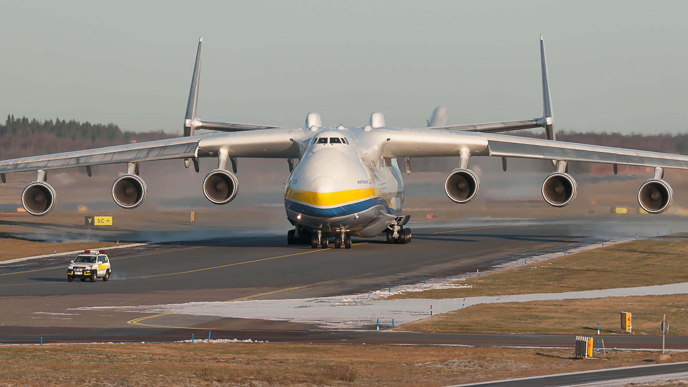
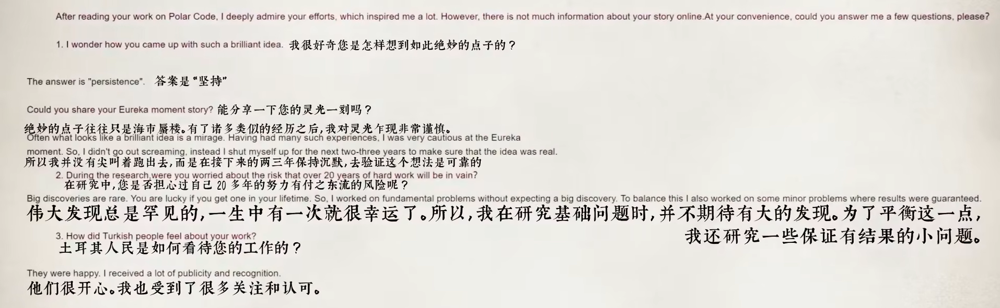

# 第十一周的Plog

​		今天是2022年3月22日，星期二，是我记录Plog的第十一周，但从正式进入考研状态开始算起的话，今天是第三周。感觉这一周之中的每一天都有千言万语的话想说，但是到总结的时候，流到指尖的就只剩下一句：这周过的乏善可陈。

​		我不太喜欢对生活中的事情碎碎念，因为我觉得生活中的小事只是记忆中的碎片，会被慢慢清理出去的，人生应该是由大多数的高光时刻所组成的。

​		但是呢，人生之中其实并没有那么多的高光时刻，我曾经也一直以为的哪些历史上的高光时刻，都如后人笔触下的熠熠生辉，都像电影主角里的奔走相告，但其实呢哪些高光时刻终究只是一瞬，而那数载的努力积蓄与寒窗苦读，方才是记忆之中的真正高光点。就像张宇老师所说的一样：“电影里的武功高手，往往都会闭关，然后突然有一天，出关了，变得好厉害，但其实哪个闭关的过程才是最重要的”。别人往往只看了高手出关的结果，却不知道高手为了这个结果付出了多少的心血、承受了多少的孤独。

​		所以一个人的成就最终是会收敛于他所付出的努力的。对此，我在B站上看到的一个给Arikan教授（5G极化码发明者，应用于华为的5G通信之中）后深有感触，以此自勉。

​	ps：之所以用这个飞机起飞做封面，是因为最近发生了一件很惨痛的事情：东航坠机。真的很令人惊讶，所以我用了一张飞机起飞做封面，只希望人们的每次出行都安全顺利，世间少一些苦难。

# 完成情况

Completed Some Tasks：

- 平均每日60个单词
- 高数基本复习完毕
- 刷完本校高数（上）的考卷

Future Plans：

- 总结高数笔记
- 写完300题
- 刷完本校高数（下）的试卷

​	这周大概完成了之前定下的计划，逐步加大单词量，刷高数(上)的卷子，单词还是得找对方法，词根词缀熟了之后加大单词量疯狂的input，明显感觉比之前强了好多。

​	不过这周也迎来了复习过程之中的第一个大坎，高数下，计算量大，概念难，经常是一个积分、微分方程算半天，然后算不出来，接着就去劝慰自己知道怎么解就行了，计算不是问题，然后去看答案，但这样肯定是不行的，打算花点时间慢慢去克服这个难题，预计在这两周完成上面的Future Plans。

​	同时也能预见之后的复习也会碰到很多类似的难题，如一座座高山一样阻挡在前，首先英语阅读肯定是会存在这个问题的，希望能保持心态，其次计组肯定也有，越是这种概念很难，存在一个模糊不清的地方学科、知识点，越容易畏难，坚持吧，用张宇老师引用《狮子王》里的一句话自勉：

> You are more than what you have become。
>
> 译：你比过去更好！

# 一些碎碎念

​	想了想还是想念叨下生活的一些琐事，有些东西必须直面过后内心才能成长。

​	这周抽空在写给人写的小程序，室友看见我还在弄哪个，说了一句：要不别考研了，你还是去找工作吧。也许是不经意的一句话，让我开始紧张了，因为我一直都感觉自己的复习晚了，事情太多了，好担心到后来进度落后于别人，然后一想到各种各样的事情，心里就更加的紧张了，所以那两天都过得很焦虑，反复的想以后的事情，没考上研咋办？同时也一直在想自己为什么考研？

​	而且今年22年的考研，各种各样离谱的分数线，国家线上涨，科软爆冷，软微下降，上了几次热搜，让我都有些迷失方向感了，同时也感觉现在的考研报考像赌博一样，有点赌不起了。

​	过了两天，零零散散和一些朋友聊了聊天，收到了各种各样的鼓励，虽然可能有些鼓励纯粹是出于礼貌，但有一些朋友的开导与夸奖，真的能感觉到是出自于内心，听完让人觉得充满了力量与信心，也让我想清楚了为什么而考研，引用乔布斯的一句话：

> We cannot connect the dots looking forward, but we can only connect them looking backwards.
>
> 译：少一些功利主义的追求，多一些不为什么的坚持

 	热爱与渴望变优秀的冲动，永远都是坚持下去的理由。现在是0：16，最近武汉倒春寒好冷，前几天还穿短袖，今天就穿袄子了，睡了睡了......