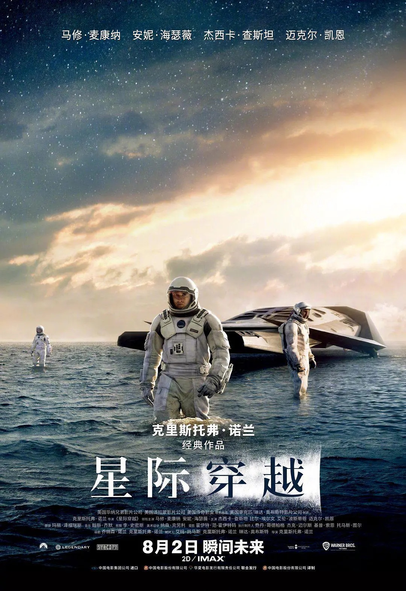

# 第二十二周的Plog

​		今天是6月5日，星期天，备战考研的第十四周。这周术后恢复的不错，学习状态感觉也比之前好了很多，打算等伤口彻底好了就恢复锻炼，太长时间没动了感觉身体都僵掉了。

​		学习上，到今天差不多把线代刷完了，计组也把笔记和思维导图弄完了，感觉对整个学习的网络的认识比以前清晰了许多，还是要反复学反复看才能看通看懂。

​		后面一段时间学校考试比较多，但得亏大部分是线上的，上周刚考完一门Linux（到我们这一届卷子变难了），当时没怎么复习就去考了，很快做完信心满满就出了考场，想着有个90出头就行了，再不济也有个3.7绩点吧，考完老师群里发了答案，大跌眼镜，好多套路和比较模糊的反套路，让我聪明反被聪明误了，估计分不高了，也算是给我一个警醒吧。后面的线下的计算机体系结构的课程打算好好复习了，也算是对机组学习的一个帮助吧。

# 完成情况

Completed Some Tasks：

- 英语：每日250个单词
- 习题：《660》完成至310
- 计组：笔记、思维导图
- 数学：二刷《基础30讲》线代完成5讲

Future Plans：

- 英语：15年以前真题，开始长难句学习
- 英语：每周背3篇作文

​		一直以来我都以数学为重，对专业课和英语虽然重视但都没投入过多的行动，尤其是英语，感觉还是有点学习不得法。而且京区众所周知的旱区，昨天看了个视频，一个雅思几乎满分的选手京区作文6分，说实话有点怕，还是多做准备比较好，到时候单科不过线就很难受了。

# 电影

​		这周决定抽出点时间看部电影，挑了挑决定看《星际穿越》，本来一直对科幻电影不感冒的，因为虽然我很喜欢科幻，但我觉得很多不管国内还是国外的科幻拍摄出来都差点意思，尤其是点进去发现这部片将近3个小时的时候，但挑来挑去发现很多电影都看过，最后还是把这部片看完了。事实证明看这种片子对我的专注力的提升还是很有帮助的，看完之后感觉自身的思考变得不那么浮躁了。

​		诺兰也不愧是诺神，片子确实没让人失望，很值得n刷，而且剧情的推进很循序渐进，将哪些庞大的物理概念抽丝剥茧的告诉观众，让我这个不那么懂的人都看懂了。诺神在电影里展示了面临死亡时人类的保存文明火种的两种态度——集体主义或者是逃亡主义，但在展示了黑洞、高维空间、相对论等一系列科学概念后，他又终于带我们回到了哪唯一的价值尺度——爱。但光有爱不行，正如片中库珀一开始反对去布兰德博士爱人的星球那样，不能光有爱，还要有理智，哪二者的比例是多少呢？我觉得诺兰也许通过机器人塔斯的诚实指数已经给出了他心中的答案：90%。

​		看完这个让我想起了刘慈欣的《朝闻道》，二者给我同样的震撼，但哪种感觉是不一样的，《朝闻道》里说："对宇宙真理的追求，是文明的最终目标和归宿"；”最后，当生存问题完全解决，当爱情因个体的异化和融和而消失，当艺术因过分的精致和晦涩而最终死亡，对宇宙终极美的追求便成为文明存在的唯一寄托，他们的这种行为方式也就符合了整个世界的基本价值观。“。个人觉得两者的相同之处在于都在启发着观者人的目的是什么？不同之处在于《星际穿越》在科幻外偏重于抒情，强调爱如同引力一样是能穿越时空的，《朝闻道》则通过对宇宙的探索引出一种对人本质的探求，其实都很值得我们思考。

​		考研休息时看一些这种宏大的片子感觉对大脑好放松，也许是哪种宇宙的宏大与人的渺小的感觉，让人能慢慢舒缓下来，变得不那么焦虑。