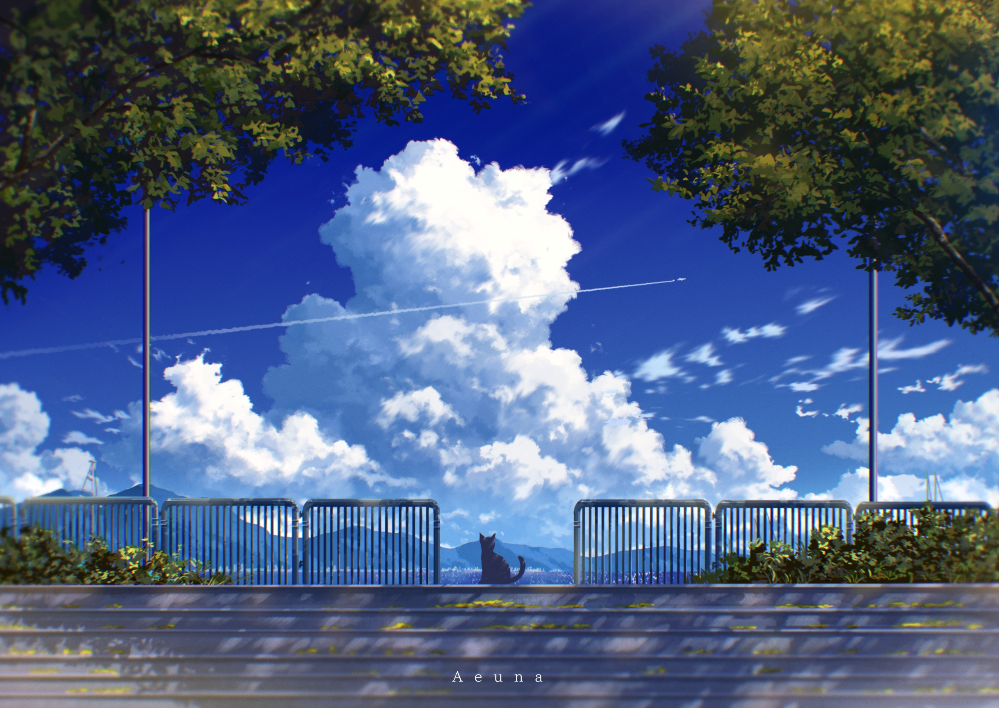

# 第二十四周的Plog

​		今天是6月20日，星期一，过去一周是备战考研的第十六周。展望过去一周，感觉有点乏善可陈，之前没学过概率论，过一遍概率论都觉得好痛苦，总觉得自己是在还之前没好好学的债。终于在前些天突然走出来了，果断放弃，不再看数一的内容。之前还是有些好高骛远，计划得太远了，所以有些时候脚下的路都没走好，就开始规划未来，然后半只脚已经迈向了前方，另一只脚还停在原地，最后就只会是自己把自己绊倒了。

# 完成情况

Completed Some Tasks：

- 跑步：8.5公里
- 英语：每日300个单词
- 数据结构：完成前三章笔记代码
- 计组：二刷完王道书上习题，剩下一部分大题没写
- 操作系统：完成前两章视频、笔记

No Completed  Tasks：

- 数学习题
- 英语作文、真题

Future Plans：

- 李林880，20题/天
- 高数强化18讲，1讲/天

​		可能是因为同时备考期末考试，以及转数二学习，这一周对数学的重视完全不够，而且英语也没怎么推进，后面还是要恢复每天至少20道题的感觉，一日不学，则三日白学。

# 电影

​		听人推荐，昨晚抽空看了皮克斯的《心灵奇旅》，看完感觉像喝了一碗不那么油腻的鸡汤，将我前些时间心里的苦恼全扫空了。我看了一个影评里说这部片子里的世界观很多都来自一些西方哲学，比如柏拉图的灵肉三分——心智、灵魂和身体。

​		我没了解过那么多哲学，但还是被这部影片深深触动了。我对其最大的感觉就是一种生与死的思考，古人云：“死生亦大矣，岂不痛哉！”。以前对死亡没有什么感觉，以为只有脚走到了它的前面才会有那种恍惚的感觉。但经历了外公去世，见过或了解了越来越多身边的人或者是他们的亲朋的病痛、离世之后，我对死亡才有了那么些浅薄的认知。仿佛有点理解马尔克斯那一句话了：

>  父母是搁在我们和死亡之间的一个帘子，你和死亡好像隔着什么在看，等到父母过世了，你才会直面这些东西。

​		影片给我的另一个思考就是对人生意义的追求，我以前总和别人说，以后自己不想干了就去天桥贴膜、跑网约车、街边卖炒饭，过闲云野鹤的生活。但是同时呢，我又以一种很执着的态度奋力的学习，挣扎着生活。

​		以前我也曾经天真的想过，自己的梦想是什么什么，如果不能实现梦想，那么我的人生将毫无意义，就像主人公一样，不能完成自己的梦想，他宁愿去死。但其实后来想想，不是每个人都能那么幸运的走在自己的梦想的道路上的，甚至大多数人的生活路径，都跟曾经规划的梦想偏离甚至背道而驰了。

​		而且实现了梦想又能如何了？就像主人公一样，他梦寐以求的人生高光点并没有到来，引接他的也不过是一场又一场的类似的演出罢了。想起之前一周的Plog里写的一句话：“人生之中其实并没有那么多的高光时刻，我曾经也一直以为的哪些历史上的高光时刻，都如后人笔触下的熠熠生辉，都像电影主角里的奔走相告，但其实呢哪些高光时刻终究只是一瞬，而那数载的努力积蓄与寒窗苦读，方才是记忆之中的真正高光点”。生活的意义不在于追逐某些事物，生活的意义在于生活本身。

>  小鱼：我想去大海。
> 
>  老鱼：你所在的这就是大海呀。
> 
>  小鱼：不，这只是水，我想去的是大海。