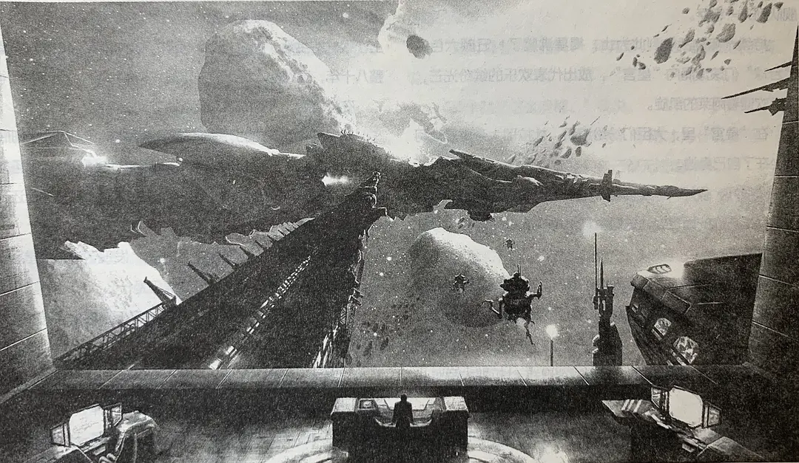

# 第三十三周的Plog

​		今天是8月21日，星期天，考研的第二十五周。这周做了好多数学的真题卷，手上握笔导致的水泡更大了，不过看着桌子上堆满的用完的草稿纸，写没墨的笔，还是很有成就感的。

​		做了这么多数学卷子，感觉数学主要还是计算，现在剩下的就是细心慢慢来把这部分分稳住了。现在怕的还是英语单科不过线、408和复试的问题，数学之外对这些还是有些厌烦的，比较难找到状态，努力克服。

​	

# 完成情况

Completed Some Tasks：

- 运动：2.61公里
- 英语：每日200个单词
- 高数：《18讲》二刷至第12章
- 习题：《1000题》至第11章
- 英语：2008及以前真题
- 数学：2008及以前真题
- 408：二刷《数据结构》至第8章

​		这周图书馆空调坏了（lj后勤一直不修），搬到了工作室学习，感觉受到了不少影响。一群认识的人，在一个不受约束的空间里，难免会有时聊上几句，而且看见别人在玩，心里还是有点受影响的。

​		不过和学弟一起聊聊未来规划、对技术的理解还是很开心的，遗憾当时我大二时没有遇到对技术抱有热爱，对未来早做规划的朋友。而且多摆一摆烂感觉心态也好了许多。

# 他人即是地狱

> 何必用火炉呢？他人即是地狱。
>
> ——萨特《禁闭》

​		开始我对萨特这句话是不太理解的，甚至不知道这是名家之言，还以为是什么非主流伤痛文字。后面才知道这句是说我们每个人都活在他人的目光之中，人们互相审视、监督、拷问，进入了他人所构成的地狱。

​		这些天来我的作息有些紊乱了，每天不到凌晨一点都睡不着觉，每天躺在床上脑袋里就开始冒出各种想法，回忆过去，焦虑未来。时常在想，我们为什么每个人都要沿着世俗的路线和要求去走完一生呢？上学、工作、买房、买车、结婚、生子，然后死去。为什么一定要受到他人的影响呢？但是，但是不这么做就好像真的没有别的路能走了。就像是我们为什么要考研？为什么要去吃这个苦呢？不过细细一想，生活哪里没有苦呢？有什么人能回避掉这些苦头嘛？富贵者？权势者？应该都不能，生老病死，这四个过程，没有人类能逃避。

​		我过去总是极力地想摆脱掉某种思想束缚，比如说，不是说大学里学了前端工作了就一定要主攻前端，大学学的是计算机毕业了一定要去从事CS相关行业。我总是想着要摆脱掉这些偏执的想法，但却总是走入了另一个地狱。

​		不禁感叹起世人的奇怪，996嫌累，摸鱼又觉得无趣焦虑；用开源库觉得没技术含量，自己造轮子又嫌弃太累；写代码的羡慕领导写PPT，写PPT又害怕自己没有硬实力。终其一生，满是遗憾。

​		也许在某个平行时空里的我，能够走出这个地狱，将编程只是当作爱好，不用在哪些孤立无援的夜里，把自己消耗殆尽，只为成为一个普通人。

# 咒语

> 古人造字，恍如神启。
>
> ——《科幻世界》2015年4月刊

​		这周看了得空看了一篇科幻《咒语》，角度真的很新奇：地球人类用语言将外星文明消灭了，让人感到不可思议又觉得理所当然。也让我不禁思考起我们民族的语言。

​		语言，分为表意文字和表音文字，汉字就是表意文字。不同于表音文字，表意文字的大部分字都需要与实体进行联系。小说里面如此解释，像自由、民主，诸如此类的抽象词语，使用表意文字是很难将其与实物相联系的，这就导致了封建制度下的人民逐渐习惯了被奴隶，任何对封建的忤逆之言都没有了容身之地，真的细思极恐。小说里主角就是如此哄骗外星人的君主，使其更加接纳了他推荐的表意语言，但是同时，诸如无穷大、集合这类的抽象科学概念也再难以通过表意语言表达出来了，使得外星文明的科技也再无进步，从而最终被地球文明消灭，故小说将其称之为“咒语”。

​		读这篇文章之前，虽然我很喜欢文学，但是我还是对其真正能对现实产生影响的力量很表示怀疑。读完小说之后，我觉得我已经开始相信“人文科学”的力量了，有时候这种力量甚至比科技的力量更加强大，空有一身力量，但面对着沟通的“巴别塔”，还是很难施展出来。

​		最后，还是要感叹一句，汉字真美。