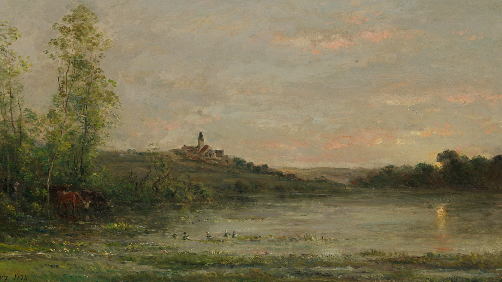

# 第三十八周的Plog

​		今天是9月25日，星期天，考研的第三十周。回望这一周感觉好像自己什么都没做，感觉浑浑噩噩的，但又感觉头脑比以往都清晰。这周预报名，填了北大，但却一点慌张都没有，也许是已经做了所有能做的努力吧，也也许是释然了，大不了再来一遍，二战三战四站大有人在。期间也想过一些别的学校，但心里总是放不下去，真乃除却巫山不是云。每次别人问起自己的目标，总是遮遮掩掩，希望能等到那一天考上了，亲口地、大声地把自己上岸的学校说出来。

# 完成情况

Completed Some Tasks：

- 英语：每日600个单词
- 408：二刷计网加笔记
- 英语：2019年真题以及唐迟方法论
- 习题：二刷《986》

Future Plans：

- 英语：每周背诵大小作文各一篇
- 408：二刷王道习题、二刷计组、数据结构
- 政治：刷完小程序1600题

​		感觉这周之所以觉得什么都没做的一个原因就是没怎么写数学，全都去做408的笔记去了。做过数学套卷之后，感觉分章节做题总差点意思，但现在买的卷子快递都没到就有点难受，还是抓紧时间突破408吧，后面408的时间就要挤一挤了。

​		考研还有91天，预计70天十个星期，每周起码两天作文，把作文一定要安排好，前面一直在拖，现在不能再拖了。

