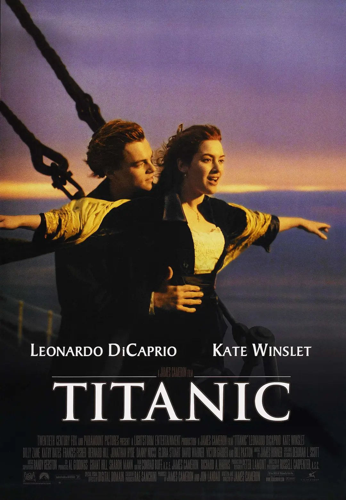

# 第四十二周的plog

​		今天是10月22日，星期六，考研的第三十四周。

​		也是二十一岁的生日，今年的生日过得简单很多，突然觉得生日也无非就是生命中很普通而又特殊的一天。在这一天，也就是比平常多吃了些好吃的，多了些娱乐，多了些对人生顾影自怜的思考。

​		人一闲下来就会思考过去、现在与未来，想想过不了几年就要像很多普遍的中国青年那样一样渡过往后的余生就很痛苦。毕业、结婚、生子，在结婚、孩子百岁的宴会上与别人觥筹交错地应酬，又或者是考上了北大，投身科研，面对一个让自己很痛苦的过程。人生似乎完全没有电视剧里的那般波澜壮阔，情节跌宕。

​		不过也许只是现在一时的痛苦让我陷入了这样的思考吧，活着的感觉还是很让人留念的，真是苦乐参半的人世间。

# 完成情况

Completed Some Tasks：

- 英语：背诵两篇作文(至2015)、每日100个单词、08年真题复盘、20年英二
- 数学模拟卷：李正元5套卷
- 数学习题：超越135
- 408：模拟卷复盘（01-03）

Future Plans：

- 数学：消化吸收各类题型、典型题目
- 英语：作文、英二真题
- 政治：每日50道1000题
- 运动：每日30个深蹲、50个举铁
- 408：模拟卷、真题复盘

​		突然发现比身边人的进度快好多，而且感觉很多人都好拘泥于王道书过了几轮、数学到什么进度进度了，很在乎这个进度而不在于理解。

​		但同时又好害怕自己变成笑话，好多人都知道我刷了好多卷子，现在好担心掌握得不扎实或考试失常成为笑话。真是得者失之！

>执者失之。我想当一个诗人的时候，我就失去了诗。
>
>我想当一个人的时候，我就失去了我自己。
>
>在你什么也不想要的时候，一切如期而来。
>
>——顾城《执者失之》

# 电影

​		今天生日休息一天，把泰坦尼克重新看了一遍，电影真是常看常新，一部电影每次看总能看到些新东西，谈谈自己看完后的感悟吧。

​		电影背景在一战前几年，中国正值大清的最后几年，西方资本主义达到了巅峰，贫富极化，工人们处在水深火热之中。以前看类似这种影视作品从未将自己带入过这些所谓“下等人”的生活，但是现在学得知识越来越多，思考也越来越多，好像受到了知识的诅咒。

​		说实话，虽然我有时跟朋友聊天时自诩讨论精英主义，总说着：“那你们看看哪些过得不好的人呢？”，但是懂得越多，并且深深服膺于知识时，心中总是不可避免地充满了傲慢，尤其是作为一个程序员，更甚。

​		以前听到别人讨论编程知识时，不管懂不懂、懂得多或少、深或浅，总想跟别人争辩争辩讨论讨论，越深奥的知识，越难的知识越自得。什么高并发负载均衡、红黑树、动态规划、编译原理、性能调优，总想显得自己多么厉害，比别人优秀很多。但是却陷入了一种傲慢的偏见，太在意别人的看法，果真他人即是地狱。

​		现在想想，去追逐哪些知识又有何用处呢？不过是站在巨人的肩膀上罢了，懂得这些，证明自己懂得这些，并没有给这个诺大的世界带来一丝一毫的好的改变。反而一颗傲慢的心真的是让人变得浮躁，以后一定要沉得下心。嗯，以后不管是混得好或不好，与什么样的人打交道，真的是要保持谦逊的知行合一，精英主义真的不仅仅是一个阶级问题。

​		不过抛开对剧里面的精英主义不谈，里面的爱情是真的好使人触动。不过也许只有真正经历过哪种春心萌动、想不顾一切爱一个人的哪种爱情的人才会对剧情产生共鸣吧，可悲的是，感觉现在的我好像失去了这种感觉，大学的四年，考研的痛苦过程，让人变得无比现实。

​		认清现实也许是一个当代普通人成长的必经之路，但又感觉好可悲，呜呼！

> 更近我主 ，
>
> 在死亡来临的时刻，上帝擦去他们所有的眼泪
>
> 死亡不再有 ，也不再有悲伤和生死离别，不再有痛苦  
>
> 因为往事已逝