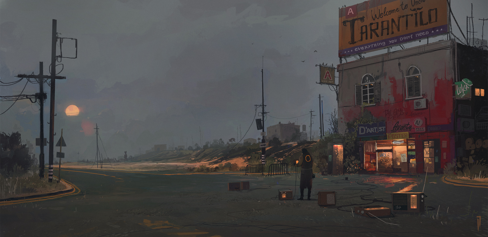

# 第四十八周的plog

​		今天是12月4日，星期天，学校混检有阳性了。

​		图书馆、自习室全关，寝室只允许寝室长出门买饭，写plog前一个小时图书馆通知寒假前不会再开了。各种群和朋友圈里都在宣泄着情绪，虽说一代人有一代人的长征，一代人的困难只会越来越难，但从我们这一带开始的遭遇，感觉却是那么的独特又艰难。

​		希望今年一次上岸吧，毛主席《七律·长征》聊以自勉：

> 金沙水拍云崖暖，大渡桥横铁索寒。
>
> 更喜岷山千里雪，三军过后尽开颜。

# 完全情况

Completed Some Tasks：

- 政治：肖八、腿四选择题
- 英语：黄皮书前三套卷、三套CET6真题
- 数学：22年共创卷（后两套）
- 模拟卷：22李艳芳、超越卷整理
- 408：王道机组书n刷

Future Plans：

- 政治：纸质笔记整理、肖八腿四大题
- 英语：黄皮书后两套及复盘、真题精读
- 数学：李四、23超越共创、20年及以前超越共创选填
- 408：王道模拟题二刷、真题二刷

​		疫情影响，好多快递都停了或者受影响，导致本来的计划打乱了好多，真的很无语。今天看了个乌克兰的视频，他们在打仗快递仍然正常...

​		后面的时间打算把精力从数学上挪到其它三科上来，最后再抢一抢分。