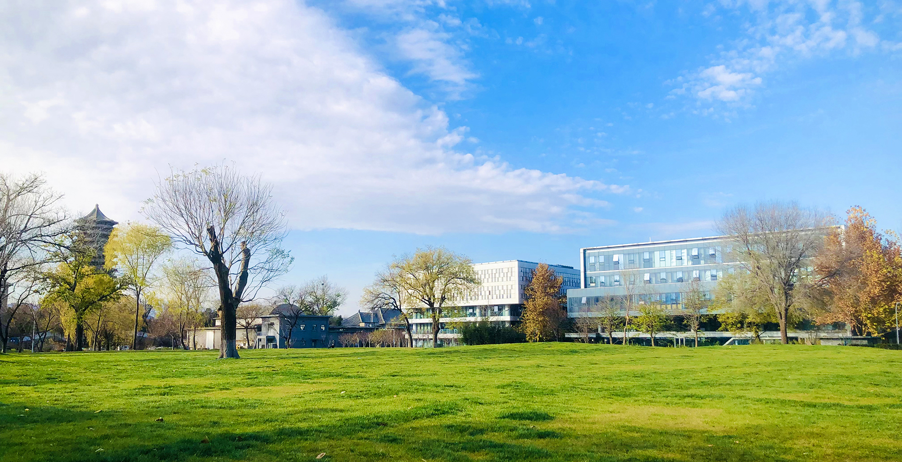

# 第五十周的Plog

​		今天是12月19日，星期一，还有五天，也就是这周六就要踏上战场。

​		今天也是我阳性感染的第六天，这六天什么都没学，直至今天嗓子还在疼，不知道后面几天还能背多少政治。虽然我觉得今年分数线可能会因此下降一些，但对于北大而言，我却不认为会降低多少。前几天做梦，无数次梦到自己回到高中，又无数次梦到自己复读、二战。之前本来一直斗志昂扬的，但经过这一次发烧，似乎把自己烧醒了，也把自己烧坏了。

​		虽然之前一直在说着每一届都很难，但都得去过，但今年的我们好像是真的格外的难。今年如果没考上，不知道自己还会再有几次重来，重来的话还敢不敢再冲刺北大。今天睡到凌晨4点醒了，打开手机，36岁的梅西得偿所愿捧得大力神杯，真是不容易，跟我们考研人又何其相似。想起他之前申请注视大力神杯的照片，我都有点替他神伤。

​		也许整日埋头苦学，让我有些过于患得患失了吧，就算今年失利，明年再考一次北大又何妨？况且今年准备得如此充分，加油吧！

> A man is not old until regrets take the place of dreams.
>
> 一个人不会老去，直到悔恨取代了梦想。
>
> ——约翰.巴里摩

