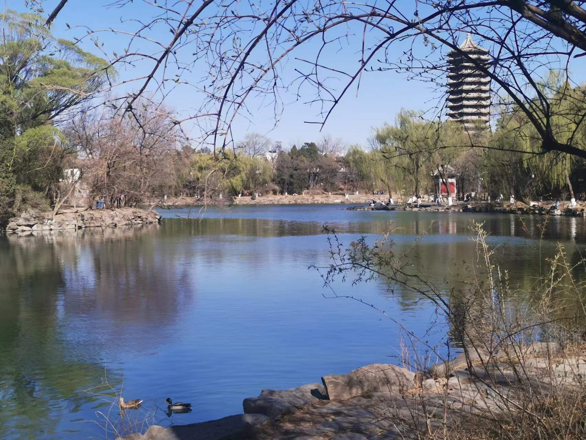

# 写在前面

​		既然要记录，总得要有记录的东西，初步打算设定一些阶段性目标，并记录在这个文档里，每周看看自己完成了多少，同时也记录一些自己看过的书、喜爱的电影和音乐、走过的路和一些自己的思考，以给以后的人生留下点宝贵的回忆和思考。

# 目标院校

​		谈到这个话题，其实心里还是摇摆了很多次，想过一些院校，也考虑过保本校的研，但最后兜兜转转，始终是放不下，不是最好的学校，上了也会很难受，最终还是决定了自己的目标——北大。

# 5月总结

​		写了好多周的Plog之后，发现光每周做个总结还是不够，这样视野仅仅局限在了一个小小的”邻域“之内，只有往更长地跨度去总结，才能形成更好的知识框架，知道自己完成了哪些目标，方便后面设定目标。所以打算后面每月的开始和结束也分别进行一个规划和总结。

​		回望整个5月份，感觉还是挺曲折坎坷的，遇到了很多的挫折，也产生了许多动摇。学校查学生租房，被迫搬回宿舍一个月，又偏偏是最热的一个月，学习状态很低迷，在宿舍又很容易受影响，打游戏比较频繁，又偏偏很悲惨的生病做手术住院。

​		不过经历了困难之后才能更好地克服困难吧，好在现在已经痊愈了，搬回租的房子后也把游戏卸载了，慢慢地也恢复运动了，一切都在往好的方向发展。不过看完5月份的plog之后感觉这一整个月还是走了不少的歪路的，做了太多重复题，虽然有的题对计算帮助很大，但是一些太简单的题做多了还是没什么进步的。后面还是要多做一些母题，举一反三，多多思考。

- 高数：二刷《基础30讲》
- 计组：完成视频、笔记、思维导图
- 英语：每天200个单词，总共6000个
- 习题：《986》8个单元；《三大计算》刷完；《660》完成160题

# 6月规划

​		整个6月一些考试、实验报告的事情还是比较烦的，还是要做好平衡。前两个月花在数学上的时间有些过于多了，这个月打算集中攻破一下英语，京区的英一感觉难度还是不小，我的4级也才勉强过线，还是要多练一练。

​		上学期刚学完操作系统和计网，感觉还是有点印象的，而且当时也是看的王道的视频，也算是一点小优势吧，不至于太慌张，也足够我慢一点来了。

​		嗯这个月也打算认真一点对待运动和娱乐了，当成一个任务来完成，不能可有可无随心而来了，考研是长线战争，对人的考验也不仅仅是11/22408那么简单。

- 线代：二刷《基础30讲》

- 概率论：《基础30讲》、《300》

- 习题：《986》完成；《660》完成

- 操作系统：视频、笔记、习题

- 单词：每天300个单词，总共9000个

- 阅读：每天2篇阅读，每周3篇真题，完成19年前英一真题

- 作文：2天背1篇英语作文

- 运动：每周10公里

- 娱乐：两周看一部电影

  

# 6月总结

​		又到了总结一个月的收获的时候，突然发现这个月也很摆烂，月月都有困难，月月都没克服，似乎只有最开始充满激情准备考研时最有干劲。

​		这个月学校的考试比较多，当初想的是无所谓考得怎么样，还是要把重心主要放在考研上，但感觉还是被影响了许多。自己的惰性也比较强，还是低估了自己的懒。而且夏天到了整日都很没精神，睡得早依然起得晚，感觉一部分原因是玩手机导致的，后面还是要重新开始克制下自己玩手机的时间。

- 线代：二刷《基础30讲》
- 习题：《986》、《660》、《880》两章
- 操作系统：视频、笔记、习题
- 单词：每日平均200个
- 运动：每周平均5.5公里

# 7月规划

> 会当凌绝顶，一览众山小。

​		6月份结束，就到了下半年了，正式进入持久战拼耐力的时候了。希望这个7月，能少点烦心事、没有病痛，多点灵光一现，多点努力和坚持。

- 高数：《18讲》
- 线代：《9讲》
- 习题：《880》、《330》
- 单词：每日平均300个
- 阅读：阅读真题、唐迟视频
- 作文：作文书
- 长难句：刘晓燕、田静
- 运动：每周10公里
- 娱乐：每月一部电影
- 计网：视频、习题、笔记

# 7月总结

​		这个月结束，考研就已经走到中点了，希望这个中点，同时也是一个跳跃间断点。这个月最大的收获就是学到了舍与得，之前老想着什么都要看，什么都要学，但后来明白了，别说是开三倍速，就算是开十倍速，很多东西很多题到三战都弄不完，还是要针对考试内容，考试试卷针对性地学习。

- 高数：《18讲》
- 线代：《9讲》
- 习题：《880》
- 单词：每日平均300个
- 王道：一轮过完
- 运动：平均每周5.5公里

# 8月规划

> 鹏北海，凤朝阳。又携书剑路茫茫。

- 习题：《330》、《线代严选题》、二刷《660》
- 数学：二刷《高数18讲》、《线代9讲》
- 王道：二轮过完
- 数学真题：2016年及以前
- 英语真题：2010年及以前
- 408真题：刷完一遍

# 8月总结

> 欲渡黄河冰塞川，将登太行雪满山。

- 习题：《1000题》高数部分
- 数学：二刷《高数18讲》
- 王道：二轮过完
- 数学真题：2019年及以前
- 英语真题：2013年及以前二刷完成
- 408真题：刷完一遍选择题

​		暑假过完，真的感觉好苦，不过，马克思哲学说，事务的发展总是曲折的、螺旋上升的。下个月，坚定信念，克服困难，去争取胜利！

# 9月规划

- 数学：一套模拟卷（张宇/李林/哈工大/李艳芳）
- 习题：《李林108》
- 408：王道三刷并总结重点笔记、刷完天勤
- 英语真题：2019年及以前真题二刷
- 408真题：大题二刷
- 政治：徐涛强化、腿姐技巧视频
- 政治习题：《1000》题完成一半

> In the depth of winter, I finally learned that within me there lay an invincible summer.  
>
> --Albert Camus
>
> 译：在隆冬，我终于知道，我的内心有一个永不凋零的夏天。
>
> --阿尔贝·加缪

# 9月总结

- 数学习题：《李林108》、《1000题》、二刷《880》线代
- 408：计组、计网二刷
- 408习题：操作系统选择题二刷
- 408真题：大题二刷
- 政治：徐涛强化视频
- 政治习题：小程序1600

​		从刷完手头能刷完的题之后，好久都没有好好的总结一下了，没有好好地回头望一下，每天都在有一点得过且过的。虽说现在不管是对考试的知识点，还是对读研这件事的见解和看法上都有了很大的变化，但是还是被这一天天重复的生活给磨得有点失去了耐性。

​		休息时经常会翻一翻诗词，读了杜甫、王勃，同是读书人，读到他们也经历过哪些苦，心中似乎也没那么烦了。重新读了《项脊轩志》，却又有点湿了眼眶，”儿寒乎？欲食乎？“，每次读到这句诗我的脑海都有无数帧画面闪过，外婆、爸爸、高中室友....每次去外婆家她都会紧紧地上来握住我的手，带着哪种老人特别的泪眼仔细地看着我，仿佛想拼命地记住我的模样，然后进屋子去拿一些家里的零食，还总说着：”在外面又瘦了“。唉，姥爷去年走了，不知外婆还能见我几回.....还有爸爸，每次我在学习时，都会拿着各种零食进来给我，有时是切好的苹果香瓜，有时是用勺子挖去了籽的西瓜，有时是没有黄的皮蛋，虽然我总嫌他烦.....还有高中室友，当时他总敲着我的床，重复着："儿寒乎？欲食乎？"，现在想想，那种日子却再也回不去了。

​		想到这些，内心总是会坚定许多，这最近一周下来对学习的感觉也确实比以前变化了许多。一个人的日子里，也多亏了有这些知识的陪伴，让我不那么的寂寞，相反如果不学习、没有一个目标的话，我觉得自己才是真的会很寂寞、过着哪些枯燥的生活。

​		就写到这吧，以王勃的《滕王阁序》收尾：

> 孟尝高洁，空余报国之情。
>
> 阮籍猖狂，岂效穷途之哭？

# 10月规划

- 数学试卷：张宇8套卷
- 408：数据结构、操作系统二刷
- 408习题：王道选择二刷
- 408真题：快速二刷、总结笔记
- 408试卷：王道8套卷
- 英语：背完大作文
- 英语真题：近8年英二
- 政治：刷完一遍《精讲精练》
- 政治习题：刷完《肖1000》、二刷小程序1600

​		9月因为英语作文一直没怎么背、数学模拟卷快递一直没到，所以没怎么写套卷。而数学因为所有习题都是成章节的，导致没什么心思和耐心刷，所以导致整个9月推进的速度稍微有些慢了，10月份打算进入模拟考的模式了，两天一场考试，隔一天下一场，严格按照考试的模式来进行，白天考试，晚上批改加总结，政治的早上以政治学习为主、背诵的内容为辅。大概八套卷子，二十四天完成，剩下的时间休整加看书整理。

> 吾家读书久不效，儿之成，则可待乎。
>
> --《项脊轩志》

# 10月总结

- 数学试卷：张宇八套、李艳芳21、22六套、李正元五套、李永乐22三套、李丁开三套
- 数学习题：李正元135
- 英语作文：大作文2011-2022
- 英语真题：英二2016-2022
- 408习题：计组、数据结构、计网选择二刷
- 408试卷：王道八套模拟
- 政治：小程序1600、真题选择题

​		现在回过头来发现整个十月制定的计划完成得有点差强人意，很多计划看似完成了，但总有点囫囵吞枣的感觉，数学卷子倒是刷了很多，但是分普遍都不怎么高，其它的学科感觉也因为时间分配不够还有好多漏洞。还有最后两个月，最后临阵磨一磨枪，不辜负自己之前的所有努力。

# 11月规划

- 数学试卷：超越共创、余炳森五套卷、李林六套卷、张宇四套卷、李艳芳三套卷
- 数学：总结抄录错题、好题
- 408：刷两遍真题、过一遍王道选择
- 英语：大小作文背完、默写完、英一精读读完
- 英语试卷：刷完英二加解析
- 政治：小程序题目错题好题再刷

​		报北大之前，自己内心毫不慌张，但是自从报名截止后，不知为何，心里总是很焦虑和懊悔。虽然再回到哪个时间点，我还是会报北大不动摇，但是时间一天天过去，心里总是没有底，所以才会去不断地刷数学卷，去填补心里的焦虑，但是总是囫囵下去的，碰到有些题依然会做错，有些简单错误还是一遍遍地犯。

​		这个月打算保持试卷量不变，然后专门将一些好题错题整理一下，用心去感受去记忆。

> 孩儿立志出乡关，学不成名誓不还。
>
> ——毛泽东

# 11月总结

- 数学试卷：李六、张四、余炳森五、李艳芳三、22超越和共创、21超越
- 数学笔记：对所有试卷的整理总结
- 数学：武忠祥十七堂课
- 政治：腿姐技巧班、四科笔记
- 英语：主题作文模板整理
- 英语：英二、十套CET6真题
- 408：汤子瀛操作系统

​		一回头才发现这么多卷子居然是我一个月里写完的，还是有点震惊的，一天一套，一个月下来也是不小的刷题量了。不过408专业课的时间却放了不少，基本都没怎么去做题了，看书的时间也变少了好多。下个月得捡一捡了。

​		11月23日的时候，我订的酒店突然给我打电话来问我入不入住，这时我才发现我的酒店订成了11月，也不确定是当时确实看错了（虽然确认了好几遍），还是一些其它的原因。但真的是感觉好崩溃，不完全是因为又得重新订酒店了，还因为到了这最后的一段时间还在犯这种错误，真的让人很难原谅自己。

​		最近疫情封控又严了好多，天气也变冷了，仿佛一切都难了起来，赶紧考完过年吧，年关一过，就都好了。

> 北海虽赊，扶摇可接。
>
> 东隅已逝，桑榆非晚。

# 12月规划

- 数学试卷：真题二刷、23超越、李林四
- 英语试卷：黄皮书五套卷、英一英二真题精读完成
- 政治：肖四背诵、肖八时政总结
- 408：王道模拟卷、真题二刷，过一遍王道全书

​		最后一个月了，简单定个目标吧：65+65+140+120=390。

> 艰难困苦，玉汝于成。
>
> 筚路蓝缕，荆棘前行。

# 复试之前

​		今天是2月24日，自考研结束到今天，已有两月。一切的一切，仿佛都像是一场梦一般，总觉得有写点什么的必要，但是真写起来，却觉得一切都是那么的索然无味。

​		再看之前的plog和所做的哪些努力，真的会很惊叹自己居然会挺到最后。当时查完分之后，真的是狠狠地哭了一下，虽然没掉什么眼泪，但是却有点如释重负的感觉。很想找个人倾诉一下，但还是欲说还休，欲说还休，却道天凉好个秋！

​		所幸最后的分数还算可以，努力没被辜负的感觉真好。接下来还有一个月时间准备复试，要抓紧拾起之前的学习状态了。

# 北大这条路

> ps：应朋友要求重新更新这篇青春伤感之作，写这个的目的更多的是想说明报考top985真的需要慎重，因为备考的这一年真的消耗了我太多的心力，所以看到这篇文章的朋友报考时一定要理性。

​        似乎从开始考研以来，我就患了失眠，不仅睡不着，睡着了也会做各种各样的梦，梦到高中，梦到高考，梦到考研失败，梦到二战。每次跟别人讨论这过去的本科三年，我总会说出“遗憾”一个词，是的，有太多遗憾了，无从说起，真是“欲说还休，欲说还休，却道天凉好个秋”。

​        之前看了一篇文章，里面一句话很触动：“我好像从很久很久以前就开始经常感到无聊了，所以在看到朋友们那么快乐，开心地规划着周末去哪里玩，吃什么的时候，还是会觉得很奇怪”。嗯，我也从很久很久以前经常感到无聊了。现在是凌晨2点，躺在床上，想了想，还是想写点什么来留下点存在过的痕迹。

​        出分到现在已经有十多天了，我发现出分前我反而还安稳些，至少失眠不这么严重。招37人，我和另外两个人并列第10名，虽然这个成绩很不错，但我现在每每想到报考前的自己，都会感到一阵后怕，失眠甚至比考研时更甚，昨晚到凌晨4点才睡着，睡着了还做了两个梦，一个梦是我回到了考研前，同样的过程，最后的结局却是分数巨低，遗憾落榜。另一个梦是梦到自己在复试，一直卡壳，然后在梦里变得很清醒很清醒，突然很想跟老师说点什么，却好像鬼上身一样说不出一句话。

​        回想走向北大的这条路，似乎也充满了好多的坎坷与遗憾，想写点什么来给自己留点回忆，却好像一切都那么的风轻云淡不值一提了。只记得查分的那天下午，我似乎是因为没睡好有点魂不守舍，无意识的就点进了那个网站，过了半晌才反应过来自己的分数，当时真的好想哭出来喊出来，但是却一滴眼泪都没有，情绪上头在桌子上趴了半天，又去走廊上走了好几圈，碰见了我的一个兄弟，他问我分数好坏，我说还不错，一下子跳到他的身上把他抱住了。

​        再回想那些考研时，自己一个人在出租屋里度过的一个个为未来担忧的难挨的夜，似乎已变得那么遥远。
​        过去时总是有些不自信，时常会思考我是否有资格当一个北大人，我的品德真的合格吗？我的能力够强吗？配得上北大这个印记吗？到了考完后才想明白，北大也只是一个人身上众多标签中的一个而已，考上了北大也不一定会给我带来什么，考研和研究生也只是我人生道路中经停的一个站点罢了，我无需对不对得起这个标签，做最好的自己就好了，道理真的很简单，但身在其中的人却总是想不明白。
​        很多时候，时常觉得自己是个废物，总是追不上前面的那些越行越远的背影，但回头才发现，北大这条路我已经走了这么远，路上堆满了大学时敲的代码，考研时写过的数学卷子。还是很感谢自己曾经做出过的努力和奋斗，感谢自己坚持了对计科的初心和热爱。

​		 这条路走到现在，终于是要看到终点了。前面的那些背影追不追得上已经无所谓了，只希望北大的录取通知书能深埋那些青春里的遗憾与不堪，希望以后的自己每天都能早睡早起。

——2023年3月8日

